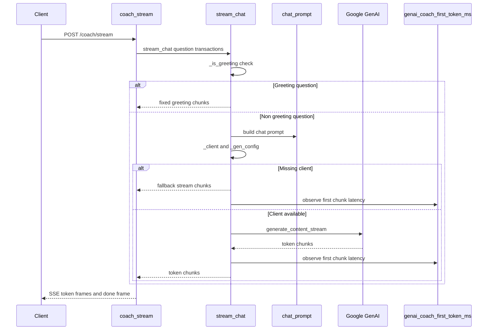
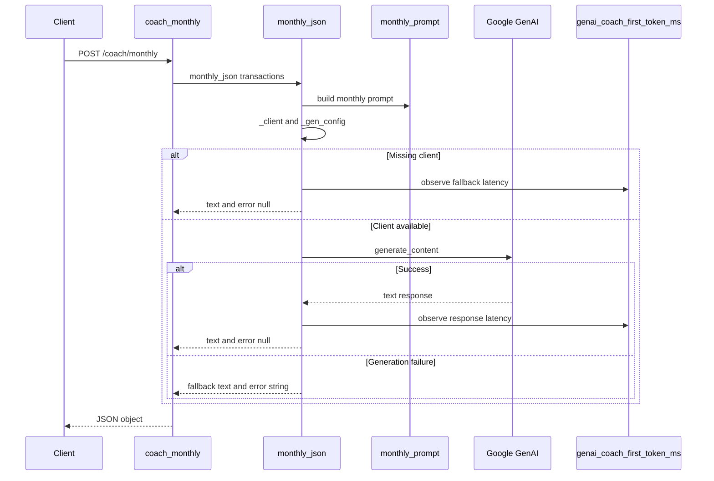
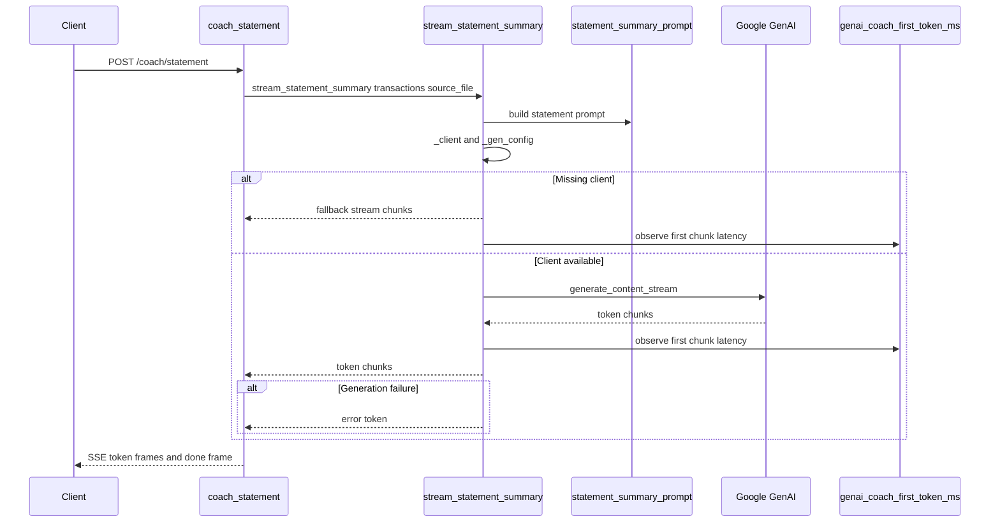

# AI-Powered Financial Coaching DOMAIN - Coach runtime, Gemini integration, and deterministic fallback behavior

## Overview

The GenAI coaching service turns categorized transaction data into three user-facing coaching contracts: live chat guidance, a monthly review, and an uploaded statement summary. The runtime is built so each contract can run with Gemini when credentials are available, but still produce deterministic output when the model cannot be initialized.

This service is centered in  and . The FastAPI layer exposes the HTTP contract, while the coach runtime handles dotenv loading, Gemini client bootstrapping, generation configuration, prompt assembly, token streaming, first-token timing, and demo-mode fallback behavior.

The monthly review path has a distinct non-streaming JSON contract, while the chat and statement paths are streamed Server-Sent Events responses. That separation matters because the failure handling, timing capture, and output shape differ between the routes.

## Architecture Overview

```mermaid
flowchart TB
    subgraph HTTPInterface[FastAPI HTTP interface]
        MetricsEndpoint[prometheus_metrics]
        HealthEndpoint[health]
        CoachStream[coach_stream]
        CoachMonthly[coach_monthly]
        CoachMonthlyStream[coach_monthly_stream]
        CoachStatement[coach_statement]
    end

    subgraph RuntimeLayer[Coach runtime]
        StreamChat[stream_chat]
        MonthlyJson[monthly_json]
        StreamMonthly[stream_monthly_summary]
        StreamStatement[stream_statement_summary]
        ClientInit[_client]
        GenConfig[_gen_config]
        GreetingCheck[_is_greeting]
        FallbackStream[_fallback_stream]
        FallbackMonthly[_fallback_monthly]
    end

    subgraph PromptLayer[Prompt builders]
        ChatPrompt[chat_prompt]
        MonthlyPrompt[monthly_prompt]
        StatementPrompt[statement_summary_prompt]
    end

    subgraph TelemetryLayer[Telemetry]
        CoachInvocations[genai_coach_invocations]
        FirstTokenMs[genai_coach_first_token_ms]
        MetricsResponse[metrics_response]
    end

    subgraph ExternalInputs[External inputs]
        Dotenv[service env and repo env]
        GeminiAPI[Google GenAI]
        PrometheusFormat[Prometheus exposition]
    end

    CoachStream --> StreamChat
    CoachMonthly --> MonthlyJson
    CoachMonthlyStream --> StreamMonthly
    CoachStatement --> StreamStatement
    MetricsEndpoint --> MetricsResponse
    StreamChat --> GreetingCheck
    StreamChat --> ClientInit
    StreamChat --> GenConfig
    StreamChat --> ChatPrompt
    StreamChat --> FallbackStream
    StreamChat --> GeminiAPI

    StreamMonthly --> ClientInit
    StreamMonthly --> GenConfig
    StreamMonthly --> MonthlyPrompt
    StreamMonthly --> FallbackStream
    StreamMonthly --> GeminiAPI

    StreamStatement --> ClientInit
    StreamStatement --> GenConfig
    StreamStatement --> StatementPrompt
    StreamStatement --> FallbackStream
    StreamStatement --> GeminiAPI

    MonthlyJson --> ClientInit
    MonthlyJson --> GenConfig
    MonthlyJson --> MonthlyPrompt
    MonthlyJson --> FallbackMonthly
    MonthlyJson --> GeminiAPI

    ClientInit --> Dotenv
    MetricsResponse --> PrometheusFormat
    StreamChat --> CoachInvocations
    StreamMonthly --> CoachInvocations
    StreamStatement --> CoachInvocations
    MonthlyJson --> CoachInvocations
    StreamChat --> FirstTokenMs
    StreamMonthly --> FirstTokenMs
    StreamStatement --> FirstTokenMs
    MonthlyJson --> FirstTokenMs
```



## Request Models and Route Handlers

### `CoachBody`

*genai-service/app.py*

The chat stream route accepts a simple conversational question plus the current transaction context.

| Property | Type | Description |
| --- | --- | --- |
| `question` | `str` | User question sent to `stream_chat`. Defaults to `""`. |
| `transactions` | `list[Any]` | Recent transaction payload passed through to the prompt builder. Defaults to `[]`. |


### `MonthlyBody`

*genai-service/app.py*

This request model is used by both monthly review routes.

| Property | Type | Description |
| --- | --- | --- |
| `transactions` | `list[Any]` | Categorized transaction list passed to `monthly_json` or `stream_monthly_summary`. Defaults to `[]`. |


### `StatementBody`

*genai-service/app.py*

This request model carries both the uploaded rows and the original file name.

| Property | Type | Description |
| --- | --- | --- |
| `transactions` | `list[Any]` | Categorized statement rows passed to `stream_statement_summary`. Defaults to `[]`. |
| `source_file` | `str` | Source file name injected into the statement summary prompt. Defaults to `""`. |


## HTTP Endpoints

### Health Check

*genai-service/app.py*

```api
{
    "title": "Health Check",
    "description": "Returns a simple service status payload from FastAPI.",
    "method": "GET",
    "baseUrl": "<GenAiServiceBaseUrl>",
    "endpoint": "/health",
    "headers": [],
    "queryParams": [],
    "pathParams": [],
    "bodyType": "none",
    "requestBody": "",
    "formData": [],
    "rawBody": "",
    "responses": {
        "200": {
            "description": "Service is running.",
            "body": "{\n    \"status\": \"ok\"\n}"
        }
    }
}
```

### Prometheus Metrics

*genai-service/app.py*

```api
{
    "title": "Prometheus Metrics",
    "description": "Returns the current Prometheus exposition payload from metrics_response.",
    "method": "GET",
    "baseUrl": "<GenAiServiceBaseUrl>",
    "endpoint": "/metrics",
    "headers": [],
    "queryParams": [],
    "pathParams": [],
    "bodyType": "none",
    "requestBody": "",
    "formData": [],
    "rawBody": "",
    "responses": {
        "200": {
            "description": "Prometheus text format payload produced by generate_latest.",
            "body": "{\n    \"contentType\": \"text/plain; version=0.0.4; charset=utf-8\",\n    \"payload\": \"Prometheus exposition text\"\n}"
        }
    }
}
```

### Coach Chat Stream

*genai-service/app.py*

```api
{
    "title": "Coach Chat Stream",
    "description": "Streams coaching tokens as Server-Sent Events. Each emitted chunk is wrapped as {\"token\": \"...\"} and the stream ends with {\"done\": true}. The handler delegates to stream_chat, which applies greeting handling, Gemini streaming, and fallback behavior.",
    "method": "POST",
    "baseUrl": "<GenAiServiceBaseUrl>",
    "endpoint": "/coach/stream",
    "headers": [
        {
            "key": "Content-Type",
            "value": "application/json",
            "required": true
        }
    ],
    "queryParams": [],
    "pathParams": [],
    "bodyType": "stream",
    "requestBody": "{\n    \"question\": \"How can I reduce dining spend this month?\",\n    \"transactions\": [\n        {\n            \"date\": \"2026-03-03\",\n            \"merchant\": \"Swiggy\",\n            \"category\": \"Food\",\n            \"amount\": 245,\n            \"type\": \"debit\"\n        },\n        {\n            \"date\": \"2026-03-05\",\n            \"merchant\": \"Uber\",\n            \"category\": \"Transport\",\n            \"amount\": 182,\n            \"type\": \"debit\"\n        }\n    ]\n}",
    "formData": [],
    "rawBody": "",
    "responses": {
        "200": {
            "description": "Server-Sent Events stream. A successful response yields token frames and a final done frame.",
            "body": "{\n    \"token\": \"Hi. I can help with your spending insights.\"\n}"
        }
    }
}
```

### Monthly Review

*genai-service/app.py*

```api
{
    "title": "Monthly Review",
    "description": "Returns a JSON monthly review from monthly_json. The response body contains the generated text plus an error field that is null on success and populated when Gemini generation fails.",
    "method": "POST",
    "baseUrl": "<GenAiServiceBaseUrl>",
    "endpoint": "/coach/monthly",
    "headers": [
        {
            "key": "Content-Type",
            "value": "application/json",
            "required": true
        }
    ],
    "queryParams": [],
    "pathParams": [],
    "bodyType": "json",
    "requestBody": "{\n    \"transactions\": [\n        {\n            \"date\": \"2026-03-01\",\n            \"merchant\": \"Amazon\",\n            \"category\": \"Shopping\",\n            \"amount\": 1499,\n            \"type\": \"debit\"\n        },\n        {\n            \"date\": \"2026-03-06\",\n            \"merchant\": \"HDFC Bank\",\n            \"category\": \"Bills\",\n            \"amount\": 5200,\n            \"type\": \"debit\"\n        }\n    ]\n}",
    "formData": [],
    "rawBody": "",
    "responses": {
        "200": {
            "description": "Monthly review payload.",
            "body": "{\n    \"text\": \"Monthly snapshot: spend was concentrated in shopping and bills, with recurring charges worth reviewing.\",\n    \"error\": null\n}"
        }
    }
}
```

### Monthly Review Stream

*genai-service/app.py*

```api
{
    "title": "Monthly Review Stream",
    "description": "Streams the monthly review token by token as Server-Sent Events. The stream uses the same monthly_prompt input as the JSON route but returns incremental token frames instead of a single JSON object.",
    "method": "POST",
    "baseUrl": "<GenAiServiceBaseUrl>",
    "endpoint": "/coach/monthly/stream",
    "headers": [
        {
            "key": "Content-Type",
            "value": "application/json",
            "required": true
        }
    ],
    "queryParams": [],
    "pathParams": [],
    "bodyType": "stream",
    "requestBody": "{\n    \"transactions\": [\n        {\n            \"date\": \"2026-03-01\",\n            \"merchant\": \"Amazon\",\n            \"category\": \"Shopping\",\n            \"amount\": 1499,\n            \"type\": \"debit\"\n        },\n        {\n            \"date\": \"2026-03-06\",\n            \"merchant\": \"HDFC Bank\",\n            \"category\": \"Bills\",\n            \"amount\": 5200,\n            \"type\": \"debit\"\n        }\n    ]\n}",
    "formData": [],
    "rawBody": "",
    "responses": {
        "200": {
            "description": "Server-Sent Events stream. The body emits token frames and ends with a done frame.",
            "body": "{\n    \"token\": \"1) Spending summary\"\n}"
        }
    }
}
```

### Statement Summary Stream

*genai-service/app.py*

```api
{
    "title": "Statement Summary Stream",
    "description": "Streams a statement upload summary token by token as Server-Sent Events. The handler includes the uploaded source_file in the prompt and delegates to stream_statement_summary.",
    "method": "POST",
    "baseUrl": "<GenAiServiceBaseUrl>",
    "endpoint": "/coach/statement",
    "headers": [
        {
            "key": "Content-Type",
            "value": "application/json",
            "required": true
        }
    ],
    "queryParams": [],
    "pathParams": [],
    "bodyType": "stream",
    "requestBody": "{\n    \"transactions\": [\n        {\n            \"date\": \"2026-02-02\",\n            \"merchant\": \"Railway Ticket\",\n            \"category\": \"Travel\",\n            \"amount\": 840,\n            \"type\": \"debit\"\n        },\n        {\n            \"date\": \"2026-02-03\",\n            \"merchant\": \"Salary\",\n            \"category\": \"Income\",\n            \"amount\": 85000,\n            \"type\": \"credit\"\n        }\n    ],\n    \"source_file\": \"february_statement.pdf\"\n}",
    "formData": [],
    "rawBody": "",
    "responses": {
        "200": {
            "description": "Server-Sent Events stream. The body emits token frames and ends with a done frame.",
            "body": "{\n    \"token\": \"1) Spending summary\"\n}"
        }
    }
}
```

## Coach Runtime

### Runtime Functions

*genai-service/coach.py*

| Function | Description |
| --- | --- |
| `_client` | Builds `genai.Client(api_key=key)` when `google.genai` is importable and either `GEMINI_API_KEY` or `GOOGLE_API_KEY` is present. Returns `None` when the package import fails or no key is available. |
| `_gen_config` | Returns the Gemini generation config dictionary with `temperature`, `top_p`, and `top_k` from environment variables. |
| `_is_greeting` | Checks whether a question is one of the fixed greeting strings used for the deterministic short opener. |
| `stream_chat` | Streams conversational coaching tokens for `/coach/stream`. Uses the greeting shortcut, prompt generation, Gemini streaming, fallback streaming, and error token handling. |
| `stream_statement_summary` | Streams the statement upload summary for `/coach/statement`. Uses the uploaded `source_file` in the prompt and otherwise follows the shared streaming pattern. |
| `stream_monthly_summary` | Streams the monthly review for `/coach/monthly/stream`. Uses the same structured prompt family as the JSON monthly route. |
| `monthly_json` | Returns the monthly review as a JSON object with `text` and `error`. Uses deterministic fallback text when Gemini cannot be used or generation fails. |
| `_fallback_stream` | Produces a fixed demo-mode message in 24-character chunks for stream-based routes. |
| `_fallback_monthly` | Produces a deterministic monthly summary string from transaction count and total amount. |


### Environment Loading and Gemini Client Bootstrap

`coach.py` loads `.env` files at module import time with two explicit lookups:

1. 
2. Repository-root `.env`

Both calls use `override=False`, so already-present environment variables remain authoritative. This is the only configuration loading path shown in the runtime.

The Gemini client is created in `_client` only when both conditions are true:

- `google.genai` imported successfully
- A key exists in `GEMINI_API_KEY` or `GOOGLE_API_KEY`

If both key names are present, `GEMINI_API_KEY` wins because `_client` checks it first.

### Generation Config Handling

`_gen_config` reads three generation controls from the environment and converts them to the expected types:

| Environment variable | Type | Default |
| --- | --- | --- |
| `GEMINI_TEMPERATURE` | `float` | `0.35` |
| `GEMINI_TOP_P` | `float` | `0.9` |
| `GEMINI_TOP_K` | `int` | `40` |


The resulting dict is passed unchanged to both `generate_content_stream` and `generate_content`.

### Prompt Builders Used by the Runtime

*genai-service/prompts.py*

| Function | Description |
| --- | --- |
| `chat_prompt` | Builds the plain-text chat prompt from the user question and the first 200 transactions. |
| `monthly_prompt` | Builds the structured monthly review prompt from the first 200 transactions. |
| `statement_summary_prompt` | Builds the statement summary prompt from the first 250 transactions and the `source_file` value. |


These helpers are the only prompt constructors used by the runtime paths in `coach.py`.

### Deterministic Fallback Behavior

The runtime uses two different fallback styles:

- **Streaming routes** return deterministic chunks from `_fallback_stream` when Gemini credentials are missing.
- **Monthly JSON** returns a deterministic string from `_fallback_monthly` when Gemini cannot be used or fails.

| Path | Missing Gemini client | Gemini generation failure | Output contract |
| --- | --- | --- | --- |
| `stream_chat` | `_fallback_stream` unless the question is a greeting | Emits `\n[coach error: ...]\n` | `AsyncIterator[str]` |
| `stream_monthly_summary` | `_fallback_stream` | Emits `\n[coach error: ...]\n` | `AsyncIterator[str]` |
| `stream_statement_summary` | `_fallback_stream` | Emits `\n[coach error: ...]\n` | `AsyncIterator[str]` |
| `monthly_json` | `_fallback_monthly` and `error: null` | `_fallback_monthly` and `error: str(e)` | `dict[str, Any]` |


`_fallback_stream` emits a fixed demo-mode banner in 24-character slices. `_fallback_monthly` computes `len(transactions)` and the total spend by summing `float(t.get("amount") or 0)` for each row, then formats the result in INR.

### Streaming Token Loop and First Token Timing

monthly_json records genai_coach_first_token_ms after generate_content completes, so this path measures full-response latency rather than a streamed first-token interval.

The streaming functions share the same token loop pattern:

1. Build the prompt text.
2. Create a Gemini client if credentials are present.
3. Start a `time.perf_counter()` timer.
4. If no client exists, stream deterministic fallback chunks.
5. Otherwise call `client.aio.models.generate_content_stream`.
6. If the returned object is awaitable, await it before iterating.
7. Iterate the stream and read `chunk.text` with `getattr`.
8. On the first non-empty text chunk, observe `genai_coach_first_token_ms`.
9. Yield each chunk immediately to the caller.

This means the first-token histogram is recorded from the first emitted text chunk, whether the chunk came from Gemini or from `_fallback_stream`.

### Greeting Shortcut in `stream_chat`

`stream_chat` has a unique deterministic branch before any Gemini work starts. If the normalized question matches one of these values:

`hi`, `hii`, `hello`, `hey`, `yo`, `good morning`, `good afternoon`, `good evening`

the function returns a short fixed opener and slices it into 26-character chunks. This branch bypasses prompt generation and Gemini entirely.

## Execution Flows

### Chat Stream Flow



**Flow details**

- The route wraps the async token iterator into `StreamingResponse`.
- Each emitted token is serialized as `{"token": "<chunk>"}`.
- The stream terminates with `{"done": true}`.
- Greeting questions do not hit Gemini or the fallback banner path.

### Monthly Review JSON Flow



**Flow details**

- The route returns a JSON object directly, not SSE.
- The response always contains `text`.
- On success, `error` is `null`.
- On generation failure, the route still returns fallback text and exposes the exception string in `error`.

### Statement Summary Stream Flow



**Flow details**

- `source_file` is inserted into the prompt before generation starts.
- The route is streamed, so clients receive partial coaching output as it is produced.
- Missing credentials trigger the same deterministic demo-mode banner used by the other stream routes.

## Telemetry and Metrics

### Prometheus Metrics

*genai-service/metrics.py*

| Symbol | Type | Labels | Description |
| --- | --- | --- | --- |
| `genai_coach_invocations_total` | `Counter` | `endpoint` | Counts coach calls by route family. |
| `genai_coach_first_token_ms` | `Histogram` | none | Captures first-token latency for streamed paths and response latency for `monthly_json`. |


`genai_coach_invocations_total` is incremented with these label values in `coach.py`:

- `stream`
- `statement`
- `monthly_stream`
- `monthly`

The histogram buckets are fixed at `10`, `50`, `100`, `200`, `500`, `1000`, `2000`, `3000`, `5000`, and `10000` milliseconds.

### Metrics Response

`metrics_response` returns `Response(content=generate_latest(), media_type=CONTENT_TYPE_LATEST)`. The `/metrics` endpoint exposes that payload directly, so the runtime can be scraped by Prometheus without any additional transformation.

## Dependencies

### Runtime and HTTP Dependencies

- `FastAPI`
- `StreamingResponse`
- `BaseModel`
- `Response`
- `json`
- `time`
- `inspect`
- `pathlib.Path`

### External Service Dependencies

- `google-genai` through `from google import genai`
- `python-dotenv` through `load_dotenv`
- `prometheus-client` through `Counter`, `Histogram`, `generate_latest`, and `CONTENT_TYPE_LATEST`

### Environment Dependencies

- `GEMINI_API_KEY`
- `GOOGLE_API_KEY`
- `GEMINI_MODEL`
- `GEMINI_TEMPERATURE`
- `GEMINI_TOP_P`
- `GEMINI_TOP_K`

## Testing Considerations

- Verify the greeting branch in `stream_chat` returns the fixed opener and does not call Gemini.
- Verify missing credentials force `_client()` to return `None`.
- Verify each streaming route emits `data: {"token": ...}` frames and a terminal `data: {"done": true}` frame.
- Verify first-token timing is captured on the first non-empty streamed chunk.
- Verify `monthly_json` returns `{"text": ..., "error": null}` on success.
- Verify `monthly_json` returns deterministic fallback text and a string error on generation failure.
- Verify `source_file` appears in the statement prompt path.

## Key Classes Reference

| Class | Location | Responsibility |
| --- | --- | --- |
| `CoachBody` | `app.py` | Request payload for `/coach/stream`. |
| `MonthlyBody` | `app.py` | Request payload for `/coach/monthly` and `/coach/monthly/stream`. |
| `StatementBody` | `app.py` | Request payload for `/coach/statement`. |
