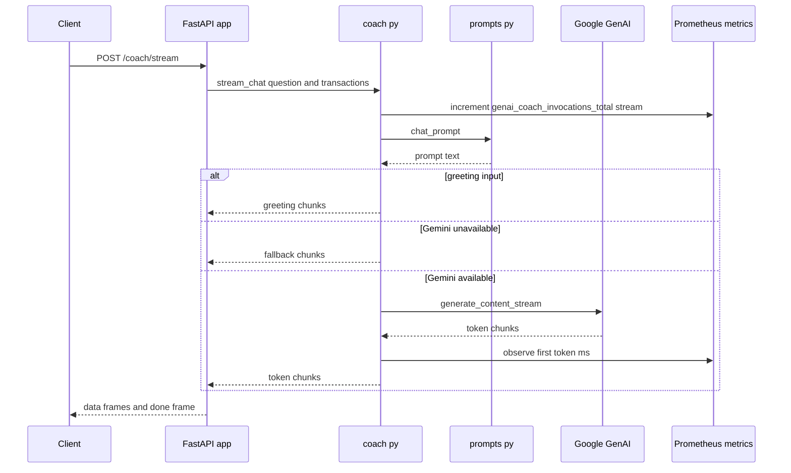
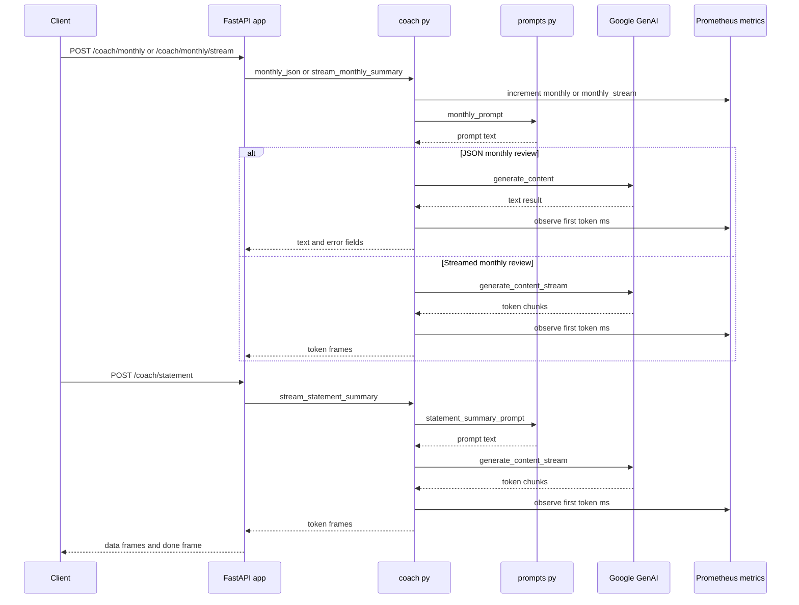

# AI-Powered Financial Coaching DOMAIN - GenAI Service API Surface and Streaming Endpoint Design

## Overview

`genai-service` is a standalone FastAPI service that powers the personal finance coaching experience exposed by the platform. It runs as its own container, listens on port `8003`, and exposes a small HTTP surface for liveness, Prometheus metrics, live coaching chat, monthly review generation, and statement upload summaries.

The service is intentionally split into distinct endpoints because each coaching mode has a different contract. Live chat is optimized for short, conversational replies and supports token-by-token SSE output. Monthly review and statement summary are structured review flows built from different prompt templates, carry different context payloads, and are tracked separately in telemetry. That separation keeps the API aligned with the actual coaching behaviors implemented in `coach.py` instead of collapsing everything into a generic chat endpoint.

## Architecture Overview

```mermaid
flowchart TB
    Client[Frontend or API Client]

    subgraph FastAPIService[genai-service app.py]
        HealthRoute[GET health]
        MetricsRoute[GET metrics]
        CoachStreamRoute[POST coach stream]
        CoachMonthlyRoute[POST coach monthly]
        CoachMonthlyStreamRoute[POST coach monthly stream]
        CoachStatementRoute[POST coach statement]
    end

    subgraph CoachModule[coach.py]
        StreamChat[stream_chat]
        StreamMonthly[stream_monthly_summary]
        MonthlyJson[monthly_json]
        StreamStatement[stream_statement_summary]
        ClientFactory[_client]
        ConfigFactory[_gen_config]
        FallbackStream[_fallback_stream]
        FallbackMonthly[_fallback_monthly]
    end

    subgraph PromptModule[prompts.py]
        ChatPrompt[chat_prompt]
        MonthlyPrompt[monthly_prompt]
        StatementPrompt[statement_summary_prompt]
        StructuredSections[STRUCTURED_SECTIONS]
    end

    subgraph MetricsModule[metrics.py]
        MetricsResponse[metrics_response]
        CoachInvocations[genai_coach_invocations]
        FirstTokenMs[genai_coach_first_token_ms]
    end

    GeminiAPI[Google GenAI API]
    Prometheus[Prometheus scraper]

    Client --> HealthRoute
    Client --> MetricsRoute
    Client --> CoachStreamRoute
    Client --> CoachMonthlyRoute
    Client --> CoachMonthlyStreamRoute
    Client --> CoachStatementRoute

    HealthRoute --> CoachModule
    MetricsRoute --> MetricsResponse

    CoachStreamRoute --> StreamChat
    CoachMonthlyRoute --> MonthlyJson
    CoachMonthlyStreamRoute --> StreamMonthly
    CoachStatementRoute --> StreamStatement

    StreamChat --> ChatPrompt
    StreamMonthly --> MonthlyPrompt
    StreamStatement --> StatementPrompt

    StreamChat --> ClientFactory
    StreamMonthly --> ClientFactory
    StreamStatement --> ClientFactory
    MonthlyJson --> ClientFactory

    StreamChat --> ConfigFactory
    StreamMonthly --> ConfigFactory
    StreamStatement --> ConfigFactory
    MonthlyJson --> ConfigFactory

    StreamChat --> GeminiAPI
    StreamMonthly --> GeminiAPI
    StreamStatement --> GeminiAPI
    MonthlyJson --> GeminiAPI

    MetricsResponse --> Prometheus
    StreamChat --> CoachInvocations
    StreamMonthly --> CoachInvocations
    StreamStatement --> CoachInvocations
    MonthlyJson --> CoachInvocations

    StreamChat --> FirstTokenMs
    StreamMonthly --> FirstTokenMs
    StreamStatement --> FirstTokenMs
    MonthlyJson --> FirstTokenMs

    StreamChat --> FallbackStream
    StreamMonthly --> FallbackStream
    StreamStatement --> FallbackStream
    MonthlyJson --> FallbackMonthly
```



## Module Responsibilities

| File | Responsibility |
| --- | --- |
|  | FastAPI app definition, request models, health and metrics endpoints, SSE route wrappers |
|  | Gemini client creation, prompt selection, streaming chat, monthly review generation, statement summary generation, fallback output |
|  | Prompt templates and output-shaping instructions for chat, monthly review, and statement summary |
|  | Prometheus counters, histogram, and metrics response serialization |
|  | Runtime dependency set for FastAPI, Uvicorn, Gemini, dotenv, Pydantic, and Prometheus |
| `genai-service/Dockerfile` | Container build and service startup definition |


## FastAPI Application

The FastAPI application is created in  with `FastAPI(title="GenAI Service")`. The route handlers are thin wrappers over the orchestration functions in `coach.py` and the metrics serializer in `metrics.py`.

### Public Methods

| Method | Description |
| --- | --- |
| `prometheus_metrics` | Returns the Prometheus exposition payload from `metrics_response` |
| `health` | Returns the service health payload `{"status": "ok"}` |
| `coach_stream` | Streams live coaching output as SSE token frames |
| `coach_monthly` | Returns a monthly review as a JSON object |
| `coach_monthly_stream` | Streams the monthly review as SSE token frames |
| `coach_statement` | Streams a statement-upload summary as SSE token frames |


#### Health Check

```api
{
    "title": "Health Check",
    "description": "Returns the service status for readiness and liveness checks",
    "method": "GET",
    "baseUrl": "<GenAiServiceBaseUrl>",
    "endpoint": "/health",
    "headers": [],
    "queryParams": [],
    "pathParams": [],
    "bodyType": "none",
    "requestBody": "",
    "formData": [],
    "rawBody": "",
    "responses": {
        "200": {
            "description": "Service is running",
            "body": "{\n    \"status\": \"ok\"\n}"
        }
    }
}
```

#### Prometheus Metrics Export

```api
{
    "title": "Prometheus Metrics Export",
    "description": "Returns the Prometheus exposition generated by prometheus_client",
    "method": "GET",
    "baseUrl": "<GenAiServiceBaseUrl>",
    "endpoint": "/metrics",
    "headers": [],
    "queryParams": [],
    "pathParams": [],
    "bodyType": "none",
    "requestBody": "",
    "formData": [],
    "rawBody": "",
    "responses": {
        "200": {
            "description": "Prometheus exposition text",
            "body": "[]",
            "rawBody": "genai_coach_invocations_total{endpoint=\"monthly\"} 4\n# HELP genai_coach_first_token_ms Time to first streamed token\n# TYPE genai_coach_first_token_ms histogram\n"
        }
    }
}
```

#### Coach Stream

```api
{
    "title": "Coach Stream",
    "description": "Streams a live coaching answer token by token using Server Sent Events",
    "method": "POST",
    "baseUrl": "<GenAiServiceBaseUrl>",
    "endpoint": "/coach/stream",
    "headers": [
        {
            "key": "Content-Type",
            "value": "application/json",
            "required": true
        }
    ],
    "queryParams": [],
    "pathParams": [],
    "bodyType": "application/json",
    "requestBody": "{\n    \"question\": \"How was my dining spend in March?\",\n    \"transactions\": [\n        {\n            \"transaction_id\": \"txn_1001\",\n            \"posted_at\": \"2026-03-05\",\n            \"merchant\": \"Cafe Aroma\",\n            \"category\": \"Food\",\n            \"amount\": 480.5,\n            \"currency\": \"INR\"\n        },\n        {\n            \"transaction_id\": \"txn_1002\",\n            \"posted_at\": \"2026-03-08\",\n            \"merchant\": \"Metro Rail\",\n            \"category\": \"Transport\",\n            \"amount\": 60,\n            \"currency\": \"INR\"\n        }\n    ]\n}",
    "formData": [],
    "rawBody": "",
    "responses": {
        "200": {
            "description": "SSE stream of token frames followed by a terminal done frame",
            "body": "{\n    \"token\": \"Your dining spend is concentrated in a few merchants.\",\n    \"done\": true\n}",
            "rawBody": "data: {\"token\":\"Your dining spend is concentrated in a few merchants.\"}\n\ndata: {\"token\":\" You can cut this by focusing on recurring cafe purchases.\"}\n\ndata: {\"done\":true}\n\n"
        }
    }
}
```

#### Monthly Review

```api
{
    "title": "Monthly Review",
    "description": "Returns a structured monthly spending review as JSON",
    "method": "POST",
    "baseUrl": "<GenAiServiceBaseUrl>",
    "endpoint": "/coach/monthly",
    "headers": [
        {
            "key": "Content-Type",
            "value": "application/json",
            "required": true
        }
    ],
    "queryParams": [],
    "pathParams": [],
    "bodyType": "application/json",
    "requestBody": "{\n    \"transactions\": [\n        {\n            \"transaction_id\": \"txn_2001\",\n            \"posted_at\": \"2026-03-01\",\n            \"merchant\": \"SuperMart\",\n            \"category\": \"Groceries\",\n            \"amount\": 3240,\n            \"currency\": \"INR\"\n        },\n        {\n            \"transaction_id\": \"txn_2002\",\n            \"posted_at\": \"2026-03-12\",\n            \"merchant\": \"RideNow\",\n            \"category\": \"Transport\",\n            \"amount\": 860,\n            \"currency\": \"INR\"\n        }\n    ]\n}",
    "formData": [],
    "rawBody": "",
    "responses": {
        "200": {
            "description": "Structured review payload with the generated text and an error slot",
            "body": "{\n    \"text\": \"Monthly snapshot: 2 transactions reviewed. Groceries and transport were the largest categories. Review recurring merchants and compare against last month.\",\n    \"error\": null\n}"
        }
    }
}
```

#### Monthly Review Stream

```api
{
    "title": "Monthly Review Stream",
    "description": "Streams the monthly review token by token as Server Sent Events",
    "method": "POST",
    "baseUrl": "<GenAiServiceBaseUrl>",
    "endpoint": "/coach/monthly/stream",
    "headers": [
        {
            "key": "Content-Type",
            "value": "application/json",
            "required": true
        }
    ],
    "queryParams": [],
    "pathParams": [],
    "bodyType": "application/json",
    "requestBody": "{\n    \"transactions\": [\n        {\n            \"transaction_id\": \"txn_3001\",\n            \"posted_at\": \"2026-03-02\",\n            \"merchant\": \"Books Hub\",\n            \"category\": \"Education\",\n            \"amount\": 1250,\n            \"currency\": \"INR\"\n        },\n        {\n            \"transaction_id\": \"txn_3002\",\n            \"posted_at\": \"2026-03-18\",\n            \"merchant\": \"Cloud Music\",\n            \"category\": \"Entertainment\",\n            \"amount\": 199,\n            \"currency\": \"INR\"\n        }\n    ]\n}",
    "formData": [],
    "rawBody": "",
    "responses": {
        "200": {
            "description": "SSE stream of monthly review tokens followed by a terminal done frame",
            "body": "{\n    \"token\": \"Monthly spend is led by education and entertainment this period.\",\n    \"done\": true\n}",
            "rawBody": "data: {\"token\":\"Monthly spend is led by education and entertainment this period.\"}\n\ndata: {\"token\":\" Focus on high-frequency discretionary purchases to free cash flow.\"}\n\ndata: {\"done\":true}\n\n"
        }
    }
}
```

#### Statement Summary

```api
{
    "title": "Statement Summary",
    "description": "Streams a statement upload summary token by token as Server Sent Events",
    "method": "POST",
    "baseUrl": "<GenAiServiceBaseUrl>",
    "endpoint": "/coach/statement",
    "headers": [
        {
            "key": "Content-Type",
            "value": "application/json",
            "required": true
        }
    ],
    "queryParams": [],
    "pathParams": [],
    "bodyType": "application/json",
    "requestBody": "{\n    \"source_file\": \"march-2026-bank-statement.pdf\",\n    \"transactions\": [\n        {\n            \"transaction_id\": \"txn_4001\",\n            \"posted_at\": \"2026-03-03\",\n            \"merchant\": \"Cafe Aroma\",\n            \"category\": \"Food\",\n            \"amount\": 480.5,\n            \"currency\": \"INR\"\n        },\n        {\n            \"transaction_id\": \"txn_4002\",\n            \"posted_at\": \"2026-03-21\",\n            \"merchant\": \"Electro World\",\n            \"category\": \"Shopping\",\n            \"amount\": 8999,\n            \"currency\": \"INR\"\n        }\n    ]\n}",
    "formData": [],
    "rawBody": "",
    "responses": {
        "200": {
            "description": "SSE stream for the uploaded statement summary followed by a terminal done frame",
            "body": "{\n    \"token\": \"Statement summary for march-2026-bank-statement.pdf highlights food and shopping as the largest categories.\",\n    \"done\": true\n}",
            "rawBody": "data: {\"token\":\"Statement summary for march-2026-bank-statement.pdf highlights food and shopping as the largest categories.\"}\n\ndata: {\"token\":\" Review the top merchants, recurring debits, and unusual spikes.\"}\n\ndata: {\"done\":true}\n\n"
        }
    }
}
```

## Request Models

The request models are defined in  as Pydantic `BaseModel` subclasses. They are intentionally lightweight and pass transaction-shaped data through to prompt builders without imposing a stricter schema at this layer.

### `CoachBody`

| Property | Type | Default | Description |
| --- | --- | --- | --- |
| `question` | `str` | `""` | Natural language coaching prompt for live chat |
| `transactions` | `list[Any]` | `[]` | Transaction context used by `chat_prompt` |


### `MonthlyBody`

| Property | Type | Default | Description |
| --- | --- | --- | --- |
| `transactions` | `list[Any]` | `[]` | Categorized transaction list used by the monthly review prompts |


### `StatementBody`

| Property | Type | Default | Description |
| --- | --- | --- | --- |
| `transactions` | `list[Any]` | `[]` | Statement-derived transaction rows used by the statement summary prompts |
| `source_file` | `str` | `""` | Uploaded statement filename passed into the prompt text |


## Streaming Endpoint Design

The three streaming endpoints use the same SSE envelope pattern:

1. A route handler builds an async generator named `gen`.
2. The generator iterates over a token stream from `coach.py`.
3. Each token is wrapped with `json.dumps({"token": token})`.
4. The route yields `data: {payload}\n\n` bytes with `media_type="text/event-stream"`.
5. After the token stream ends, the route emits a terminal `{"done": true}` event.

This pattern is implemented consistently in `coach_stream`, `coach_monthly_stream`, and `coach_statement`, so clients can treat all streaming coach responses as a sequence of token frames followed by a completion frame.

### Stream State and Timing

| State or Signal | Where It Lives | Purpose |
| --- | --- | --- |
| `first` | Local variable in each stream coroutine | Detects the first emitted token so first-token latency can be recorded once |
| `t0` | Local monotonic timestamp in each stream coroutine | Measures elapsed time for `genai_coach_first_token_ms` |
| `done` frame | Final SSE payload emitted by the route wrapper | Signals stream completion to the client |
| `genai_coach_invocations` | Prometheus counter in `metrics.py` | Tracks usage by endpoint label |


### Live Coaching Flow



### Monthly Review and Statement Summary Flow



## Prompt Contracts

The endpoint split maps directly to the three prompt builders in .

### Prompt Constants

| Constant | Purpose |
| --- | --- |
| `SYSTEM_COACH` | Declares the coach persona as an expert personal finance coach in INR |
| `STRUCTURED_SECTIONS` | Forces the five review sections used by monthly and statement review flows |


### Prompt Functions

| Method | Description |
| --- | --- |
| `chat_prompt` | Builds a short conversational prompt for live coaching |
| `monthly_prompt` | Builds the monthly review prompt with the required review sections |
| `statement_summary_prompt` | Builds the statement upload prompt with the required review sections and source file context |


### Prompt Behavior by Endpoint

| Endpoint | Prompt Function | Output Shape |
| --- | --- | --- |
| `/coach/stream` | `chat_prompt` | Short plain-text coaching reply |
| `/coach/monthly` | `monthly_prompt` | JSON object with `text` and `error` |
| `/coach/monthly/stream` | `monthly_prompt` | SSE token stream of the monthly review |
| `/coach/statement` | `statement_summary_prompt` | SSE token stream of the statement summary |


### Why Monthly Review and Statement Summary Are Separate Endpoints

The code keeps monthly review and statement summary separate from generic chat because they have different contracts:

- `monthly_json` returns a structured object with `text` and `error`, not a conversational stream.
- `monthly_prompt` and `statement_summary_prompt` both require the fixed `STRUCTURED_SECTIONS` review format.
- `statement_summary_prompt` injects `source_file`, which is only meaningful for uploaded statements.
- Telemetry labels separate the flows as `monthly`, `monthly_stream`, and `statement`, so usage and latency are reported independently.

That separation keeps the API aligned with the actual review workflows instead of forcing them through the conversational `chat_prompt` path.

### Live Chat Prompt Rules

`chat_prompt` adds a different response contract than the review endpoints:

- plain text only
- no markdown headings
- no emojis
- 2 to 4 short sentences
- one short greeting line at the start
- exactly one follow-up question at the end

`stream_chat` also includes a deterministic greeting shortcut for greetings such as `hi`, `hello`, `hey`, and `good morning`, returning a brief opener in fixed 26-character chunks.

## Telemetry and Metrics

 defines the observability surface for this service.

### Metrics Definitions

| Metric | Type | Labels | Description |
| --- | --- | --- | --- |
| `genai_coach_invocations_total` | `Counter` | `endpoint` | Counts coach calls by route family |
| `genai_coach_first_token_ms` | `Histogram` | none | Measures time to first streamed token or first text response |


### Endpoint Label Values

| Label Value | Used By |
| --- | --- |
| `stream` | `stream_chat` |
| `monthly` | `monthly_json` |
| `monthly_stream` | `stream_monthly_summary` |
| `statement` | `stream_statement_summary` |


### Metrics Endpoint Behavior

`prometheus_metrics` returns the raw Prometheus exposition from `generate_latest()` using `CONTENT_TYPE_LATEST`. That makes `/metrics` directly scrapeable by Prometheus without any custom response wrapper.

## Error Handling and Fallback Behavior

The service uses a deterministic fallback path when Gemini credentials are missing or when the Gemini call fails.

| Path | Behavior |
| --- | --- |
| `stream_chat` with greeting input | Emits a fixed short opener and stops |
| `stream_chat` without a Gemini client | Emits `_fallback_stream` chunks |
| `stream_statement_summary` without a Gemini client | Emits `_fallback_stream` chunks |
| `stream_monthly_summary` without a Gemini client | Emits `_fallback_stream` chunks |
| `monthly_json` without a Gemini client | Returns fallback text and `error: null` |
| Gemini request failure in stream functions | Emits a `[coach error: ...]` text chunk |
| Gemini request failure in `monthly_json` | Returns fallback text and the exception string in `error` |


The fallback monthly response is already formatted as a monthly snapshot message, while the stream fallback explains that the service is running without Gemini credentials and instructs the operator to set `GEMINI_API_KEY` in `.env`.

## Runtime Packaging and Dependencies

### Docker Runtime

`genai-service/Dockerfile` builds the service as a small Python container:

- base image: `python:3.12-slim`
- working directory: `/app`
- installs dependencies from `requirements.txt`
- copies the service source into the image
- exposes port `8003`
- starts `uvicorn app:app --host 0.0.0.0 --port 8003`

### Python Dependencies

 declares the runtime stack:

| Package | Purpose |
| --- | --- |
| `fastapi` | HTTP API framework |
| `uvicorn[standard]` | ASGI server used by the container entrypoint |
| `httpx` | Declared dependency for HTTP client support |
| `google-genai` | Gemini client used by `coach.py` |
| `python-dotenv` | Loads service-level and repo-root `.env` files |
| `pydantic` | Request model validation for FastAPI bodies |
| `prometheus-client` | Prometheus counters, histogram, and response generation |


### Configuration Inputs

| Variable | Used In | Purpose |
| --- | --- | --- |
| `GEMINI_API_KEY` | `coach.py` | Primary Gemini API key |
| `GOOGLE_API_KEY` | `coach.py` | Alternate key name accepted by `_client` |
| `GEMINI_MODEL` | `coach.py` | Overrides the model name, defaulting to `gemini-3.1-flash-lite-preview` |
| `GEMINI_TEMPERATURE` | `coach.py` | Controls generation temperature |
| `GEMINI_TOP_P` | `coach.py` | Controls nucleus sampling |
| `GEMINI_TOP_K` | `coach.py` | Controls top-k sampling |


`coach.py` loads `.env` from the service directory first and then the repo root as a fallback, which matches the code comment about local `uvicorn` runs not automatically sourcing the Docker Compose environment file.

## Key Classes Reference

| Class | Responsibility |
| --- | --- |
| `CoachBody` | Request model in `app.py` for live coaching questions and transaction context |
| `MonthlyBody` | Request model in `app.py` for monthly review transaction context |
| `StatementBody` | Request model in `app.py` for statement summary uploads and source file context |
| `prometheus_metrics` | `app.py` handler that exposes Prometheus metrics text |
| `health` | `app.py` handler that returns service status |
| `coach_stream` | `app.py` SSE wrapper for live coaching responses |
| `coach_monthly` | `app.py` JSON wrapper for the monthly review flow |
| `coach_monthly_stream` | `app.py` SSE wrapper for the monthly review stream |
| `coach_statement` | `app.py` SSE wrapper for statement upload summaries |
| `stream_chat` | `coach.py` live coaching generator with Gemini and fallback paths |
| `stream_monthly_summary` | `coach.py` streaming monthly review generator |
| `monthly_json` | `coach.py` JSON monthly review generator |
| `stream_statement_summary` | `coach.py` streaming statement summary generator |
| `chat_prompt` | `prompts.py` prompt builder for conversational coaching |
| `monthly_prompt` | `prompts.py` prompt builder for monthly review output |
| `statement_summary_prompt` | `prompts.py` prompt builder for statement summary output |
| `metrics_response` | `metrics.py` Prometheus exposition helper |
