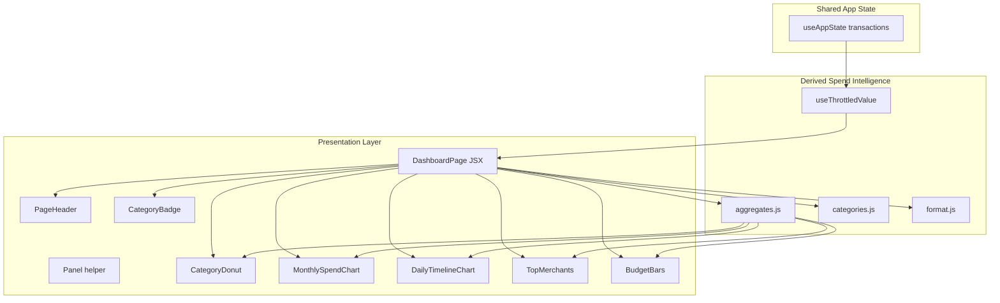
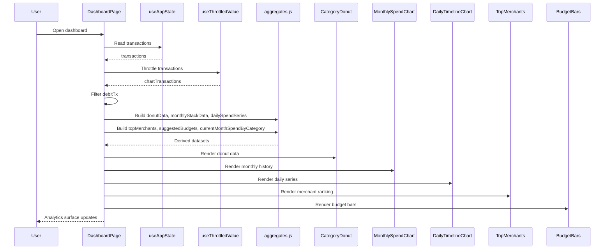
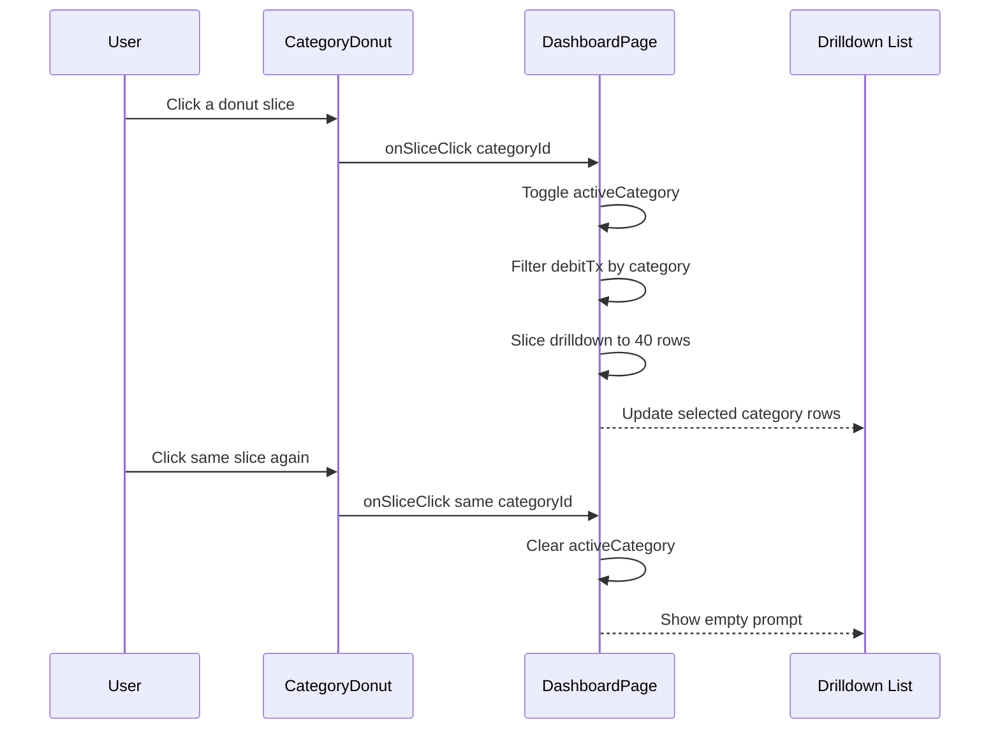

# Financial Data Visualization and Dashboarding Domain

## Overview

`DashboardPage.jsx` is the main analytics surface for the expense intelligence app. It turns the shared transaction stream from `useAppState` into spend intelligence that focuses on debit activity only, so the visuals describe money leaving the account rather than all ledger movement. The page combines category mix, drilldown lists, monthly history, daily rhythm, merchant ranking, and budget pressure into one screen that updates as the transaction buffer changes.

The dashboard is built from small, reusable visualization pieces that all consume the same derived datasets from . That keeps the donut chart, stacked monthly bars, daily timeline, merchant ranking, and budget bars aligned on the same filters, category taxonomy, and formatting rules. `PageHeader.jsx` and `CategoryBadge.jsx` supply consistent chrome and labels across the analytics views.

## Architecture Overview

## Dashboard Page

The dashboard’s analytics are derived from debitTx, which is computed by filtering out transactions whose debit_credit is "credit". That exclusion applies to the category donut, monthly history, daily series, merchant ranking, suggested budgets, current-month category totals, recent activity snapshot, and drilldown list.

*`frontend/src/pages/DashboardPage.jsx`*

`DashboardPage` is the analytics composition layer. It reads the shared `transactions` array, throttles updates with `useThrottledValue(transactions, 280)`, filters to debit transactions, derives the dashboard datasets with `aggregates.js`, and renders the chart surface plus the category drilldown and recent activity snapshot.

### Responsibilities

- Consume the shared transaction buffer from `useAppState`.
- Throttle rapid transaction updates before recomputing dashboard aggregates.
- Remove credit transactions from all analytics.
- Build dashboard-ready datasets for category mix, monthly history, daily rhythm, merchants, budgets, and current-month totals.
- Manage category drilldown state with `activeCategory`.
- Render the analytics panels and the recent activity list.

### State and derived values

| Name | Type | Description |
| --- | --- | --- |
| `transactions` | array | Shared transaction buffer from `useAppState`. |
| `chartTransactions` | array | Throttled transaction list returned by `useThrottledValue`. |
| `activeCategory` | string \ | null | Selected category ID for donut drilldown. |
| `debitTx` | array | `chartTransactions` filtered to exclude credit transactions. |
| `donut` | array | Category mix data from `donutData(debitTx)`. |
| `monthly` | array | Last 6 months of stacked category totals from `monthlyStackData(debitTx, 6)`. |
| `daily` | array | Current-month daily spend series from `dailySpendSeries(debitTx)`. |
| `merchants` | array | Top debit merchants from `topMerchants(debitTx, 10)`. |
| `budgets` | object | Suggested budget cap by category from `suggestedBudgets(debitTx)`. |
| `monthSpend` | object | Current-month spend totals by category from `currentMonthSpendByCategory(debitTx)`. |
| `drilldown` | array | Latest 40 debit transactions in the selected category. |
| `activeLabel` | string \ | null | Category display label resolved from `CATEGORY_BY_ID`. |

### Rendered dashboard regions

| Region | Data source | Behavior |
| --- | --- | --- |
| Category mix | `donut` | Renders a donut chart and allows slice selection. |
| Category drilldown | `drilldown` | Lists the latest matching transactions for the selected category. |
| Monthly momentum | `monthly` | Shows a stacked 6-month spend history. |
| Daily rhythm | `daily` | Shows current-month daily spend, with anomaly markers. |
| Top merchants | `merchants` | Shows the highest-debit merchants by total spend. |
| Budget pulse | `monthSpend`, `budgets` | Compares current-month spend to suggested caps. |
| Recent activity snapshot | `debitTx.slice(0, 6)` | Shows the latest six debit transactions with category and amount. |

### Local interaction logic

| Handler / rule | Description |
| --- | --- |
| `onSliceClick` | Toggles `activeCategory`; clicking the same slice clears the selection. |
| Drilldown limit | Category drilldown is capped at 40 rows. |
| Debit-only filter | Every dashboard aggregate is built from `debitTx`, not the raw transaction list. |
| Snapshot order | Recent activity uses the first six entries from `debitTx`. |

## Feature Flows

### Dashboard hydration and redraw

### Category drilldown selection

## Data Shapes Used by the Dashboard

### Transaction fields consumed by `DashboardPage`

| Property | Type | Description |
| --- | --- | --- |
| `txn_id` | string | Stable row key used in lists and drilldown views. |
| `amount` | number | Spend value used in all charts and summaries. |
| `currency` | string | Currency passed to `formatCurrency` in visible transaction rows. |
| `date` | string | Timestamp used for daily, monthly, and recent activity formatting. |
| `debit_credit` | string | Filter key; `"credit"` rows are excluded from dashboard analytics. |
| `category` | string | Category ID used for donut, bars, budgets, badges, and drilldown. |
| `merchant_clean` | string | Display merchant label shown in drilldown, merchant ranking, and snapshots. |
| `merchant_raw` | string | Original merchant string shown in the drilldown and recent activity details. |
| `anomaly` | object \ | falsey | Anomaly payload used by the daily series and recent activity context. |

## Derived Spend Intelligence Utilities

*`frontend/src/lib/aggregates.js`*

This module is the analytics engine for the dashboard. Each function accepts the raw transaction array and returns a data shape tailored for a specific visualization or summary block. All public helpers skip credit transactions where applicable and rely on the shared category taxonomy from `CATEGORIES`.

### Public functions

| Method | Description | Returns |
| --- | --- | --- |
| `totalsByCategory` | Builds a category-to-total map from debit transactions. | object |
| `donutData` | Converts category totals into donut slices and removes zero-value categories. | array |
| `monthlyStackData` | Produces a rolling stacked history for the last `monthsBack` calendar months. | array |
| `dailySpendSeries` | Builds a current-month day-by-day spend series and flags anomaly days. | array |
| `topMerchants` | Aggregates debit spend by merchant, sorts descending, and returns the top `n` merchants. | array |
| `suggestedBudgets` | Calculates suggested category budgets from the last 90 days of spend. | object |
| `currentMonthSpendByCategory` | Returns current-month spend totals by category. | object |

### Output shapes

#### `donutData`

| Field | Type | Description |
| --- | --- | --- |
| `id` | string | Category ID. |
| `name` | string | Category label shown in the chart tooltip. |
| `value` | number | Spend total for the category. |
| `fill` | string | Slice color taken from the category palette. |

#### `monthlyStackData`

| Field | Type | Description |
| --- | --- | --- |
| `month` | string | Year-month key in `YYYY-MM` format. |
| `<category id>` | number | Spend total for that category in the month. |

#### `dailySpendSeries`

| Field | Type | Description |
| --- | --- | --- |
| `day` | number | Day number in the current month. |
| `label` | string | Stringified day number used by the chart. |
| `spend` | number | Total debit spend for that day. |
| `anomaly` | boolean | Marks days containing at least one anomalous debit transaction. |

#### `topMerchants`

| Field | Type | Description |
| --- | --- | --- |
| `name` | string | Merchant label from `merchant_clean`. |
| `total` | number | Aggregate debit spend for that merchant. |
| `category` | string | Category ID attached to the merchant bucket. |

#### `suggestedBudgets`

| Field | Type | Description |
| --- | --- | --- |
| `<category id>` | number | Suggested cap computed from trailing 90-day spend. |

### Calculation rules

- `totalsByCategory` initializes every category from `CATEGORIES` to `0`.
- Credit transactions are excluded where the function logic explicitly checks `t.debit_credit === 'credit'`.
- `monthlyStackData` creates exactly `monthsBack` rows and ignores transactions outside that window.
- `dailySpendSeries` only includes the current month.
- `suggestedBudgets` uses the last 90 days, divides the category total by `3`, and applies a `1.05` multiplier.
- `topMerchants` uses `merchant_clean` as the aggregation key and defaults `n` to `10`.
- `currentMonthSpendByCategory` filters by the current calendar month and year.

## Category Taxonomy

*`frontend/src/lib/categories.js`*

The dashboard uses a shared category taxonomy to keep colors, labels, badge styling, and chart ordering consistent. `DashboardPage`, `MonthlySpendChart`, `TopMerchants`, `BudgetBars`, and `CategoryBadge` all consume the same category definitions.

### `CATEGORIES`

| id | label | chartColor | tw |
| --- | --- | --- | --- |
| `food_dining` | Food & Dining | `#f97316` | `bg-orange-500/15 text-orange-300 border-orange-500/30` |
| `transport` | Transport | `#3b82f6` | `bg-blue-500/15 text-blue-300 border-blue-500/30` |
| `shopping` | Shopping | `#a855f7` | `bg-violet-500/15 text-violet-300 border-violet-500/30` |
| `housing` | Housing | `#eab308` | `bg-yellow-500/15 text-yellow-200 border-yellow-500/30` |
| `health_medical` | Health & Medical | `#22c55e` | `bg-emerald-500/15 text-emerald-300 border-emerald-500/30` |
| `entertainment` | Entertainment | `#ec4899` | `bg-pink-500/15 text-pink-300 border-pink-500/30` |
| `travel` | Travel | `#06b6d4` | `bg-cyan-500/15 text-cyan-300 border-cyan-500/30` |
| `education` | Education | `#6366f1` | `bg-indigo-500/15 text-indigo-300 border-indigo-500/30` |
| `finance` | Finance | `#64748b` | `bg-slate-500/15 text-slate-300 border-slate-500/30` |
| `subscriptions` | Subscriptions | `#14b8a6` | `bg-teal-500/15 text-teal-300 border-teal-500/30` |
| `family_personal` | Family & Personal | `#f43f5e` | `bg-rose-500/15 text-rose-300 border-rose-500/30` |
| `uncategorised` | Uncategorised | `#94a3b8` | `bg-slate-600/30 text-slate-400 border-slate-500/25` |

## Formatting Helpers

*`frontend/src/lib/format.js`*

The dashboard surfaces use formatting helpers to present money and timestamps consistently. The functions are consumed in drilldown rows, merchant cards, recent activity, budget bars, and confidence badges.

| Function | Used for |
| --- | --- |
| `formatCurrency` | Transaction amounts, merchant totals, budget comparisons, and recent activity amounts. |
| `formatDateTime` | Drilldown timestamps, recent activity timestamps, and any time-stamped transaction row. |
| `formatPercent` | Percentage-style confidence labels in the shared badge components used across the app. |

## Reusable Dashboard Components

### Panel helper

*`frontend/src/pages/DashboardPage.jsx`*

`Panel` is the local card wrapper used to standardize dashboard sections. It renders an optional icon, title, subtitle, and body slot, and adds the interactive shell when `interactive` is set.

| Property | Type | Description |
| --- | --- | --- |
| `icon` | component \ | null | Optional icon component rendered in the section header. |
| `title` | string | Section title. |
| `subtitle` | string \ | null | Supporting description under the title. |
| `children` | React node | Section content. |
| `interactive` | boolean \ | undefined | Adds the interactive panel styling when true. |

### Page Header

*`frontend/src/components/ui/PageHeader.jsx`*

`PageHeader` provides the top-of-page heading block used across the dashboard and other app pages. On the dashboard it carries the page-level title and description, and it can host right-aligned actions or controls.

| Property | Type | Description |
| --- | --- | --- |
| `eyebrow` | string \ | null | Small uppercase label rendered above the title. |
| `title` | string | Primary heading text. |
| `description` | React node \ | null | Supporting copy under the title. |
| `children` | React node \ | null | Optional action area rendered on the right. |

### Category Badge

*`frontend/src/components/CategoryBadge.jsx`*

`CategoryBadge` renders the current category label as a compact pill. It resolves the label from `CATEGORY_BY_ID` and applies category-specific styling via `categoryStyle(categoryId)`.

| Property | Type | Description |
| --- | --- | --- |
| `categoryId` | string | Category ID to display. |
| `className` | string | Additional class names appended to the badge. |

### Chart Container

*`frontend/src/components/charts/ChartContainer.jsx`*

`ChartContainer` gives the charts a predictable height so `ResponsiveContainer` can render consistently inside the dashboard cards.

| Property | Type | Description |
| --- | --- | --- |
| `dims` | object | Dimension object with `width` and `height`. |
| `children` | React node | Chart content rendered inside the container. |

#### `CHART_DIMS`

| Key | Width | Height |
| --- | --- | --- |
| `donut` | `480` | `320` |
| `monthly` | `640` | `340` |
| `daily` | `640` | `300` |

### Category Donut

*`frontend/src/components/charts/CategoryDonut.jsx`*

`CategoryDonut` renders the category mix visualization that powers category drilldown. Clicking a slice calls `onSliceClick`, and the active category is highlighted with a white stroke while non-selected slices fade.

| Property | Type | Description |
| --- | --- | --- |
| `data` | array | Slice data from `donutData`. |
| `activeId` | string \ | null | Active slice ID used for highlighting. |
| `onSliceClick` | function \ | undefined | Handler invoked with a category ID when a slice is clicked. |

**Behavior notes**

- Uses a fallback slice labeled `No data` when the data array is empty.
- Ignores clicks on the fallback slice.
- Keeps the chart cursor pointer enabled for interactive drilldown.

### Monthly Spend Chart

*`frontend/src/components/charts/MonthlySpendChart.jsx`*

`MonthlySpendChart` renders the stacked month-by-category history used by the “Monthly momentum” panel. Each category becomes one `Bar` with a shared `stackId` so the chart shows category composition per month.

| Property | Type | Description |
| --- | --- | --- |
| `data` | array | Rows returned by `monthlyStackData`. |

**Behavior notes**

- Uses `CATEGORIES` to define bar order, colors, and legend names.
- Renders a stacked bar chart with category labels from the shared taxonomy.

### Daily Timeline Chart

*`frontend/src/components/charts/DailyTimelineChart.jsx`*

`DailyTimelineChart` visualizes the current month’s daily debit spend and marks anomaly days with larger red dots. The tooltip label changes based on whether the point belongs to an anomaly day.

| Property | Type | Description |
| --- | --- | --- |
| `data` | array | Rows returned by `dailySpendSeries`. |

**Behavior notes**

- The custom `Dot` renderer uses a larger red marker for anomaly days.
- Tooltip labels switch between `Spend` and `Spend (anomaly day)`.
- X-axis labels are day numbers, with the axis caption `Day of month`.

### Top Merchants

*`frontend/src/components/charts/TopMerchants.jsx`*

`TopMerchants` lists merchants in descending debit order with rank, merchant name, category label, and total spend.

| Property | Type | Description |
| --- | --- | --- |
| `items` | array | Merchant aggregates returned by `topMerchants`. |

**Behavior notes**

- Renders an empty state when the list is empty.
- Uses category-aware tinting for the rank chip.
- Resolves the merchant’s category label through `CATEGORY_BY_ID`.

### Budget Bars

*`frontend/src/components/charts/BudgetBars.jsx`*

`BudgetBars` compares current spend against suggested caps for every category in the canonical taxonomy. The visual bar fills up to the percentage of budget consumed, and the label turns red when spend exceeds budget.

| Property | Type | Description |
| --- | --- | --- |
| `spentByCategory` | object | Current-month totals from `currentMonthSpendByCategory`. |
| `budgetByCategory` | object | Suggested caps from `suggestedBudgets`. |

**Behavior notes**

- Every category from `CATEGORIES` is shown, even when spend is zero.
- Uses a budget fallback of `1` to keep the ratio stable.
- Clamps the animated bar width at `100%` while still showing the computed percentage text.

## State Management

`DashboardPage` uses a small local state model and memoized derived data:

- `activeCategory` is the only interactive local state.
- `chartTransactions` is throttled before analytics are recomputed.
- `useMemo` keeps each derived dataset tied to its input slice.
- The page is effectively read-only from a data-entry perspective; user actions only change view state or filter scope.

The dashboard stays synchronized with the shared transaction store by recomputing whenever `transactions` changes. That makes it responsive to live-feed updates and any other client-side transaction source wired into `useAppState`.

## Error Handling and Empty States

The dashboard handles empty and partial data through chart fallbacks and in-page prompts rather than error banners.

| Scenario | Behavior |
| --- | --- |
| No category data | `CategoryDonut` renders a `No data` fallback slice. |
| No merchant data | `TopMerchants` shows `No merchant spend yet`. |
| No selected category | Drilldown panel shows the prompt to pick a category. |
| Selected category with no matches | Drilldown list shows the same empty prompt. |
| Budget ratio edge case | `BudgetBars` defaults the denominator to `1` before computing the percentage. |
| Empty transaction stream | The derived datasets collapse to empty arrays or zero totals without breaking the layout. |

## Integration Points

- `useAppState` supplies the shared transaction buffer.
- `useThrottledValue` smooths bursty transaction updates before analytics recomputation.
- `CategoryDonut` drives category drilldown through `activeCategory`.
- `MonthlySpendChart` and `DailyTimelineChart` present the same debit-only spend stream at different time scales.
- `TopMerchants` and `BudgetBars` convert the same transaction pool into merchant and category intelligence.
- `CategoryBadge` and `PageHeader` keep analytics labels and page framing consistent with the rest of the app.

## Dependencies

| Dependency | Role in this feature |
| --- | --- |
| `react` | Local state and memoization in `DashboardPage` and chart components. |
| `framer-motion` | Section transitions, hover motion, and animated chart/list elements. |
| `recharts` | Donut, stacked bar, and line visualizations. |
| `lucide-react` | Section icons and inline UI icons. |
| `useAppState` | Source of the transaction stream. |
| `useThrottledValue` | Debounce-style throttling of transaction updates. |
|  | Client-side spend intelligence derivation. |
|  | Shared category labels and colors. |
|  | Currency, date, and percent formatting. |

## Testing Considerations

- Verify that all analytics exclude credit transactions.
- Verify that clicking a donut slice filters drilldown and clicking it again clears the selection.
- Verify that `monthlyStackData` returns exactly six rows for the default dashboard configuration.
- Verify that `dailySpendSeries` only includes the current month and marks anomaly days correctly.
- Verify that `suggestedBudgets` uses a 90-day window and never returns a value below `1`.
- Verify that `TopMerchants` sorts descending by total and truncates to 10 by default.
- Verify that empty datasets trigger the expected fallback content in the donut, merchant list, and drilldown panel.

## Key Classes Reference

| Class | Responsibility |
| --- | --- |
| `DashboardPage.jsx` | Main analytics surface that derives and renders spend intelligence. |
| `aggregates.js` | Client-side aggregation helpers for category, merchant, time-series, and budget views. |
| `categories.js` | Canonical category taxonomy used across dashboard visuals and labels. |
| `format.js` | Shared formatting helpers for money, timestamps, and percentages. |
| `CategoryBadge.jsx` | Compact category label pill used in dashboard transaction rows. |
| `PageHeader.jsx` | Reusable page-level heading and action block. |
| `ChartContainer.jsx` | Fixed-height wrapper for responsive charts. |
| `CategoryDonut.jsx` | Interactive category mix donut with slice drilldown. |
| `MonthlySpendChart.jsx` | Stacked monthly spend history by category. |
| `DailyTimelineChart.jsx` | Current-month daily spend chart with anomaly markers. |
| `TopMerchants.jsx` | Ranked merchant spend list. |
| `BudgetBars.jsx` | Current-month spend versus suggested budgets by category. |
