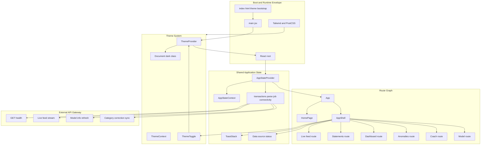
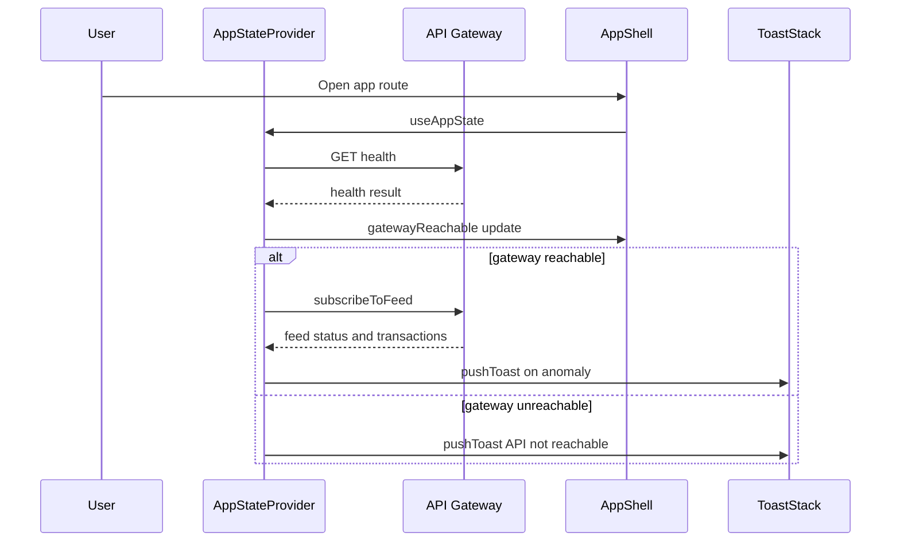
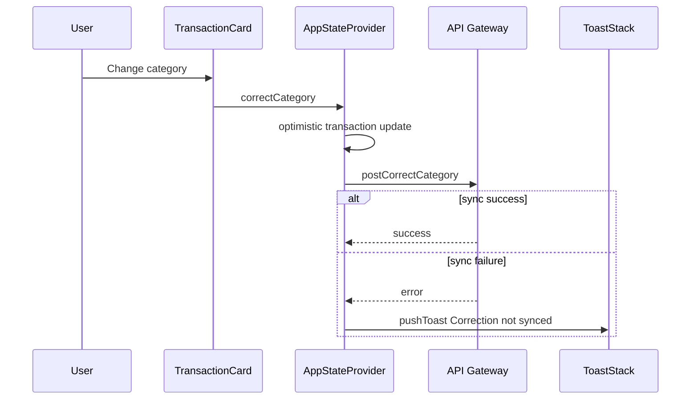
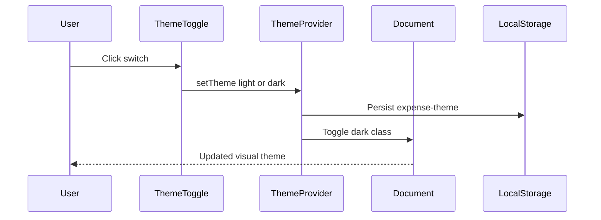

# Financial Data Visualization and Dashboarding DOMAIN - Frontend Shell, Routing, Theme System, and Shared Application State

## Overview

This frontend domain composes the public landing experience and the authenticated-style application shell for the personal expense intelligence platform. The landing page at `/` presents the product narrative, while the `/app` route family wraps the live feed, statement upload, dashboard, anomalies, coach, and model pages in a persistent shell with shared navigation, theme controls, connectivity status, and toast notifications.

The shared state layer centralizes the client-side transaction buffer, parse job progress, gateway reachability, model metadata, toast queue, and live feed status. That state is exposed through `AppStateContext.jsx` and consumed by the shell, the notification stack, and route pages. Theme behavior is handled separately by `ThemeContext.jsx`, with `ThemeToggle.jsx` providing the user-facing switch used on both the landing page and inside the app shell.

## Architecture Overview



## Routing and Shell Composition

### `main.jsx`

*File path: `frontend/src/main.jsx`*

`main.jsx` is the application bootstrap. It mounts the React tree into `#root` and defines the provider order that every route and shell component inherits.

#### Composition order

| Order | Wrapper | Responsibility |
| --- | --- | --- |
| 1 | `StrictMode` | Development-time React checks |
| 2 | `ThemeProvider` | Theme state, persistence, and document class updates |
| 3 | `BrowserRouter` | Client-side route resolution |
| 4 | `AppStateProvider` | Shared expense, feed, parse, and connectivity state |
| 5 | `App` | Route tree and lazy page loading |


#### Provider responsibilities

| Provider | Props | Behavior |
| --- | --- | --- |
| `ThemeProvider` | `children` | Restores theme from `localStorage`, tracks system preference, and toggles the root `dark` class |
| `AppStateProvider` | `children` | Owns transactions, parse jobs, toasts, model info, connectivity, and live feed metadata |


### `App.jsx`

*File path: `frontend/src/App.jsx`*

`App.jsx` defines the route map and wraps the route tree in `Suspense` so page bundles can load lazily. The default fallback is a centered loading spinner with the text `Loading module…`.

#### Route map

| Route | Element | Notes |
| --- | --- | --- |
| `/` | `HomePage` | Landing experience |
| `/app` | `AppShell` | Shell wrapper for all application pages |
| `/app` | `LiveFeedPage` | Index route inside the shell |
| `/app/upload` | `UploadPage` | Statement upload route |
| `/app/dashboard` | `DashboardPage` | Analytics dashboard route |
| `/app/anomalies` | `AnomaliesPage` | Anomalies route |
| `/app/coach` | `CoachPage` | Coaching route |
| `/app/model` | `ModelPage` | Model visibility route |
| `/upload` | Redirect to `/app/upload` | Legacy shortcut |
| `/dashboard` | Redirect to `/app/dashboard` | Legacy shortcut |
| `/anomalies` | Redirect to `/app/anomalies` | Legacy shortcut |
| `/coach` | Redirect to `/app/coach` | Legacy shortcut |
| `/model` | Redirect to `/app/model` | Legacy shortcut |
| `*` | Redirect to `/` | Catch-all fallback |


#### Internal component

| Component | Description |
| --- | --- |
| `PageFallback` | Renders a spinner and loading label while lazy route chunks resolve |


### `AppShell.jsx`

*File path: `frontend/src/components/layout/AppShell.jsx`*

`AppShell` frames every `/app/*` route with a responsive shell that changes structure between desktop and mobile. On desktop it renders a persistent sidebar; on mobile it renders a sticky header, a slide-in overlay menu, and a bottom dock.

#### Component responsibilities

| Component | Description |
| --- | --- |
| `AppShell` | Owns shell layout, mobile drawer state, route label resolution, and page framing |
| `NavItems` | Renders the shared navigation list for desktop, mobile drawer, and bottom dock |
| `DataSourceStatus` | Shows gateway reachability state derived from `AppStateContext` and `API_BASE` |
| `MobileBottomDock` | Renders the compact mobile route switcher |


#### `AppShell` properties

| Property | Type | Description |
| --- | --- | --- |
| `mobileOpen` | `boolean` | Controls visibility of the mobile drawer |
| `pathname` | `string` | Current route path from `useLocation()` |
| `current` | `NAV item` | Active shell label resolved from the current pathname |


#### `NAV` configuration

| `to` | `label` | `end` | Icon |
| --- | --- | --- | --- |
| `/app` | `Live feed` | `true` | `Zap` |
| `/app/upload` | `Statements` | `false` | `Upload` |
| `/app/dashboard` | `Dashboard` | `false` | `LayoutDashboard` |
| `/app/anomalies` | `Anomalies` | `false` | `TriangleAlert` |
| `/app/coach` | `Coach` | `false` | `Sparkles` |
| `/app/model` | `Model` | `false` | `Cpu` |


#### Internal helper props

| Component | Props |
| --- | --- |
| `NavItems` | `onNavigate`, `mobile` |
| `DataSourceStatus` | `className = ''` |
| `MobileBottomDock` | None |


#### Shell behavior

- Desktop sidebar renders the brand mark, product label, route list, theme toggle, and data source status.
- Mobile header renders the current route label, a theme toggle, and a menu button.
- The mobile drawer uses `AnimatePresence` and `motion.aside` for a slide-in transition.
- The `Outlet` region hosts the active child route page.
- `ToastStack` is mounted at shell level so notifications persist across route changes.

### `ToastStack.jsx`

AppShell resolves the active route label from useLocation(), so the mobile header title stays synchronized with the URL instead of requiring page-level title wiring.

*File path: `frontend/src/components/layout/ToastStack.jsx`*

`ToastStack` renders the toast queue from `AppStateContext` and provides dismiss actions for individual messages. It is part of the shell frame, so notifications remain visible while users move between `/app/*` routes.

#### Properties and behavior

| Property | Type | Description |
| --- | --- | --- |
| `toasts` | `Toast[]` | Context-backed queue of toast objects |
| `dismissToast` | `function` | Removes a toast by id |


| Method | Description |
| --- | --- |
| `dismissToast` | Clears a single toast from the queue |


#### Toast content visible in the shell

- `title`
- `body`
- toast-specific visual variant used for iconography and styling
- optional `txn_id` marker used by the anomaly workflow

### `HomePage.jsx`

*File path: `frontend/src/pages/HomePage.jsx`*

`HomePage` is the landing route at `/`. In this section, the relevant shell behavior is that it also uses `ThemeToggle` in the top navigation so theme selection is available before entering the app.

#### Shell-facing responsibilities

| Property | Type | Description |
| --- | --- | --- |
| `activeModule` | `string` | Landing-page section selection |
| `openFaq` | `number` | FAQ expansion state |
| `activeStep` | `number` | Journey highlight state |
| `activeSection` | `string` | Scroll-tracked navigation state |
| `spotlight` | `object` | Cursor spotlight position and activation flag |
| `highlightIndex` | `number` | Rotating highlight text index |
| `canHover` | `boolean` | Pointer-capability gate for hover effects |
| `panelTilt` | `object` | 3D tilt values for the hero panel |


#### Theme and entry-point behavior

- Uses `ThemeToggle` in the landing nav.
- Provides a `Link` to `/app` for entry into the shell.
- Reuses the same global theme state as the app shell because `ThemeProvider` wraps both route families.

## Shared Application State

### `AppStateContext.jsx`

*File path: `frontend/src/context/AppStateContext.jsx`*

`AppStateContext` is the shared client-state hub for the application. It holds transaction history, live feed state, parse progress, model information, gateway reachability, correction counts, and transient toasts. The provider also coordinates backend synchronization through helper functions imported from `../lib/api`.

#### Exported API

| Function | Description |
| --- | --- |
| `AppStateProvider` | Provides the shared application state to the route tree |
| `useAppState` | Reads the shared state and actions from context |


#### `AppStateProvider` props

| Property | Type | Description |
| --- | --- | --- |
| `children` | `ReactNode` | Application subtree that can consume the shared state |


#### Internal state slices

| State | Type | Description |
| --- | --- | --- |
| `transactions` | `array` | Live transaction buffer used by route pages |
| `streamOn` | `boolean` | Enables or disables live feed subscription |
| `parseJob` | `object \ | null` | Current statement parsing progress |
| `toasts` | `array` | Notification queue shown by `ToastStack` |
| `modelInfo` | `object` | Current model metadata snapshot |
| `correctionsTotal` | `number` | Count of successful local category corrections |
| `gatewayReachable` | `boolean \ | null` | API gateway health state |
| `liveFeedMeta` | `object \ | null` | Status metadata from the live feed stream |
| `liveFeedReady` | `boolean` | Becomes `true` once the feed announces readiness |


#### Context value properties

| Property | Type | Description |
| --- | --- | --- |
| `transactions` | `array` | Transaction buffer exposed to pages |
| `streamOn` | `boolean` | Live feed toggle |
| `setStreamOn` | `function` | Updates `streamOn` |
| `parseJob` | `object \ | null` | Current parse job record |
| `startParseJob` | `function` | Creates a new upload parse job |
| `updateParseJob` | `function` | Merges progress data into the current parse job |
| `finishParseJob` | `function` | Marks the current parse job complete or errored |
| `toasts` | `array` | Toast queue |
| `dismissToast` | `function` | Removes a toast by id |
| `addTransaction` | `function` | Prepends a transaction to the buffer |
| `correctCategory` | `function` | Optimistically changes a transaction category and syncs it to the backend |
| `markAnomalyAction` | `function` | Updates `user_anomaly_action` for a transaction |
| `modelInfo` | `object` | Model metadata |
| `setModelInfo` | `function` | Replaces the model metadata snapshot |
| `correctionsTotal` | `number` | Local correction counter |
| `updateModelAfterRetrain` | `function` | Refreshes model metadata after retraining |
| `pushToast` | `function` | Adds a toast to the queue |
| `gatewayReachable` | `boolean \ | null` | Health probe result |
| `liveFeedMeta` | `object \ | null` | Live stream status metadata |
| `liveFeedReady` | `boolean` | Feed readiness flag |


#### Shared data shapes

##### `parseJob`

| Property | Type | Description |
| --- | --- | --- |
| `running` | `boolean` | Whether a parse job is active |
| `step` | `string` | Current progress stage such as `upload`, `done`, or `error` |
| `label` | `string` | User-facing progress label |
| `done` | `number` | Completed units |
| `total` | `number` | Total units expected |
| `indeterminate` | `boolean` | Whether the UI should show indeterminate progress |


##### `modelInfo`

| Property | Type | Description |
| --- | --- | --- |
| `version` | `string` | Model version string |
| `training_rows` | `number` | Training row count |
| `eval_accuracy` | `number` | Evaluation accuracy |
| `last_retrained` | `string \ | null` | Timestamp of the last retrain |
| `confusionMatrix` | `array` | Stored confusion matrix data |
| `correctionCounts` | `object` | Per-class correction counts |


##### `liveFeedMeta`

| Property | Type | Description |
| --- | --- | --- |
| `kind` | `string` | Status kind such as `connecting`, `waiting_kafka`, `kafka_unavailable`, or `sse_error` |
| `bootstrap` | `string` | Kafka bootstrap reference when present |
| `error` | `string` | Error detail when present |
| `hint` | `string` | Informational hint when present |


#### Public methods

| Method | Description |
| --- | --- |
| `pushToast` | Adds a toast and auto-removes it after 6 seconds |
| `dismissToast` | Removes a toast immediately |
| `addTransaction` | Prepends a transaction and emits an anomaly toast when `txn.anomaly` is present |
| `correctCategory` | Applies an optimistic category update, then posts the correction to the backend |
| `markAnomalyAction` | Persists a user anomaly action in local state |
| `startParseJob` | Initializes an upload parse job |
| `updateParseJob` | Merges incremental progress fields into the active parse job |
| `finishParseJob` | Marks the parse job as done or error |
| `updateModelAfterRetrain` | Re-fetches model metadata after a 2 second delay |
| `setStreamOn` | Enables or disables live feed streaming |
| `setModelInfo` | Replaces the current model snapshot |


#### State management rules

- `pushToast` keeps only the newest five prior items before appending the next toast.
- Each toast auto-expires after 6 seconds.
- `addTransaction` caps the transaction buffer to `MAX_FEED`, which is `180`.
- `correctCategory` updates the UI immediately, sets `confidence` to `0.99`, and clears `review_required` before attempting backend sync.
- `markAnomalyAction` only updates local state.
- `startParseJob` seeds a parse job with `running: true`, `step: 'upload'`, `label: 'Uploading…'`, and `indeterminate: false`.
- `finishParseJob('success')` sets `running: false`, `step: 'done'`, and `label: 'Done'`.
- `finishParseJob('error')` keeps the last label and switches the step to `error`.

#### Error handling behavior

| Action | Error path |
| --- | --- |
| Gateway health probe | Sets `gatewayReachable` to `false` when the API base is absent or health fails |
| Category sync | Leaves the optimistic local change in place and raises a `Correction not synced` toast when the backend call fails |
| Retrain refresh | Swallows refresh failures silently after the delayed refetch attempt |
| Toast cleanup | Removes expired toasts even if the UI does not manually dismiss them |


#### Gateway connectivity and live feed probe

`AppStateProvider` polls gateway health when `API_BASE` is configured, then subscribes to the live feed only after the gateway reports reachable.

#### API endpoint

##### Probe Gateway Health

```api
{
    "title": "Probe Gateway Health",
    "description": "Checks whether the configured API gateway is reachable before live feed and model refresh logic run.",
    "method": "GET",
    "baseUrl": "<API_BASE>",
    "endpoint": "/health",
    "headers": [],
    "queryParams": [],
    "pathParams": [],
    "bodyType": "none",
    "requestBody": "",
    "formData": [],
    "rawBody": "",
    "responses": {
        "200": {
            "description": "Gateway reachable",
            "body": true
        }
    }
}
```

#### Connectivity flow



#### Transaction correction flow



#### Parse job flow

| Stage | Trigger | Result |
| --- | --- | --- |
| `upload` | `startParseJob` | Creates an active parse job record |
| `progress` | `updateParseJob` | Merges incremental status fields |
| `done` | `finishParseJob('success')` | Marks the job complete |
| `error` | `finishParseJob('error')` | Preserves the last label and marks the job errored |


### `ThemeContext.jsx`

*File path: `frontend/src/context/ThemeContext.jsx`*

`ThemeContext` owns the application theme preference and keeps the root document class in sync with that preference. It stores the selected theme in `localStorage` under `expense-theme`, listens to system theme changes when `theme === 'system'`, and updates `document.documentElement.classList`.

#### Exported API

| Function | Description |
| --- | --- |
| `ThemeProvider` | Provides theme state and system sync to the app |
| `useTheme` | Reads the theme context |


#### `ThemeProvider` props

| Property | Type | Description |
| --- | --- | --- |
| `children` | `ReactNode` | Application subtree that can consume the theme context |


#### Context value properties

| Property | Type | Description |
| --- | --- | --- |
| `theme` | `string` | Stored preference from `localStorage` |
| `setTheme` | `function` | Updates the stored preference |
| `effective` | `string` | Resolved theme used for rendering, `dark` or `light` |


#### Theme behavior

| Behavior | Description |
| --- | --- |
| Initial load | Reads `expense-theme` from `localStorage` and falls back to `system` |
| System sync | Watches `(prefers-color-scheme: dark)` only when the stored theme is `system` |
| Document update | Toggles the `dark` class on `document.documentElement` |
| Persistence | Writes the selected theme back to `localStorage` |
| Error handling | Ignores storage exceptions |


#### Theme state flow



### `ThemeToggle.jsx`

*File path: `frontend/src/components/ui/ThemeToggle.jsx`*

`ThemeToggle` is the user-facing theme switch used in both the landing page and the app shell. It renders as a `switch`-role button with sun and moon icons, a sliding thumb, and the current state derived from `ThemeContext`.

#### Properties

| Property | Type | Description |
| --- | --- | --- |
| `className` | `string` | Optional styling override |


#### Public methods

| Method | Description |
| --- | --- |
| `onClick` | Toggles between `light` and `dark` based on the resolved theme |


#### Behavior

- Uses `effective` to determine whether the UI is currently dark or light.
- Calls `setTheme(isDark ? 'light' : 'dark')` when clicked.
- Exposes `aria-checked` and `aria-label` for accessibility.
- Reused in:- `HomePage` top navigation
- `AppShell` desktop sidebar
- `AppShell` mobile header
- `AppShell` mobile drawer

## Build and Runtime Envelope

### `package.json`

The theme provider supports system, but ThemeToggle itself only cycles between explicit light and dark selections.

*File path: `frontend/package.json`*

The package manifest defines the Vite React application, its scripts, and the UI runtime dependencies.

#### Scripts

| Script | Command | Purpose |
| --- | --- | --- |
| `dev` | `vite` | Starts the development server |
| `build` | `vite build` | Produces the production bundle |
| `lint` | `eslint .` | Lints the frontend source tree |
| `preview` | `vite preview` | Serves the production build locally |
| `test:e2e` | `playwright test` | Runs browser-level tests |


#### Runtime dependencies

| Package | Role in this shell and state layer |
| --- | --- |
| `react` | Component runtime |
| `react-dom` | DOM rendering |
| `react-router-dom` | Route composition, navigation, redirects, and `Outlet` rendering |
| `framer-motion` | Shell transitions, drawer animation, toast animation, and fallback animation |
| `lucide-react` | Icon set used across shell, theme toggle, and status badges |
| `@tanstack/react-virtual` | Virtualization support used by route pages in the app shell |
| `recharts` | Charting dependency used by route pages in the app shell |


#### Development dependencies

| Package | Role |
| --- | --- |
| `vite` | Build tool and dev server |
| `@vitejs/plugin-react` | React plugin for Vite |
| `tailwindcss` | Utility styling pipeline |
| `postcss` | CSS processing |
| `autoprefixer` | Vendor prefixing |
| `eslint` | Static analysis |
| `@eslint/js` | ESLint base rules |
| `eslint-plugin-react-hooks` | Hook rule enforcement |
| `eslint-plugin-react-refresh` | Fast-refresh safety rules |
| `@playwright/test` | End-to-end tests |
| `globals` | Browser globals for ESLint |
| `@types/react` / `@types/react-dom` | Type definitions used by the template tooling |


### `vite.config.js`

*File path: `frontend/vite.config.js`*

The Vite configuration only registers the React plugin.

| Property | Value | Purpose |
| --- | --- | --- |
| `plugins` | `[react()]` | Enables React JSX handling and fast refresh integration |


### `tailwind.config.js`

*File path: `frontend/tailwind.config.js`*

Tailwind is configured for class-based dark mode and scans the HTML entrypoint plus all source JS, TS, JSX, and TSX files.

#### Config values

| Property | Value | Purpose |
| --- | --- | --- |
| `darkMode` | `class` | Enables the `dark` class strategy used by `ThemeContext` and `index.html` |
| `content` | , `./src/**/*.{js,ts,jsx,tsx}` | Purge and class detection targets |


#### Theme extension

| Area | Values defined |
| --- | --- |
| Fonts | `sans`, `display` |
| Colors | `surface`, `content`, `accent`, `border` |
| Shadows | `soft`, `glow`, `card`, `card-hover`, `inner-glow` |
| Backgrounds | `gradient-radial`, `mesh` |
| Keyframes | `pulseSlow`, `borderGlow`, `shimmer`, `cardEnter` |
| Animations | `pulseSlow`, `borderGlow`, `shimmer`, `cardEnter` |


### `postcss.config.js`

*File path: `frontend/postcss.config.js`*

The PostCSS pipeline is minimal and ordered for Tailwind output plus browser prefixing.

| Plugin | Role |
| --- | --- |
| `tailwindcss` | Expands Tailwind directives |
| `autoprefixer` | Adds vendor prefixes for target browsers |


### `eslint.config.js`

*File path: `frontend/eslint.config.js`*

The ESLint setup uses flat config for JS and JSX files.

#### Rules and scope

| Setting | Value | Effect |
| --- | --- | --- |
| `globalIgnores` | `dist` | Excludes build output |
| `files` | `**/*.{js,jsx}` | Lints JavaScript and JSX files |
| `extends` | `js.configs.recommended`, `reactHooks.configs.flat.recommended`, `reactRefresh.configs.vite` | Base lint rules and React-specific checks |
| `globals` | `globals.browser` | Browser globals available in frontend files |
| `ecmaVersion` | `latest` | Modern JS syntax |
| `sourceType` | `module` | ESM parsing |
| `no-unused-vars` | Error with `varsIgnorePattern: '^[A-Z_]'` | Keeps uppercase constants like component names and configuration arrays exempt from false positives |


### `index.html`

*File path: `frontend/index.html`*

`index.html` defines the document shell and performs the first theme decision before React mounts.

#### Document-level behavior

| Feature | Description |
| --- | --- |
| Charset | `UTF-8` |
| Viewport | Includes `viewport-fit=cover` for device-safe-area support |
| Title | `Expense Intelligence` |
| Description | `Personal Expense Intelligence — live categorisation, statements, and GenAI insights.` |
| Favicon |  |
| Root container | `<div id="root"></div>` |
| Entry script | Loads  as a module |


#### Early theme bootstrap

| Step | Behavior |
| --- | --- |
| Read `expense-theme` | Pulls the stored preference from `localStorage` |
| Compute theme | Uses stored value or system dark preference |
| Apply class | Toggles `dark` on `document.documentElement` |


That inline script keeps the initial render aligned with the persisted theme before React and Tailwind finish booting.

### `README.md`

*File path: `frontend/README.md`*

The README is the default Vite React template guidance. It documents the Vite React baseline, notes that React Compiler is not enabled, and points to TypeScript and type-aware ESLint guidance for future expansion.

#### What it contributes to this section

| Topic | Content |
| --- | --- |
| Build stack | React + Vite starter notes |
| React compiler | Explicitly not enabled |
| ESLint expansion | Guidance toward type-aware linting in TypeScript projects |


## Testing Considerations

### 

*File path: `frontend/e2e/app.spec.js`*

The Playwright smoke tests verify the shell entry points that this section owns.

| Test | Assertion |
| --- | --- |
| `dashboard loads and shows app shell` | Visiting `/` makes `Expense IQ` visible |
| `live feed screen can be opened` | Clicking the `Live feed` route opens the shell page and shows `Live transaction feed` |


### E2E command

| Script | Command |
| --- | --- |
| `test:e2e` | `playwright test` |


## Key Classes Reference

| Class | Responsibility |
| --- | --- |
| `App.jsx` | Defines the app route graph and lazy-loaded page boundaries |
| `main.jsx` | Bootstraps the React tree and composes providers |
| `AppShell.jsx` | Frames the `/app/*` route family with responsive navigation and status UI |
| `ToastStack.jsx` | Displays transient notifications from shared state |
| `AppStateContext.jsx` | Owns transactions, live feed, parse jobs, gateway state, model info, and correction actions |
| `ThemeContext.jsx` | Stores and resolves the active theme across the app |
| `ThemeToggle.jsx` | Provides the user-facing dark and light mode switch |
| `HomePage.jsx` | Presents the landing route and exposes theme entry controls |
| `package.json` | Defines scripts, dependencies, and the frontend runtime |
| `vite.config.js` | Registers Vite React support |
| `tailwind.config.js` | Configures Tailwind tokens, dark mode, and utility generation |
| `postcss.config.js` | Defines the CSS processing pipeline |
| `eslint.config.js` | Defines linting rules for JS and JSX sources |
| `index.html` | Boots the document shell and pre-applies the theme |
| `README.md` | Describes the Vite React starter and template guidance |
| `app.spec.js` | Verifies landing and app shell entry points through Playwright |
