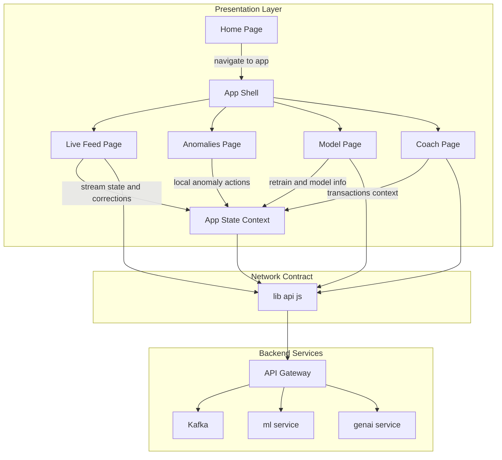
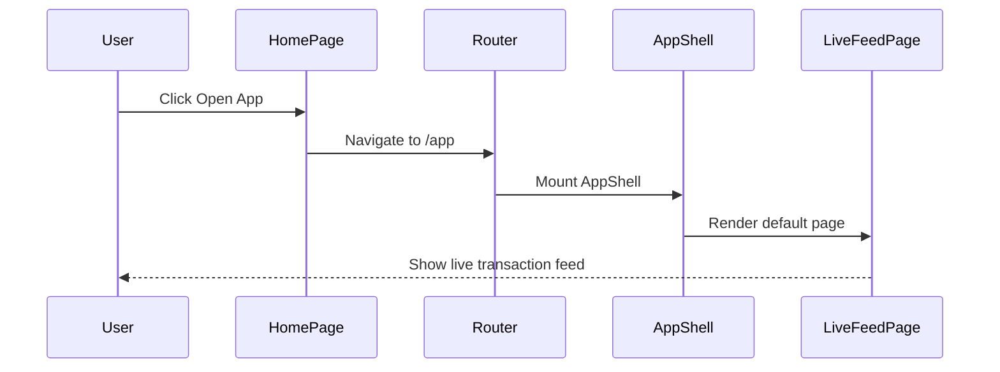
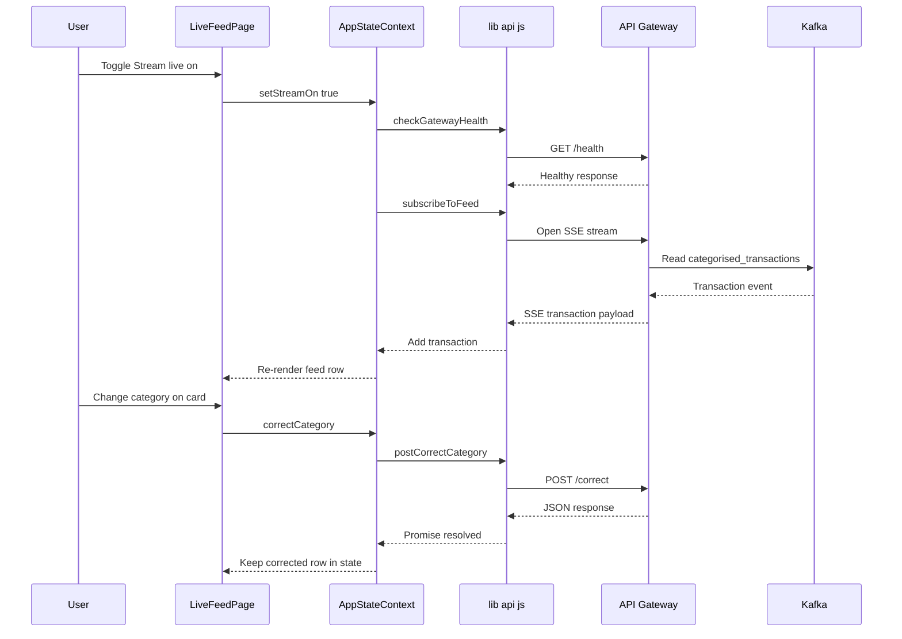
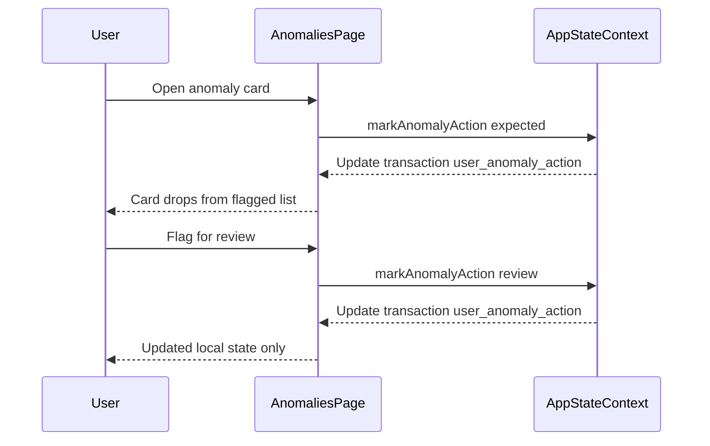
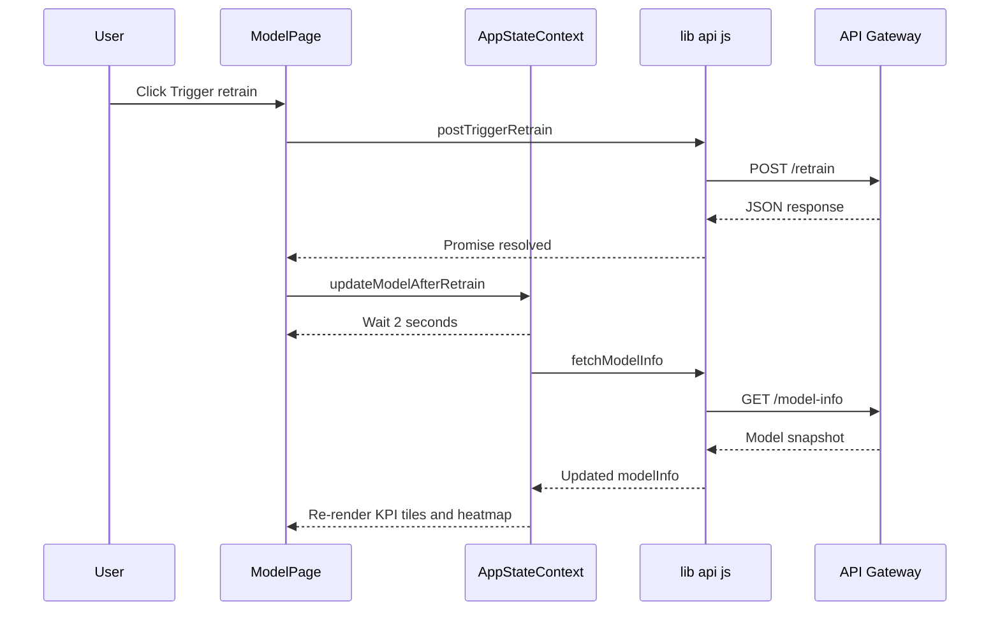
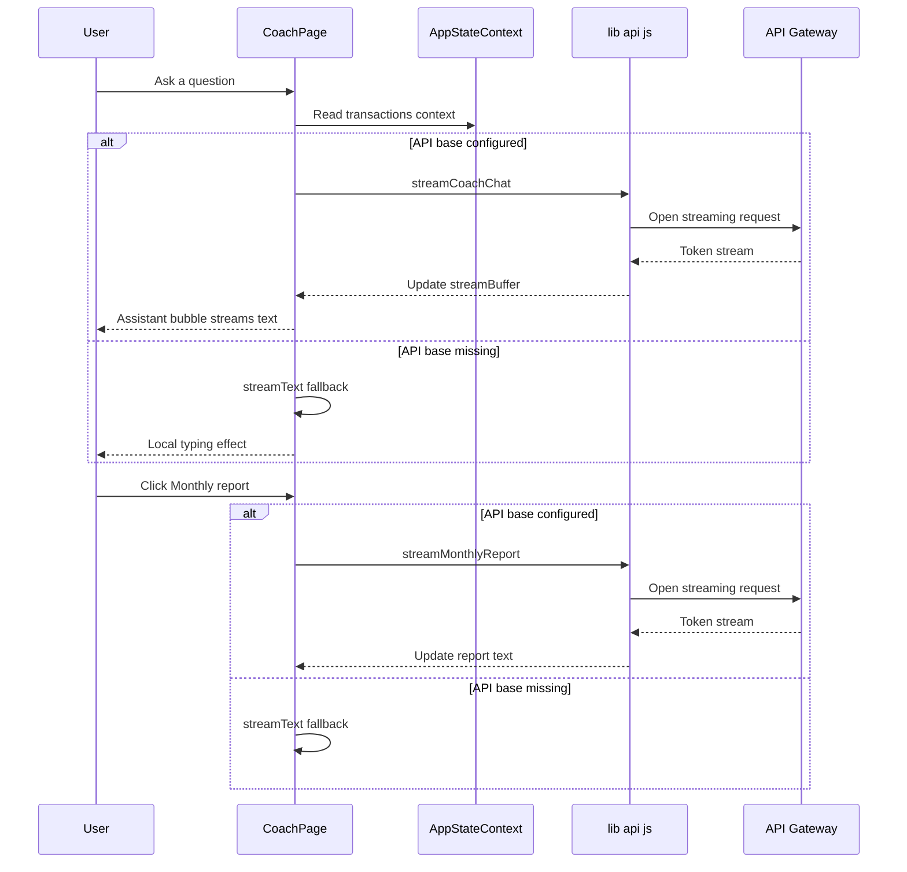

# Financial Data Visualization and Dashboarding Domain

## Overview

This part of the frontend presents the operational face of the expense intelligence platform. The landing experience in  introduces the product narrative before login, then routes users into the operational surface where they can watch live transaction activity, review anomalies, inspect model quality, and chat with the financial coach.

The pages are wired into the shared application shell and the network contract in .  mounts the landing page and the `/app` workspace, while  guards the presence of the operational page files so the visible product surface does not disappear during refactors.

## Architecture Overview



## Navigation and Route Surface

 defines the visible surface area for this section:

| Route | Component | Notes |
| --- | --- | --- |
| `/` | `HomePage` | Landing narrative and entry point to the app |
| `/app` | `AppShell` + `LiveFeedPage` | Default operational view |
| `/app/anomalies` | `AnomaliesPage` | Anomaly review workspace |
| `/app/coach` | `CoachPage` | GenAI financial coach |
| `/app/model` | `ModelPage` | Model observability page |
| `/app/upload` | `UploadPage` | Present in the route map and checked by tests |
| `/app/dashboard` | `DashboardPage` | Present in the route map and checked by tests |
| `/upload` | redirect to `/app/upload` | Legacy redirect |
| `/dashboard` | redirect to `/app/dashboard` | Legacy redirect |
| `/anomalies` | redirect to `/app/anomalies` | Legacy redirect |
| `/coach` | redirect to `/app/coach` | Legacy redirect |
| `/model` | redirect to `/app/model` | Legacy redirect |


 uses a prominent `Link` to `/app`, while the sticky navigation uses in-page anchors for the landing sections.  also verifies that the home page loads and that the live feed route can be opened from the shell.

## Landing Narrative and Page Content

 behaves like a product website before authentication. It uses animated hero text, a sticky nav, a progress bar, section-based storytelling, and CTA buttons that move the user into the operational workspace.

### Home Page

*frontend/src/pages/HomePage.jsx*

#### Purpose

- Introduces the platform as a “Personal Expense Intelligence Platform.”
- Explains the value of live transaction awareness, statement understanding, anomaly signals, AI coaching, and model transparency.
- Routes the user into `/app` through the primary CTA.

#### Local state and motion inputs

| State | Type | Purpose |
| --- | --- | --- |
| `activeModule` | `string` | Controls the highlighted product module in the platform section |
| `openFaq` | `number` | Tracks the expanded FAQ item |
| `activeStep` | `number` | Tracks the active step in the journey panel |
| `activeSection` | `string` | Tracks the section currently visible in the viewport |
| `spotlight` | `{ x: number, y: number, active: boolean }` | Drives the hover spotlight effect |
| `highlightIndex` | `number` | Rotates the “Experience highlight” message |
| `canHover` | `boolean` | Enables hover-only effects for pointer-capable devices |
| `panelTilt` | `{ rx: number, ry: number }` | Controls the 3D tilt of the active module panel |


#### Helper component: `SectionTitle`

| Prop | Type | Description |
| --- | --- | --- |
| `kicker` | `string` | Uppercase eyebrow above the section title |
| `title` | `string` | Main section heading |
| `body` | `string \ | undefined` | Optional supporting copy |


#### Narrative data blocks

| Block | Entries | Meaning |
| --- | --- | --- |
| `MODULES` | `live-intelligence`, `statement-experience`, `analytics-insights`, `anomaly-signals`, `coach-layer`, `model-observability` | The six product pillars presented in the platform section |
| `JOURNEY` | `Connect`, `Understand`, `Act` | The user journey shown as a 3-step progression |
| `EXPERIENCE_HIGHLIGHTS` | `Dynamic pre-login storytelling`, `Responsive interaction patterns`, `Action-focused data visibility`, `AI-guided decision support` | Rotating hero highlight copy |
| `IMPACT_STATS` | `50K+`, `99.9%`, `<2s` | Marketing-style platform claims surfaced in the landing page |
| `TRUSTED_BY` | `Axis Finance Team`, `Urban Retail Group`, `Mahindra Fleet Ops`, `Razorpay Commerce`, `IDFC First Desk`, `TVS Mobility Ops` | Trust strip content |
| `FAQ` | Three Q and A items | Pre-entry clarifications about the product |
| `NAV_ITEMS` | `overview`, `platform`, `journey`, `faq` | In-page landing navigation |


#### Behavior

- Uses `useScroll`, `useSpring`, and `useTransform` to drive the progress bar and hero motion.
- Uses `IntersectionObserver` to update `activeSection` as the user scrolls.
- Uses `setInterval` to rotate the feature spotlight and highlight text when reduced-motion is not enabled.
- Uses `Link` to `/app` for the primary conversion path.
- Uses `ThemeToggle` so the landing page shares the same theme system as the app shell.

#### UI states

| State | Trigger | Visible result |
| --- | --- | --- |
| Initial | Page mount | Animated hero and section shell load |
| Section active | Scrolling | Nav pills and section spotlight update |
| Hover-capable | Pointer input available | Spotlight and tilt interactions activate |
| Reduced motion | User preference | Interval-driven motion effects stop |


### Live Feed Page

*frontend/src/pages/LiveFeedPage.jsx*

#### Purpose

- Shows the streaming transaction feed.
- Lets the user pause or resume live updates with the `Stream live` checkbox.
- Surfaces Kafka and gateway readiness states.
- Allows inline category correction on low-confidence transactions through `correctCategory`.

#### Local and shared inputs

| Source | Type | Purpose |
| --- | --- | --- |
| `transactions` | array | Live transaction buffer rendered as cards |
| `streamOn` | boolean | Controls whether the feed should subscribe to SSE |
| `setStreamOn` | function | Toggles live streaming |
| `correctCategory` | function | Sends a correction for a transaction |
| `liveFeedMeta` | object \ | null | Carries stream setup and Kafka status information |
| `liveFeedReady` | boolean | Gates the empty-state messaging |
| `gatewayReachable` | boolean \ | null | Reflects API gateway health |


#### Virtualized list settings

| Setting | Value | Effect |
| --- | --- | --- |
| `count` | `transactions.length` | One row per transaction |
| `estimateSize` | `200` | Approximate height per row |
| `overscan` | `6` | Keeps nearby cards mounted |
| `gap` | `16` | Visual spacing between virtual rows |
| `getItemKey` | `txn_id` or index fallback | Stable rendering key |


#### Feed states

| State | Condition | UI result |
| --- | --- | --- |
| Connecting to Kafka | `liveFeedMeta.kind === 'waiting_kafka'` | Amber status banner with broker details |
| Kafka unavailable | `liveFeedMeta.kind === 'kafka_unavailable'` | Red alert with operator hint |
| SSE interrupted | `liveFeedMeta.kind === 'sse_error' && gatewayReachable` | Retry banner |
| Stream on | `streamOn === true` | Activity indicator pulses |
| Empty buffer | No transactions and feed ready | Kafka bootstrap explanation and producer checklist |
| Populated feed | Transactions exist | Virtualized `TransactionCard` rows render |


#### Behavior

- Renders a stream status header with `Activity`, `Radio`, `Info`, and `AlertCircle` indicators.
- Displays a live transaction count and gateway connectivity summary.
- Uses `TransactionCard` for each visible row and passes `correctCategory` as `onCorrect`.
- Explains the backend path for the feed with inline references to Kafka, `ml-service`, and the simulator.

### Anomalies Page

*frontend/src/pages/AnomaliesPage.jsx*

#### Purpose

- Presents transactions with anomaly flags that have not yet been resolved by the user.
- Lets the user mark each anomaly as expected or flag it for review.
- Keeps the anomaly action in local app state for audit-style visibility.

#### Helper function: `anomalyTypeLabel`

| Input | Output behavior |
| --- | --- |
| `anomaly.type` | Converts underscores to spaces and returns the string |
| `anomaly.types` | Joins the list with `·` after underscore replacement |
| Missing anomaly | Returns `Anomaly` |


#### Derived state

| State | Type | Purpose |
| --- | --- | --- |
| `flagged` | array | Transactions where `t.anomaly` is present and `t.user_anomaly_action` is not set |


#### Action behavior

| Action | Handler | Effect |
| --- | --- | --- |
| Expected | `markAnomalyAction(t.txn_id, 'expected')` | Updates the transaction locally |
| Flag for review | `markAnomalyAction(t.txn_id, 'review')` | Updates the transaction locally |


#### UI states

| State | Condition | Visible result |
| --- | --- | --- |
| Flagged items present | `flagged.length > 0` | Red anomaly cards with category badge, reason, amount, and actions |
| No open anomalies | `flagged.length === 0` | “All clear” empty state |


#### Behavior

markAnomalyAction mutates the transaction list inside AppStateContext; it does not call  for a backend write. The anomaly review screen therefore behaves as a local resolution surface for the currently loaded buffer.

- Uses `CategoryBadge` and `formatDateTime` for transaction context.
- Displays `t.anomaly.reason`, `merchant_clean`, `merchant_raw`, and formatted amount.
- Tags anomaly cards with `anomalyTypeLabel(t.anomaly)` so the reason stays readable even when the backend sends `type` or `types`.

### Model Page

*frontend/src/pages/ModelPage.jsx*

#### Purpose

- Exposes model observability and retraining controls.
- Reads backend model metadata through `GET /model-info`.
- Sends retrain requests through `postTriggerRetrain`.
- Refreshes model info after a retrain window.

#### Local state and derived values

| State | Type | Purpose |
| --- | --- | --- |
| `busy` | boolean | Controls the retrain button loading state |
| `msg` | string \ | null | Displays success or failure feedback |
| `heat` | number[][] | Confusion matrix extracted from `modelInfo.confusionMatrix` |
| `maxVal` | number | Used to normalize heatmap opacity |
| `hasData` | boolean | Derived from `modelInfo.training_rows > 0` |


#### Helper component: `Stat`

| Prop | Type | Description |
| --- | --- | --- |
| `label` | `string` | KPI label |
| `value` | `string` | Display value |
| `delay` | `number` | Animation delay |
| `highlight` | `boolean \ | undefined` | Uses the emphasized stat style when true |


#### Visible model metrics

| Metric | Source | Meaning |
| --- | --- | --- |
| `Model version` | `modelInfo.version` | Current backend-reported model version |
| `Training rows` | `modelInfo.training_rows` | Number of rows used for training |
| `Eval accuracy` | `modelInfo.eval_accuracy` | Evaluation accuracy displayed as a percentage |
| `Last retrained` | `modelInfo.last_retrained` | Timestamp rendered with `toLocaleString()` |
| `Corrections (session)` | `correctionsTotal` | Local count of corrections in the current session |
| `Registry stage` | static text | `Staging → Prod gate` |


#### UI states

| State | Condition | Visible result |
| --- | --- | --- |
| Backend not connected | `!API_BASE` | Setup hint for `VITE_API_BASE_URL` |
| No model info yet | `API_BASE && !hasData` | Prompt to train  and restart |
| Model data ready | `hasData` | KPI tiles, confusion heatmap, and correction counts |


#### Behavior

- Uses `postTriggerRetrain()` inside `trigger()`, then calls `updateModelAfterRetrain()` from `AppStateContext`.
- Shows a spinning `RefreshCw` icon while the retrain request is in flight.
- Renders a confusion heatmap where rows represent actual categories and columns represent predicted categories.
- Renders correction counts per category as a ranked list when `modelInfo.correctionCounts` is not empty.

### Coach Page

*frontend/src/pages/CoachPage.jsx*

#### Purpose

- Provides a GenAI-backed coaching surface for financial questions.
- Streams answers from backend helpers when the API base URL is configured.
- Falls back to a local typing effect when the backend is not configured.
- Proactively prompts for a monthly report at the start of each calendar month.

#### Local state and refs

| State | Type | Purpose |
| --- | --- | --- |
| `messages` | array | Chat transcript containing user and assistant messages |
| `input` | string | Current prompt text |
| `streamingId` | string \ | null | Identifies the assistant message that is actively streaming |
| `streamBuffer` | string | Partial text shown while streaming |
| `abortRef` | ref boolean | Allows the local streamer to stop emitting chunks |


#### Persistent keys

| Key | Use |
| --- | --- |
| `expense_coach_month_boundary` | Stores the month for which the “new month” prompt was shown |
| `expense_coach_month_boundary:auto` | Stores the month for which automatic monthly report triggering has already happened |


#### Chat and report behavior

| Flow | Behavior |
| --- | --- |
| New user message | Appends a user message and an empty assistant message |
| `API_BASE` missing | Uses `streamText()` to simulate a typing assistant response |
| `API_BASE` present | Calls `streamCoachChat(trimmed, transactions, ...)` and streams tokens into `streamBuffer` |
| Monthly report button | Calls `streamMonthlyReport(transactions, ...)` |
| Month boundary effect | Inserts a prompt encouraging the user to request a monthly report |
| Auto monthly report effect | Runs once per month when transactions exist and `API_BASE` is set |


#### Stream fallback

`streamText()` emits text in 4-character chunks every 16 ms. That local behavior is used both for the “no backend configured” case and for the user-facing assistant placeholder while streaming is simulated in-browser.

#### Page footer grounding

The footer shows `formatCurrency(sumDebits(transactions))` as the observed debit total, so the coach session stays tied to the live transaction buffer.

#### UI states

| State | Condition | Visible result |
| --- | --- | --- |
| Welcome | Initial mount | Assistant greeting appears |
| Month boundary prompt | First visit in a new month | Assistant prompt suggests a monthly report |
| Streaming | `streamingId` is set | Assistant bubble shows live text and pulse cursor |
| Input disabled | Streaming in progress | Text box and submit button are disabled |
| Backend unavailable | `!API_BASE` or request failure | Local fallback text or backend error text appears |


## API Contract and Network Facade

 is the client-side contract used by the operational pages. It normalizes `VITE_API_BASE_URL`, trims trailing slashes, and exposes the request helpers consumed by the live feed, model, and correction flows.

### 

*frontend/src/lib/api.js*

#### Public methods

| Method | Description |
| --- | --- |
| `postCorrectCategory` | Sends a transaction category correction to the backend |
| `postTriggerRetrain` | Queues a model retrain job |
| `fetchModelInfo` | Retrieves the current model snapshot |
| `checkGatewayHealth` | Polls `/health` to determine whether the API gateway is reachable |


#### Contract details

- `API_BASE` is derived from `import.meta.env.VITE_API_BASE_URL`.
- `post()` always sends `Content-Type: application/json`.
- `get()` performs a plain `fetch()` and returns parsed JSON.
- `checkGatewayHealth()` uses `AbortController` with a 5 second timeout and `cache: 'no-store'`.
- `fetchModelInfo()` returns `null` when `API_BASE` is unset.
- `postCorrectCategory()` throws when `API_BASE` is unset and optionally enriches the payload with `merchant_raw`, `description`, and `amount` from the supplied transaction snapshot.
- `postTriggerRetrain()` sends an empty JSON body.

#### Correct Transaction Category

```api
{
    "title": "Correct Transaction Category",
    "description": "Sends a transaction correction for one live feed item and optionally includes a transaction snapshot for richer backend labeling.",
    "method": "POST",
    "baseUrl": "<API_BASE>",
    "endpoint": "/correct",
    "headers": [
        {
            "key": "Content-Type",
            "value": "application/json",
            "required": true
        }
    ],
    "queryParams": [],
    "pathParams": [],
    "bodyType": "json",
    "requestBody": "{\n    \"txn_id\": \"txn_2024_000184\",\n    \"correct_category\": \"food_dining\",\n    \"merchant_raw\": \"UBER *TRIP HELP.UBER.COM\",\n    \"description\": \"Ride home after dinner\",\n    \"amount\": 18.75\n}",
    "formData": [],
    "rawBody": "",
    "responses": {
        "200": {
            "description": "Success",
            "body": "[]"
        }
    }
}
```

#### Trigger Retrain

```api
{
    "title": "Trigger Retrain",
    "description": "Queues a model retrain job from the model observability page.",
    "method": "POST",
    "baseUrl": "<API_BASE>",
    "endpoint": "/retrain",
    "headers": [
        {
            "key": "Content-Type",
            "value": "application/json",
            "required": true
        }
    ],
    "queryParams": [],
    "pathParams": [],
    "bodyType": "json",
    "requestBody": "[]",
    "formData": [],
    "rawBody": "",
    "responses": {
        "200": {
            "description": "Success",
            "body": "[]"
        }
    }
}
```

#### Get Model Info

```api
{
    "title": "Get Model Info",
    "description": "Fetches the backend model snapshot used by the model observability page.",
    "method": "GET",
    "baseUrl": "<API_BASE>",
    "endpoint": "/model-info",
    "headers": [],
    "queryParams": [],
    "pathParams": [],
    "bodyType": "none",
    "requestBody": "",
    "formData": [],
    "rawBody": "",
    "responses": {
        "200": {
            "description": "Success",
            "body": "{\n    \"version\": \"v12\",\n    \"training_rows\": 18420,\n    \"eval_accuracy\": 0.942,\n    \"last_retrained\": \"2026-04-08T10:30:00.000Z\",\n    \"confusionMatrix\": [\n        [\n            42,\n            3,\n            1\n        ],\n        [\n            5,\n            37,\n            2\n        ],\n        [\n            0,\n            1,\n            48\n        ]\n    ],\n    \"correctionCounts\": {\n        \"food_dining\": 18,\n        \"transport\": 7,\n        \"shopping\": 5\n    }\n}"
        }
    }
}
```

#### Check Gateway Health

```api
{
    "title": "Check Gateway Health",
    "description": "Checks whether the API gateway responds before the live feed subscribes to SSE.",
    "method": "GET",
    "baseUrl": "<API_BASE>",
    "endpoint": "/health",
    "headers": [],
    "queryParams": [],
    "pathParams": [],
    "bodyType": "none",
    "requestBody": "",
    "formData": [],
    "rawBody": "",
    "responses": {
        "200": {
            "description": "Success",
            "body": "[]"
        }
    }
}
```

### Page-to-Contract Mapping

| Page | Contract usage |
| --- | --- |
| `LiveFeedPage.jsx` | Uses `correctCategory` through `AppStateContext` for inline category correction |
| `ModelPage.jsx` | Uses `postTriggerRetrain` and `fetchModelInfo` |
| `AppStateContext.jsx` | Uses `checkGatewayHealth` to gate live SSE subscription and model refresh |
| `CoachPage.jsx` | Uses the streaming helpers from  and the transaction buffer as grounding context |
| `HomePage.jsx` | No API calls; navigation only |
| `AnomaliesPage.jsx` | No direct API calls; local resolution only |


## Feature Flows

### Landing to Operational Workspace



### Live Feed Monitoring and Correction



### Anomaly Review and Local Resolution



### Model Retrain and Refresh



### Coach Chat and Monthly Report



## State Management and UI Transitions

### Page-level patterns

| Page | Pattern |
| --- | --- |
| `HomePage.jsx` | Local narrative state driven by intervals, scroll progress, and viewport observation |
| `LiveFeedPage.jsx` | Shared live buffer from `AppStateContext` plus virtualized rendering |
| `AnomaliesPage.jsx` | Derived filter state from `transactions` plus local mutation actions |
| `ModelPage.jsx` | Optimistic button state and delayed backend refresh |
| `CoachPage.jsx` | Transcript state, streaming buffer, and localStorage-driven monthly prompts |


### Shared UI transitions

- `HomePage` rotates the active feature module and experience highlight automatically.
- `LiveFeedPage` changes banners and counters as `liveFeedMeta`, `gatewayReachable`, and `streamOn` change.
- `AnomaliesPage` removes resolved items from the flagged list when `user_anomaly_action` is set.
- `ModelPage` flips between disconnected, empty, and data-rich states.
- `CoachPage` switches between local fallback typing and backend streaming depending on `API_BASE`.

## Error Handling

### Verified error-handling behavior

| Condition | Page | Behavior |
| --- | --- | --- |
| `VITE_API_BASE_URL` not set | `ModelPage`, `CoachPage`, `LiveFeedPage` | Pages show offline guidance or local fallback messaging |
| Gateway unreachable | `AppStateContext` and `LiveFeedPage` | Live feed subscription is suppressed and the user sees an unreachable-state toast/banner |
| `postCorrectCategory` fails | `AppStateContext` | The correction stays in the local buffer and an error toast says the backend is unreachable |
| `postTriggerRetrain` fails | `ModelPage` | `msg` shows the failure text |
| `streamCoachChat` fails | `CoachPage` | Assistant message is replaced with a backend unavailable message |
| `streamMonthlyReport` fails | `CoachPage` | Assistant message is replaced with an error text |
| SSE interruption | `LiveFeedPage` | A retry banner tells the user to restart the API gateway and check Kafka |


## Caching Strategy

The frontend uses client-side persistence and timed refreshes rather than an HTTP cache for these operational pages.

| Key or mechanism | Use | Invalidation or refresh rule |
| --- | --- | --- |
| `expense_coach_month_boundary` | Tracks whether the monthly coach reminder has been shown for the current month | Replaced when the calendar month changes |
| `expense_coach_month_boundary:auto` | Prevents duplicate auto-triggered monthly reports for the current month | Replaced when the calendar month changes |
| `updateModelAfterRetrain()` delay | Waits 2 seconds before re-fetching model info after retrain | Refresh happens after the timeout window |
| `checkGatewayHealth()` polling | Re-checks gateway status every 15 seconds when `VITE_API_BASE_URL` is set | Cleared when the context unmounts |


## Testing Considerations

### Page existence guard

 asserts the existence of the operational page files:

| Checked file | Purpose |
| --- | --- |
| `LiveFeedPage.jsx` | Live streaming feed page |
| `UploadPage.jsx` | Statement upload surface |
| `DashboardPage.jsx` | Analytics dashboard surface |
| `AnomaliesPage.jsx` | Anomaly review page |
| `CoachPage.jsx` | GenAI coaching page |
| `ModelPage.jsx` | Model observability page |


### Behavioral smoke coverage

 validates two high-level paths:

- The landing page loads and shows `Expense IQ`.
- The live feed screen can be opened from the shell and shows `Live transaction feed`.

### Contract-sensitive scenarios

- Verify `GET /health` controls whether the live feed subscribes.
- Verify `GET /model-info` populates the model tiles and confusion heatmap.
- Verify `POST /correct` is called from the live feed correction control.
- Verify `POST /retrain` queues a retrain and triggers a later model refresh.
- Verify coach fallback text appears when `VITE_API_BASE_URL` is missing.

## Key Classes Reference

| Class | Responsibility |
| --- | --- |
| `HomePage.jsx` | Landing narrative, animated product storytelling, and app entry CTA |
| `LiveFeedPage.jsx` | Real-time transaction monitoring and inline correction |
| `AnomaliesPage.jsx` | Review and local resolution of flagged transactions |
| `ModelPage.jsx` | Model observability, confusion heatmap, and retrain trigger |
| `CoachPage.jsx` | Streaming financial coaching and monthly report interaction |
| `App.jsx` | Routes the landing page and operational workspace |
| `AppStateContext.jsx` | Shares live feed, gateway, model, and correction state across the pages |
|  | Frontend API contract for gateway health, corrections, retraining, and model info |
|  | Guards the operational page file surface |
