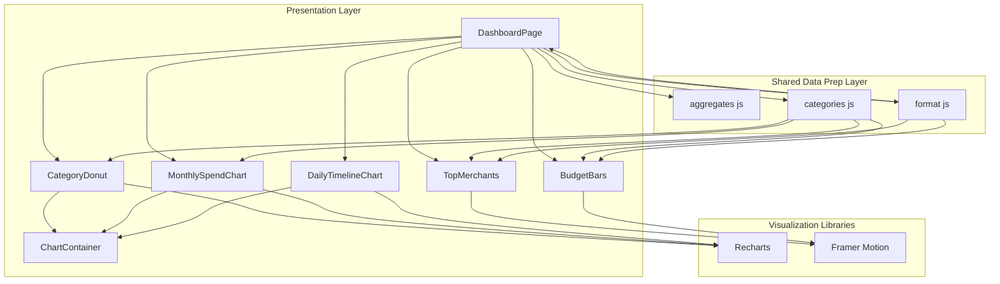
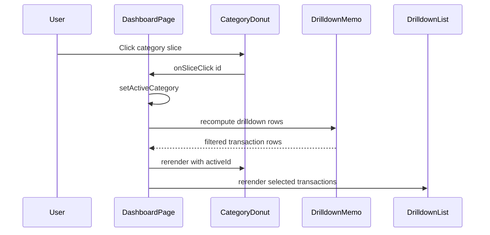
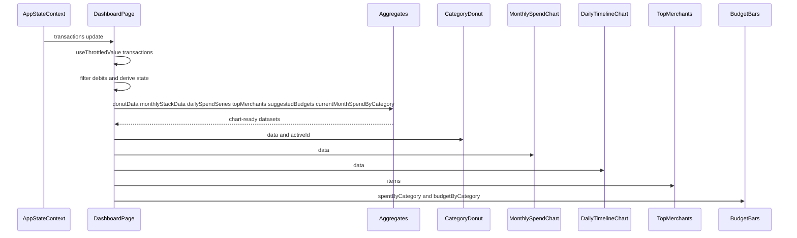

# Financial Data Visualization and Dashboarding Domain

## Overview

This domain turns categorized transaction data into a compact analytical dashboard built from reusable chart components. In the main dashboard experience, users can inspect category mix, monthly spending momentum, daily spend rhythm, top merchants, and budget pressure from the same live transaction stream that powers the rest of the application.

The chart layer is intentionally composable. `DashboardPage.jsx` prepares chart-ready data from shared aggregation helpers, then passes it into focused visual components under `frontend/src/components/charts/`. Those components share a common sizing wrapper, use the same category taxonomy from , and rely on the formatting helpers in  for consistent currency and time presentation.

## Architecture Overview

## Dashboard Composition and Data Orchestration

`DashboardPage.jsx` is the orchestration point for the dashboard view. It reads `transactions` from `useAppState()`, smooths rapid live updates with `useThrottledValue(transactions, 280)`, and derives all visual inputs with `useMemo`.

### Dashboard state and derived values

| State or value | Type | Purpose |
| --- | --- | --- |
| `chartTransactions` | transaction array | Throttled version of live transactions to reduce chart churn |
| `activeCategory` | `string \ | null` | Selected category from the donut chart |
| `debitTx` | transaction array | Filters out credit rows before charting |
| `donut` | array | Input to `CategoryDonut` from `donutData(debitTx)` |
| `monthly` | array | Input to `MonthlySpendChart` from `monthlyStackData(debitTx, 6)` |
| `daily` | array | Input to `DailyTimelineChart` from `dailySpendSeries(debitTx)` |
| `merchants` | array | Input to `TopMerchants` from `topMerchants(debitTx, 10)` |
| `budgets` | object | Suggested budget ceilings from `suggestedBudgets(debitTx)` |
| `monthSpend` | object | Current month totals from `currentMonthSpendByCategory(debitTx)` |
| `drilldown` | array | Latest 40 transactions for the selected category |
| `activeLabel` | `string \ | null` | Human-readable label resolved from `CATEGORY_BY_ID` |

### Data preparation helpers

| Helper | Description |
| --- | --- |
| `donutData` | Builds category share rows with `id`, `name`, `value`, and `fill` |
| `monthlyStackData` | Produces a six-month stacked series keyed by month and category |
| `dailySpendSeries` | Produces a day-by-day spend series for the current month, including anomaly flags |
| `topMerchants` | Aggregates merchant totals and keeps the largest `n` spenders |
| `suggestedBudgets` | Generates per-category budget caps from trailing spend |
| `currentMonthSpendByCategory` | Produces current-period spend totals by category |

## Shared Chart Container and Responsive Sizing

### `ChartContainer`

*`frontend/src/components/charts/ChartContainer.jsx`*

`ChartContainer` is the shared wrapper for all Recharts-based visuals. It standardizes chart height, keeps the chart area responsive, and prevents zero-dimension startup warnings from `ResponsiveContainer`.

#### Exports

| Export | Type | Description |
| --- | --- | --- |
| `CHART_DIMS` | constant | Shared size presets for donut, monthly, and daily charts |
| `ChartContainer` | component | Fixed-height, full-width wrapper for chart children |

#### Props

| Property | Type | Description |
| --- | --- | --- |
| `dims` | `{ width: number, height: number }` | Dimension preset selected from `CHART_DIMS` |
| `children` | `ReactNode` | Chart content rendered inside the wrapper |

#### Shared sizing conventions

| Preset | Width | Height | Used by |
| --- | --- | --- | --- |
| `donut` | `480` | `320` | `CategoryDonut` |
| `monthly` | `640` | `340` | `MonthlySpendChart` |
| `daily` | `640` | `300` | `DailyTimelineChart` |

#### Implementation details

- The outer `div` uses `w-full min-w-0` so charts can shrink inside grid layouts without overflow.
- `style.height` and `style.minHeight` both come from `dims.height`.
- Recharts children receive `ResponsiveContainer` with:- `width="100%"`
- `height="100%"`
- `minWidth={48}`
- `minHeight={dims.height}`
- `initialDimension={dims}`
- The wrapper exists so `ResponsiveContainer` does not start at `-1×-1` before `ResizeObserver` settles.

## Recharts-Based Visualizations

### `CategoryDonut`

*`frontend/src/components/charts/CategoryDonut.jsx`*

The category donut is the interactive entry point for chart-driven drilldown. It renders category share slices, highlights the selected slice, and lets the user click a slice to filter the dashboard transaction list.

#### Props

| Property | Type | Description |
| --- | --- | --- |
| `data` | `Array<{ id: string, name: string, value: number, fill: string }>` | Slice rows, usually from `donutData` |
| `activeId` | `string \ | null` | Currently selected category id |
| `onSliceClick` | `(id: string) => void` | Optional selection callback |

#### Behavior

- Falls back to a synthetic single-row dataset when `data.length` is zero:- `id: 'empty'`
- `name: 'No data'`
- `value: 1`
- `fill: '#334155'`
- Uses `PieChart`, `Pie`, `Cell`, `Tooltip`, and `ResponsiveContainer` from Recharts.
- Each `Cell` receives:- `stroke: '#fff'` and `strokeWidth: 2` for the active slice
- reduced opacity for inactive slices
- The slice click handler:- reads the clicked row from `chartData[index]`
- ignores the synthetic `empty` row
- calls `onSliceClick?.(row.id)`

#### Interaction patterns

| Pattern | Implementation |
| --- | --- |
| Slice click-through | `onClick={(_, index) => ...}` on `Pie` |
| Selected slice emphasis | White stroke and full opacity for `activeId` |
| De-emphasis of other slices | `opacity={0.45}` on non-selected slices |
| Empty-state protection | Synthetic `empty` slice does not trigger click-through |

#### Tooltip behavior

- Uses a formatter that:- converts numeric values with `toLocaleString()`
- falls back to the original `value` when it is not numeric
- Displays the payload name when available.

The donut chart keeps click handling optional with onSliceClick?.(row.id), so the visual component can be reused in contexts that only need display output.

---

### `MonthlySpendChart`

*`frontend/src/components/charts/MonthlySpendChart.jsx`*

The monthly spend chart renders a stacked bar view of category totals across recent months. It is the main trend chart in the dashboard and uses the shared taxonomy to keep labels and colors aligned with the rest of the UI.

#### Props

| Property | Type | Description |
| --- | --- | --- |
| `data` | `Array<{ month: string } & Record<string, number>>` | Month rows keyed by category id |

#### Recharts usage

| Element | Purpose |
| --- | --- |
| `BarChart` | Main stacked chart container |
| `Bar` | One stacked series per category |
| `CartesianGrid` | Light grid with dashed strokes |
| `XAxis` | Displays month keys |
| `YAxis` | Displays numeric scale |
| `Tooltip` | Hover values |
| `Legend` | Category legend using category labels |

#### Rendering rules

- Iterates through `CATEGORIES` to create one `Bar` per category.
- Uses:- `dataKey={c.id}`
- `stackId="spend"`
- `fill={c.chartColor}`
- `name={c.label}`
- Animation is enabled with `animationDuration={450}`.
- The chart uses the shared `CHART_DIMS.monthly` preset through `ChartContainer`.

#### Visual conventions

- Category colors come directly from `CATEGORIES`.
- Tooltip styling is consistent with the other Recharts charts:- rounded corners
- dark surface background
- muted border
- light text

---

### `DailyTimelineChart`

*`frontend/src/components/charts/DailyTimelineChart.jsx`*

The daily timeline chart shows day-by-day spend for the current month and uses anomaly-aware point markers to surface unusual activity immediately.

#### Props

| Property | Type | Description |
| --- | --- | --- |
| `data` | `Array<{ day: number, label: string, spend: number, anomaly: boolean }>` | Current-month daily series |

#### Recharts usage

| Element | Purpose |
| --- | --- |
| `LineChart` | Main timeline container |
| `Line` | Spend trend line |
| `CartesianGrid` | Reference grid |
| `XAxis` | Day-of-month axis |
| `YAxis` | Numeric scale |
| `Tooltip` | Hover display |

#### Internal marker renderer

`DailyTimelineChart` defines a local `Dot` function that receives Recharts point props.

| Prop | Type | Description |
| --- | --- | --- |
| `cx` | `number \ | null` | X coordinate for the dot |
| `cy` | `number \ | null` | Y coordinate for the dot |
| `payload` | object | Point payload with anomaly metadata |

#### Dot behavior

- Returns `null` when either coordinate is missing.
- Uses a larger radius for anomalies:- `r = 5` for anomaly points
- `r = 3` otherwise
- Uses color by point type:- anomaly: `#f43f5e`
- normal: `#38bdf8`
- Adds a dark stroke for contrast against the chart background.

#### Tooltip behavior

- `labelFormatter` renders the axis label as `Day ${d}`.
- `formatter`:- formats numeric values with `toLocaleString()`
- labels anomaly rows as `Spend (anomaly day)`
- labels normal rows as `Spend`

#### Chart semantics

- The line is rendered with:- `type="monotone"`
- `stroke="#38bdf8"`
- `strokeWidth={2}`
- `dot={<Dot />}`
- `activeDot={{ r: 6 }}`
- Anomaly highlighting is data-driven through the `payload.anomaly` flag, not through a separate overlay.

## Ranked and Budget Analysis Components

### `TopMerchants`

*`frontend/src/components/charts/TopMerchants.jsx`*

`TopMerchants` is a ranked list rather than a Recharts chart. It surfaces the merchants with the highest debit exposure and keeps category context visible in each row.

#### Props

| Property | Type | Description |
| --- | --- | --- |
| `items` | `Array<{ name: string, total: number, category: string }>` | Merchant ranking rows |

#### Behavior

- Renders a `<ul>` of animated rows with `framer-motion`.
- Each row shows:- rank number
- merchant name
- category label resolved from `CATEGORY_BY_ID`
- total formatted through `formatCurrency`
- The rank badge background uses `categoryColor(m.category)` with alpha suffix `33`.
- Uses an empty state when `items.length` is zero.

#### Empty state

| Condition | Output |
| --- | --- |
| No merchant rows | `No merchant spend yet` |

#### Category metadata usage

- `CATEGORY_BY_ID[m.category]?.label ?? m.category` keeps the display readable even when the category id is not recognized.
- `categoryColor(m.category)` preserves the taxonomy color palette in the rank list.

---

### `BudgetBars`

*`frontend/src/components/charts/BudgetBars.jsx`*

`BudgetBars` shows spend versus suggested budget for every category. It is a compact progress-style visualization with motion-based width animation and over-budget highlighting.

#### Props

| Property | Type | Description |
| --- | --- | --- |
| `spentByCategory` | `Record<string, number>` | Current spend totals keyed by category id |
| `budgetByCategory` | `Record<string, number>` | Suggested caps keyed by category id |

#### Behavior

- Iterates through `CATEGORIES` so the budget display always matches the chart taxonomy.
- For each category:- `spent = spentByCategory[c.id] ?? 0`
- `budget = budgetByCategory[c.id] ?? 1`
- `pct = Math.min(100, Math.round((spent / budget) * 100))`
- `over = spent > budget`
- Uses `formatCurrency` to render both spend and budget amounts.
- Uses `motion.div` for a staggered entry animation and animated fill widths.

#### Visual rules

| Condition | Bar styling | Percentage styling |
| --- | --- | --- |
| `spent > budget` | `#f43f5e` | Rose text |
| `spent <= budget` | `c.chartColor` | Emerald text |

#### Safety guards

- Missing spend totals fall back to `0`.
- Missing budgets fall back to `1`, which keeps the progress calculation stable.
- Width animation is clamped to `100%`.

## Shared Category Metadata and Formatting Helpers

### 

The chart layer relies on one shared taxonomy. The same ids, labels, and chart colors are reused by the donut, monthly bars, merchant list, and budget bars.

#### Category taxonomy

| id | label | chartColor |
| --- | --- | --- |
| `food_dining` | Food & Dining | `#f97316` |
| `transport` | Transport | `#3b82f6` |
| `shopping` | Shopping | `#a855f7` |
| `housing` | Housing | `#eab308` |
| `health_medical` | Health & Medical | `#22c55e` |
| `entertainment` | Entertainment | `#ec4899` |
| `travel` | Travel | `#06b6d4` |
| `education` | Education | `#6366f1` |
| `finance` | Finance | `#64748b` |
| `subscriptions` | Subscriptions | `#14b8a6` |
| `family_personal` | Family & Personal | `#f43f5e` |
| `uncategorised` | Uncategorised | `#94a3b8` |

#### Shared exports used around the dashboard domain

| Export | Purpose |
| --- | --- |
| `CATEGORIES` | Ordered category list used to build bars, budgets, and metadata-driven UI |
| `CATEGORY_BY_ID` | Lookup object for label resolution in drilldowns and merchant lists |
| `categoryColor` | Fallback-safe color lookup used in merchant ranking and other category-aware UI |
| `categoryStyle` | Badge styling helper used by category labels elsewhere in the dashboard domain |

### 

The chart domain uses the shared formatting module so currency and numeric presentation stay consistent across chart labels, dashboard cards, and drilldown rows.

| Helper | Used by | Role in this domain |
| --- | --- | --- |
| `formatCurrency` | `TopMerchants`, `BudgetBars`, dashboard drilldown rows | Formats spend totals and budget amounts |
| `formatDateTime` | Dashboard activity rows | Formats transaction timestamps shown near chart output |
| `formatPercent` | Adjacent dashboard badges | Formats confidence and percentage-style values in the same visual language |

## Feature Flows

### Category Slice Click-Through Flow

### Live Data to Chart Rendering Flow

## State Management and Rendering Behavior

### Local state pattern

- `DashboardPage` owns the interactive chart state.
- `activeCategory` is the only chart-selection state.
- Clicking the same donut slice again clears the selection by setting `null`.

### Derived-state pattern

| Pattern | Implementation |
| --- | --- |
| Throttled updates | `useThrottledValue(transactions, 280)` |
| Debit-only filtering | `transactions.filter((t) => t.debit_credit !== 'credit')` |
| Memoized chart data | `useMemo` for all chart datasets |
| Selected drilldown rows | `debitTx.filter((t) => t.category === activeCategory).slice(0, 40)` |
| Human-readable label | `CATEGORY_BY_ID[activeCategory]?.label ?? activeCategory` |

### Visual state behaviors

| State | Component behavior |
| --- | --- |
| Empty donut data | `CategoryDonut` renders a synthetic `No data` slice |
| Empty merchant ranking | `TopMerchants` renders `No merchant spend yet` |
| No active category | Drilldown area prompts the user to select a category |
| Selected category | Donut slice is highlighted and the drilldown list updates |

## Error Handling and Empty States

| Condition | Component | Behavior |
| --- | --- | --- |
| Empty category data | `CategoryDonut` | Uses a single fallback slice and suppresses click-through |
| Missing click handler | `CategoryDonut` | Optional chaining prevents callback errors |
| Missing merchant data | `TopMerchants` | Renders a readable empty-state row |
| Missing spend totals | `BudgetBars` | Defaults to `0` |
| Missing budget totals | `BudgetBars` | Defaults to `1` to keep percentage math stable |
| Missing dot coordinates | `DailyTimelineChart` `Dot` | Returns `null` |
| Non-numeric tooltip values | `CategoryDonut`, `DailyTimelineChart` | Preserves the raw value instead of forcing numeric formatting |

## Dependencies

### Libraries

- `recharts`
- `framer-motion`
- `react`
- `lucide-react`

### Local application dependencies

- 
- 
- 
- 
- `frontend/src/hooks/useThrottledValue`
- `DashboardPage.jsx` as the composition layer

## Testing Considerations

| Scenario | What to verify |
| --- | --- |
| Donut selection | Clicking a slice toggles `activeCategory` and updates drilldown rows |
| Empty donut data | The fallback `No data` slice renders and does not trigger selection |
| Monthly stacking | Each category series appears with the correct `chartColor` and label |
| Daily anomaly markers | Anomaly points use the larger red dot and anomaly tooltip label |
| Merchant ranking | Rows sort by total descending and category labels resolve correctly |
| Budget overage | Categories above budget display the rose color and overage percentage |
| Responsiveness | All three Recharts charts size correctly inside grid and panel layouts |
| Formatting consistency | Currency labels match `formatCurrency` output across chart-adjacent UI |

## Key Classes Reference

| Class | Responsibility |
| --- | --- |
| `ChartContainer.jsx` | Shared sizing wrapper for responsive charts |
| `CategoryDonut.jsx` | Interactive category share donut with slice drilldown |
| `MonthlySpendChart.jsx` | Stacked monthly spend visualization by category |
| `DailyTimelineChart.jsx` | Daily spend line chart with anomaly-aware markers |
| `TopMerchants.jsx` | Ranked merchant exposure list with category context |
| `BudgetBars.jsx` | Category budget progress bars with overage highlighting |
| `categories.js` | Shared category taxonomy, labels, and chart colors |
| `format.js` | Shared value formatting for currency, dates, and percentages |
| `DashboardPage.jsx` | Dashboard composition and chart data orchestration |
