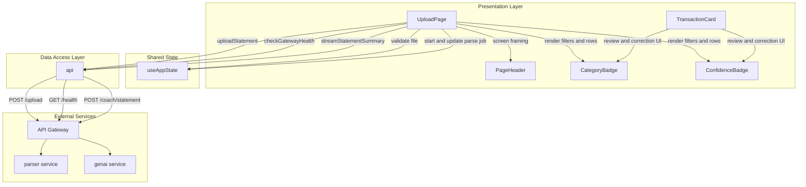
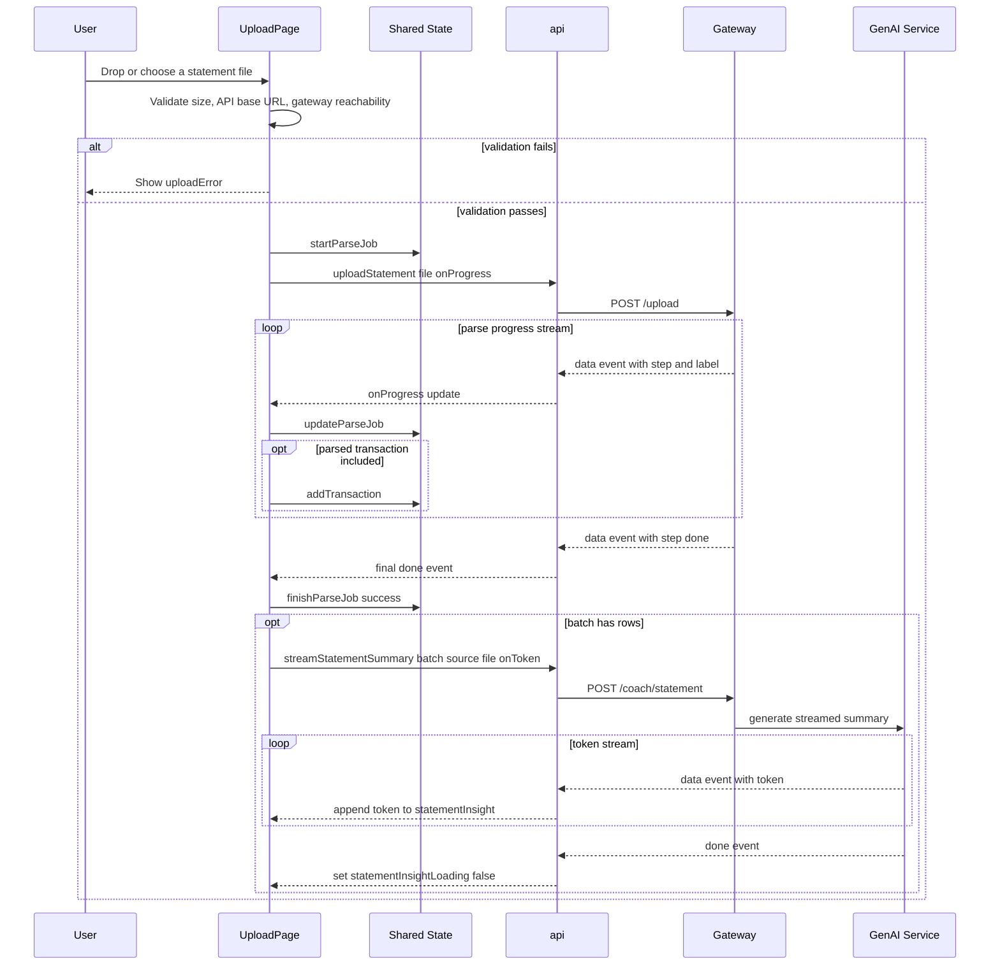
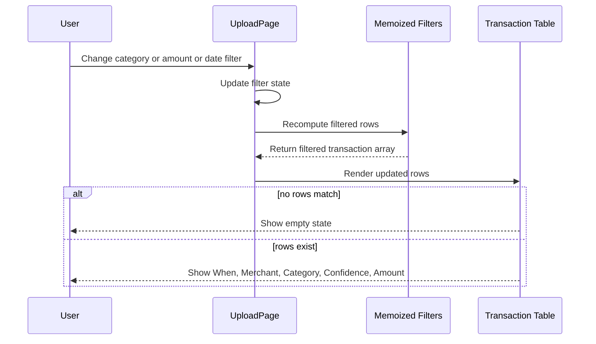

# Financial Data Visualization and Dashboarding DOMAIN - Statement Upload Review

## Overview

This feature gives users a statement-centric workspace for reviewing uploaded bank data after it has been parsed and classified. The upload page accepts PDF, CSV, and XLSX statements, validates the file before sending it to the backend, shows parse progress in real time, and then renders the resulting transactions in a filterable table with category, confidence, and amount context.

It fits the application’s larger financial intelligence flow by turning a document upload into structured transaction rows that can be inspected immediately and summarized automatically. Once parsing completes, the page streams a GenAI statement summary into the same screen so the user can read a narrative interpretation alongside the transaction list.

## Architecture Overview



## Component Structure

### 1. Presentation Layer

#### **UploadPage**

The upload zone advertises max 100MB, but handleFile rejects files larger than 20 * 1024 * 1024 bytes and shows File too large (max 20 MB).

*frontend/src/pages/UploadPage.jsx*

`UploadPage` is the statement ingestion screen. It validates the selected file, checks whether the API gateway is reachable, submits the file to the backend, tracks upload and parse progress, stores parsed rows in shared application state, and streams a statement summary after parsing finishes.

**Local state, refs, and derived values**

| Property | Type | Description |
| --- | --- | --- |
| `drag` | `boolean` | Tracks drag-over highlighting for the upload zone. |
| `catFilter` | `string` | Selected category filter, defaulting to `all`. |
| `minAmt` | `string` | Lower bound for amount filtering. |
| `maxAmt` | `string` | Upper bound for amount filtering. |
| `dateFrom` | `string` | Lower date filter value from the date input. |
| `dateTo` | `string` | Upper date filter value from the date input. |
| `uploadError` | `string \ | null` | Current validation, transport, or parsing error message. |
| `statementInsight` | `string` | Streaming GenAI statement summary text. |
| `statementInsightLoading` | `boolean` | Indicates that the statement summary stream is active. |
| `elapsedSec` | `number` | Seconds elapsed while a parse job is running. |
| `fileInputRef` | `RefObject<HTMLInputElement \ | null>` | Hidden file input reference used for click-to-upload. |
| `lastBatchRef` | `RefObject<Array<object>>` | Accumulates parsed transactions for summary streaming. |
| `uploaded` | `Array<object>` | Transactions from shared state filtered to `source === 'statement_upload'`. |
| `filtered` | `Array<object>` | `uploaded` rows after category, amount, and date filtering. |
| `progressIndeterminate` | `boolean` | Controls animated progress mode when total row count is unknown. |
| `progressPct` | `number` | Computed progress percentage for the bar and labels. |
| `phaseHint` | `string \ | null` | Human-readable parse phase label for the current `parseJob.step`. |


**Injected shared state values**

| Type | Description |
| --- | --- |
| `transactions` | Shared transaction buffer used to derive the uploaded statement subset. |
| `parseJob` | Shared parse status object updated by upload progress events. |
| `startParseJob` | Initializes a new parse job before upload begins. |
| `updateParseJob` | Merges incoming progress updates into the active parse job. |
| `finishParseJob` | Marks the parse job as `success` or `error`. |
| `addTransaction` | Prepends parsed transaction rows into the shared transaction buffer. |
| `gatewayReachable` | Gateway reachability flag used to block uploads when the gateway is known to be down. |


**Key methods**

| Method | Description |
| --- | --- |
| `handleFile` | Validates the file, starts the parse job, uploads the statement, handles progress events, stores transactions, and triggers summary streaming after completion. |
| `onDrop` | Prevents the default drop behavior and passes the dropped file to `handleFile`. |
| `onFileInput` | Reads the selected file from the hidden input and passes it to `handleFile`. |


#### **ConfidenceBadge**

*frontend/src/components/ConfidenceBadge.jsx*

`ConfidenceBadge` renders a confidence score as a compact pill with a color band based on the numeric value. It is used in the upload review table and in transaction cards to make model certainty visible at a glance.

**Properties**

| Property | Type | Description |
| --- | --- | --- |
| `value` | `number` | Confidence score rendered as a percentage and used to choose the badge color. |
| `className` | `string` | Optional extra class names appended to the badge. |


**Behavior**

- Uses `formatPercent(value)` for display.
- Applies three visual tiers:- `high` for values `>= 0.8`
- `mid` for values `>= 0.65`
- `low` for values below `0.65`
- Adds the `title` attribute `Model confidence`.

#### **CategoryBadge**

*frontend/src/components/CategoryBadge.jsx*

`CategoryBadge` renders the transaction category label with a category-specific visual style. In the upload table, it gives each parsed row a readable label instead of a raw category ID.

**Properties**

| Property | Type | Description |
| --- | --- | --- |
| `categoryId` | `string` | Category key used to resolve the display label and style. |
| `className` | `string` | Optional extra class names appended to the badge. |


**Behavior**

- Resolves the visible label from `CATEGORY_BY_ID[categoryId]?.label ?? categoryId`.
- Uses `categoryStyle(categoryId)` for the color and border styling.

#### **TransactionCard**

*frontend/src/components/TransactionCard.jsx*

`TransactionCard` is the richer transaction presentation component used for transaction review in the broader expense UI. It surfaces category, confidence, anomaly status, review state, and an optional recategorization control.

**Properties**

| Property | Type | Description |
| --- | --- | --- |
| `txn` | `object` | Transaction object containing transaction metadata and presentation fields. |
| `onCorrect` | `function \ | undefined` | Optional callback invoked when the category is changed in the recategorization select. |
| `showCorrection` | `boolean` | Controls whether the recategorization control is shown. Defaults to `true`. |


**Transaction fields used by the component**

| Field | Type | Description |
| --- | --- | --- |
| `txn.txn_id` | `string` | Unique transaction identifier used for keys and select IDs. |
| `txn.merchant_clean` | `string` | Human-friendly merchant name shown as the card title. |
| `txn.merchant_raw` | `string` | Raw merchant string shown in monospace text and as the `title`. |
| `txn.category` | `string` | Category ID displayed by `CategoryBadge` and used by the recategorize select. |
| `txn.confidence` | `number` | Confidence score displayed by `ConfidenceBadge` and used to infer review status. |
| `txn.review_required` | `boolean \ | undefined` | Backend-provided review flag used to show the review pill. |
| `txn.anomaly` | `object \ | undefined` | Optional anomaly payload used to show the anomaly badge and message. |
| `txn.date` | `string \ | Date` | Rendered with `formatDateTime`. |
| `txn.amount` | `number` | Transaction amount rendered with `formatCurrency`. |
| `txn.currency` | `string` | Currency code passed to `formatCurrency`. |
| `txn.debit_credit` | `string` | Debit or credit label shown in the side pill. |


**Derived behavior**

| Item | Description |
| --- | --- |
| `review` | True when `txn.review_required` is truthy or `txn.confidence < 0.65`. |
| anomaly marker | Renders a pulsing rose dot when `txn.anomaly` exists. |
| review badge | Shows `Review required` when `showCorrection && review` is true. |
| anomaly message | Shows `txn.anomaly.reason` in a highlighted warning band. |
| recategorize control | Renders a select control when `showCorrection && review` is true and calls `onCorrect?.(txn.txn_id, e.target.value)`. |


#### **PageHeader**

*frontend/src/components/ui/PageHeader.jsx*

`PageHeader` standardizes the top-of-page layout for the upload screen. It renders an eyebrow, title, description, and an optional right-side action area.

**Properties**

| Property | Type | Description |
| --- | --- | --- |
| `eyebrow` | `string \ | undefined` | Small upper label shown above the title. |
| `title` | `string` | Main page title. |
| `description` | `ReactNode \ | undefined` | Supporting text below the title. |
| `children` | `ReactNode \ | undefined` | Optional action area rendered on the right side. |


**Behavior**

- Animates the eyebrow, title, description, and children with staggered motion.
- Renders the right-side content only when `children` is provided.

### 2. Shared State and Upload Orchestration

#### **Application state actions used by the upload screen**

*frontend/src/context/AppStateContext.jsx*

The upload page uses shared state to coordinate parse progress and transaction buffering.

| Method | Description |
| --- | --- |
| `startParseJob` | Creates a new active parse job with `step: 'upload'`. |
| `updateParseJob` | Merges in upload and parser progress updates. |
| `finishParseJob` | Marks the job as done or error. |
| `addTransaction` | Prepends a parsed transaction to the shared buffer and emits anomaly toasts when applicable. |


**Relevant shared state fields**

| Property | Type | Description |
| --- | --- | --- |
| `transactions` | `Array<object>` | Shared transaction buffer used to derive the statement upload review table. |
| `parseJob` | `object \ | null` | Active parse job used for progress labels and bar updates. |
| `gatewayReachable` | `boolean \ | null` | Reachability state used by upload validation and dashboard status. |
| `liveFeedReady` | `boolean` | Used elsewhere in the app, but part of the same shared transaction pipeline. |


## API Integration

### API module methods used by statement upload review

*frontend/src/lib/api.js*

| Method | Description |
| --- | --- |
| `uploadStatement` | Uploads a statement file to `POST /upload` and streams parse progress events from the response. |
| `checkGatewayHealth` | Probes `GET /health` to confirm the gateway is reachable before upload and streaming actions. |
| `streamStatementSummary` | Starts a streamed GenAI summary from `POST /coach/statement` after parsing completes. |


### #### Check Gateway Health

```api
{
    "title": "Check Gateway Health",
    "description": "Polls the gateway health endpoint to determine whether statement upload and streaming can run",
    "method": "GET",
    "baseUrl": "<GatewayApiBaseUrl>",
    "endpoint": "/health",
    "headers": [],
    "queryParams": [],
    "pathParams": [],
    "bodyType": "none",
    "requestBody": "",
    "formData": [],
    "rawBody": "",
    "responses": {
        "200": {
            "description": "Gateway is reachable",
            "body": "{\n    \"status\": \"ok\"\n}"
        }
    }
}
```

### #### Upload Statement

```api
{
    "title": "Upload Statement",
    "description": "Uploads a PDF, CSV, XLSX, or XLS statement file and streams parse progress events back to the client",
    "method": "POST",
    "baseUrl": "<GatewayApiBaseUrl>",
    "endpoint": "/upload",
    "headers": [],
    "queryParams": [],
    "pathParams": [],
    "bodyType": "form-data",
    "requestBody": "{\n    \"file\": \"statement.pdf\"\n}",
    "formData": [
        {
            "key": "file",
            "value": "statement.pdf",
            "required": true
        }
    ],
    "rawBody": "",
    "responses": {
        "200": {
            "description": "Server-Sent Events stream with upload, parse, and categorisation progress",
            "body": "{\n    \"step\": \"categorise\",\n    \"label\": \"Step 4/4 \\u00b7 ML categorisation batch\",\n    \"done\": 42,\n    \"total\": 120,\n    \"running\": true,\n    \"indeterminate\": false,\n    \"uploadBytes\": null,\n    \"uploadTotal\": null,\n    \"txn\": {\n        \"txn_id\": \"txn_2024_08_001\",\n        \"merchant_raw\": \"SWIGGY 1234\",\n        \"merchant_clean\": \"Swiggy\",\n        \"category\": \"food_dining\",\n        \"confidence\": 0.92,\n        \"review_required\": false,\n        \"amount\": 458.5,\n        \"currency\": \"INR\",\n        \"date\": \"2024-08-14T13:22:00Z\",\n        \"debit_credit\": \"debit\",\n        \"anomaly\": {\n            \"reason\": \"Unusually high spend for this merchant\"\n        }\n    }\n}"
        }
    }
}
```

### #### Stream Statement Summary

```api
{
    "title": "Stream Statement Summary",
    "description": "Starts a streamed GenAI summary once parsing has completed and the client has a batch of uploaded transactions",
    "method": "POST",
    "baseUrl": "<GatewayApiBaseUrl>",
    "endpoint": "/coach/statement",
    "headers": [
        {
            "key": "Content-Type",
            "value": "application/json",
            "required": true
        }
    ],
    "queryParams": [],
    "pathParams": [],
    "bodyType": "application/json",
    "requestBody": "{\n    \"transactions\": [\n        {\n            \"txn_id\": \"txn_2024_08_001\",\n            \"merchant_raw\": \"SWIGGY 1234\",\n            \"merchant_clean\": \"Swiggy\",\n            \"category\": \"food_dining\",\n            \"confidence\": 0.92,\n            \"review_required\": false,\n            \"amount\": 458.5,\n            \"currency\": \"INR\",\n            \"date\": \"2024-08-14T13:22:00Z\",\n            \"debit_credit\": \"debit\",\n            \"source\": \"statement_upload\",\n            \"source_file\": \"statement.pdf\"\n        }\n    ],\n    \"source_file\": \"statement.pdf\"\n}",
    "formData": [],
    "rawBody": "",
    "responses": {
        "200": {
            "description": "Server-Sent Events stream of token chunks plus a terminal done event",
            "body": "{\n    \"token\": \"This statement is dominated by food and transport spending.\",\n    \"done\": true\n}"
        }
    }
}
```

## Feature Flows

### 1. Statement Upload, Parse Progress, and Summary Stream



**Flow details**

1. `handleFile` is called from both drag-and-drop and file input selection.
2. The file is rejected immediately if it exceeds `20 MB`.
3. The function blocks when `API_BASE` is missing and shows the backend connection error.
4. The function blocks when `gatewayReachable === false`.
5. Before upload starts, the page clears prior statement summary text, resets the batch buffer, zeros the elapsed timer, and starts a new parse job.
6. `uploadStatement` streams progress updates and parsed transaction rows.
7. Each parsed transaction is augmented with `source: 'statement_upload'` and `source_file: file.name` before being added to shared state.
8. When parsing reaches `done`, the page triggers `streamStatementSummary` with the captured batch and file name.
9. The streamed summary appends token-by-token into `statementInsight`.

### 2. Client Side Review Filtering and Table Presentation



**Filter behavior**

- Category filtering is exact-match against `t.category`.
- Amount filtering uses numeric comparisons after `Number(minAmt)` and `Number(maxAmt)`.
- Date filtering compares `new Date(t.date)` against `new Date(dateFrom)` and `new Date(dateTo)`.
- The table renders only rows whose `source` is `statement_upload`.

## Upload Validation

| Check | Condition | Result |
| --- | --- | --- |
| File type | File input accepts `.pdf`, `.csv`, `.xlsx`, `.xls` | Browser file picker limits the visible file types. |
| File size | `file.size > 20 * 1024 * 1024` | Sets `File too large (max 20 MB).` and stops. |
| API base URL | `!API_BASE` | Sets `Backend not connected. Set VITE_API_BASE_URL in frontend/.env and restart.` |
| Gateway reachability | `gatewayReachable === false` | Sets `API gateway unreachable. Run: docker compose up -d (and wait until services are healthy).` |


The handler only blocks on a known-down gateway. While the gateway is still being checked, the upload path is not hard-blocked by that flag.

## Parse Progress Handling

`UploadPage` maps the streaming progress events into a visible parse job and an animated progress bar.

| `parseJob.step` | Phase hint |
| --- | --- |
| `upload` | `Step 1/4 · Sending bytes to API gateway` |
| `detect` | `Step 2/4 · Parser detected format` |
| `extract` | `Step 3/4 · Reading rows from file (PDFs/OCR can take a while)` |
| `categorise` | `Step 4/4 · ML categorisation batch` |
| `progress` | `Step 4/4 · Applying categories` |


**Progress bar behavior**

| Condition | Behavior |
| --- | --- |
| `parseJob.step === 'upload'` with `uploadTotal > 0` | Shows percentage sent from uploaded bytes. |
| `progressIndeterminate === true` | Shows a moving gradient segment. |
| `parseJob.total > 0` | Shows `done / total` row count and calculates progress percentage. |
| `parseJob.running === false` | Progress bar settles at completion. |


`uploadStatement` also guards long-running uploads with a timeout of `1_800_000` ms and treats `status === 0` as cancellation or network failure.

## Transaction Presentation

The uploaded statement rows are rendered in a table with direct category and confidence visibility.

| Column | Rendered field | Notes |
| --- | --- | --- |
| When | `formatDateTime(t.date)` | Uses a compact timestamp for review. |
| Merchant | `t.merchant_clean` and `t.merchant_raw` | Clean name is bold; raw merchant is shown in monospace text. |
| Category | `CategoryBadge` | Uses the category label and category-specific styling. |
| Confidence | `ConfidenceBadge` | Shows the model score as a percentage badge. |
| Amount | `formatCurrency(t.amount, t.currency)` | Right-aligned with tabular numerals. |


### Review and confidence indicators

- `ConfidenceBadge` encodes confidence into color bands:- emerald for `>= 0.8`
- amber for `>= 0.65`
- rose below `0.65`
- `TransactionCard` derives `review` from either `txn.review_required` or `txn.confidence < 0.65`.
- When the review condition is met, `TransactionCard` displays a `Review required` pill and, if enabled, a recategorization select.

### Empty state

When no uploaded transactions match the active filters, the page shows an empty state prompting the user to upload a PDF, CSV, or XLSX file.

## State Management

### Upload job state

The upload page keeps its local UI state separate from the shared transaction buffer.

| State | Type | Purpose |
| --- | --- | --- |
| `parseJob` | `object \ | null` | Shared job state used by the progress banner and bar. |
| `uploadError` | `string \ | null` | Local error banner content. |
| `statementInsight` | `string` | Local streamed summary text. |
| `statementInsightLoading` | `boolean` | Tracks whether the summary stream is active. |
| `uploaded` | `Array<object>` | Memoized subset of `transactions` that came from statement uploads. |
| `filtered` | `Array<object>` | Memoized subset of `uploaded` after user filtering. |


### Parse job lifecycle

1. `startParseJob(0)` sets `running: true`, `step: 'upload'`, and `label: 'Uploading…'`.
2. `updateParseJob` merges each SSE progress event.
3. `finishParseJob('success')` sets `running: false`, `step: 'done'`, and `label: 'Done'`.
4. `finishParseJob('error')` sets `running: false` and leaves the last error label intact.

### Local timer

- `elapsedSec` increments once per second while `parseJob.running` is true.
- The timer is cleared automatically when parsing stops.

## Error Handling

`UploadPage` uses explicit user-facing messages for each failure point.

| Failure path | Handling |
| --- | --- |
| Oversized file | Stops before any network call and shows the size error. |
| Missing `VITE_API_BASE_URL` | Stops before any network call and instructs the user to configure the backend URL. |
| Gateway unreachable | Stops before upload and tells the user to start the backend stack. |
| Upload rejection | Catches exceptions from `uploadStatement` and displays `err.message | 'Upload failed'`. |
| Parser stream error | When `data.step === 'error'`, the page shows the stream label or `Parse error` and finishes the parse job as `error`. |
| Missing terminal SSE event | `uploadStatement` emits `Upload stream ended without a completion event. Check gateway + parser-service (docker compose up) and VITE_API_BASE_URL.` |
| Summary stream failure | Fallback text is appended when the GenAI summary stream fails. |


**Fallback summary text used on stream failure**

```text
[Coach unavailable — check GEMINI_API_KEY on genai-service or gateway connectivity.]
```

## Integration Points

- `useAppState()` supplies shared transactions, parse job state, gateway reachability, and transaction insertion actions.
- `API_BASE` is sourced from `VITE_API_BASE_URL`.
- `uploadStatement` depends on the API gateway’s `/upload` streaming behavior.
- `checkGatewayHealth` determines whether the upload path is allowed.
- `streamStatementSummary` depends on the GenAI-backed coach endpoint.
- `CategoryBadge`, `ConfidenceBadge`, and `PageHeader` provide the review UI primitives used on the page.
- `TransactionCard` shares the same confidence and review semantics as the broader transaction presentation surfaces.

## Dependencies

- `react` hooks: `useCallback`, `useEffect`, `useMemo`, `useRef`, `useState`
- `framer-motion` for the page and progress animations
- `lucide-react` icons for upload, filter, error, and transaction visuals
- `useAppState` for shared transaction and parse state
-  for gateway health, upload, and summary streaming
-  for category lists and labels
-  for currency and date formatting
- 
- 
- 
- 

## Testing Considerations

- Upload a file larger than 20 MB and verify the client-side rejection message.
- Set `VITE_API_BASE_URL` to an empty value and verify the backend connection error.
- Simulate an unreachable gateway and verify the gateway warning appears before upload.
- Verify `parseJob.step` transitions render the correct progress labels.
- Confirm rows added from the upload stream are tagged with `source: 'statement_upload'`.
- Confirm category, amount, and date filters reduce the table as expected.
- Confirm the empty state appears when the filter set yields no rows.
- Verify `statementInsightLoading` toggles only after parsing completes and at least one uploaded row exists.
- Confirm the summary stream appends text incrementally and falls back cleanly on failure.

## Key Classes Reference

| Class | Responsibility |
| --- | --- |
| `UploadPage.jsx` | Statement upload validation, parse progress, filtering, and summary streaming UI. |
| `ConfidenceBadge.jsx` | Confidence percentage badge with tiered styling. |
| `TransactionCard.jsx` | Rich transaction presentation with confidence, anomaly, and review controls. |
| `CategoryBadge.jsx` | Category label and styling badge. |
| `PageHeader.jsx` | Page-level title, description, and action header. |
| `api.js` | Gateway health probe, statement upload streaming, and statement summary streaming. |
