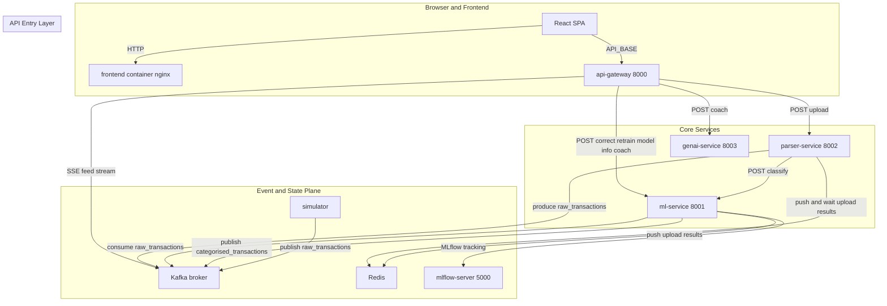
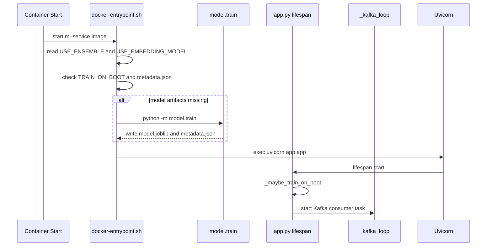
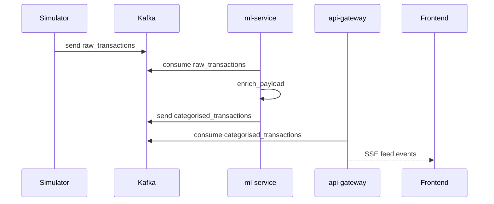
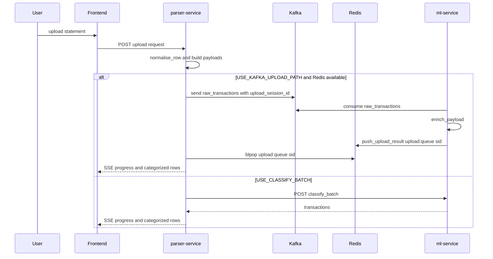
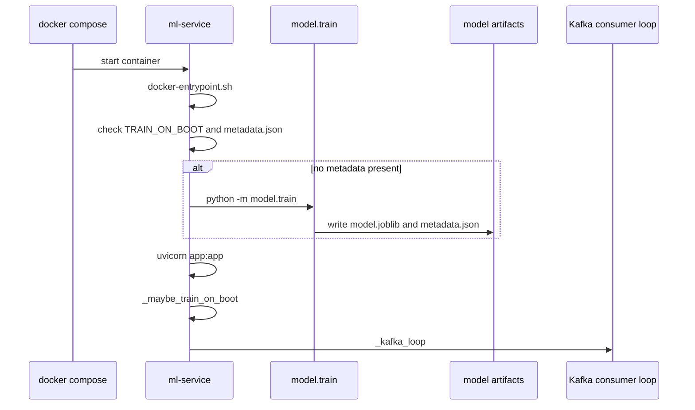
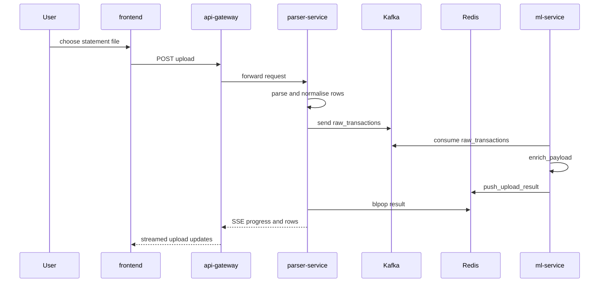
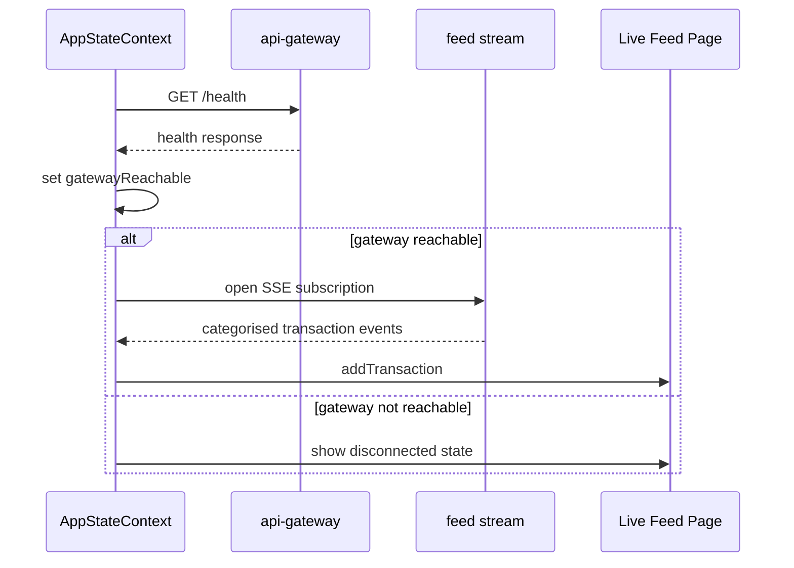

# Platform Architecture and Runtime Topology

## Overview

This platform is deployed as a Docker-first stack of FastAPI services, a React/Vite frontend, Kafka-based ingestion, Redis-backed upload coordination, PostgreSQL-backed MLflow tracking, and a simulator that can seed live transaction traffic. The runtime is organized around two ingestion paths that converge in the ML service: live transaction streaming through Kafka, and statement upload through the parser service.

The deployment model is designed to run cleanly in `docker-compose` and to fall back to host-run development by using service-local defaults such as `localhost:8000`, `localhost:8001`, `localhost:8002`, `localhost:8003`, and `localhost:29092`. The code also hardens that fallback path by loading `.env` files in the GenAI service, training the ML model on boot when artifacts are missing, and polling gateway health from the frontend before enabling streaming UI flows.

## Runtime Topology



> **Note:**  describes `VITE_API_BASE_URL` as usable with the API gateway or `ml-service`, but the browser runtime calls `GET /health`, `POST /coach/stream`, `POST /coach/monthly/stream`, and statement upload flows through the gateway path. Direct `ml-service` URLs cover the ML endpoints only, so the full UI runtime still depends on `api-gateway`.

The browser never talks directly to Kafka, Redis, or MLflow. Its runtime contract is the gateway base URL, which is stripped of trailing slashes in  and used as the only API origin for the app shell.

## Container Matrix

| Container | File | Base Image | Port | Startup Contract | Runtime Dependencies |
| --- | --- | --- | --- | --- | --- |
| API Gateway | `api-gateway/Dockerfile` | `python:3.12-slim` | `8000` | `uvicorn main:app --host 0.0.0.0 --port 8000` | ML service, parser service, GenAI service, Kafka |
| ML Service | `ml-service/Dockerfile` +  | `python:3.12-slim` | `8001` | Boot-time training gate, then `uvicorn app:app --host 0.0.0.0 --port 8001` | Kafka, model artifacts, data directory, Redis, MLflow |
| Parser Service | `parser-service/Dockerfile` | `python:3.12-slim` | `8002` | `uvicorn app:app --host 0.0.0.0 --port 8002` | Kafka, Redis, ML service, OCR packages |
| GenAI Service | `genai-service/Dockerfile` | `python:3.12-slim` | `8003` | `uvicorn app:app --host 0.0.0.0 --port 8003` | Gemini client config, `.env` files |
| Simulator | `simulator/Dockerfile` | `python:3.12-slim` | none | `python generator.py` | Kafka |
| MLflow Server | `mlflow-server/Dockerfile` | `python:3.12-slim` | `5000` | MLflow server image only | PostgreSQL-backed tracking store, MLflow artifact registry |
| Frontend | `frontend/Dockerfile` | `node:20-alpine` build stage, `nginx:1.27-alpine` runtime | `80` | static build copied to nginx | `VITE_API_BASE_URL`, gateway |
| Frontend Dev Host | ,  | Vite dev server | `5173` | `npm run dev -- --host 127.0.0.1 --port 5173` in Playwright config | `VITE_API_BASE_URL` |


### API Gateway Container

The gateway is the frontend-facing entrypoint in the Docker stack. It serves as the CORS boundary, the SSE bridge for live categorised transactions, and the proxy layer for ML and GenAI calls. Its Docker contract is intentionally simple: port `8000`, `uvicorn`, and no build-time application logic beyond dependency installation.

### ML Service Container

The ML service owns the categorisation model, online feedback loop, and Kafka consumer. The image pre-creates writable directories for model artifacts and training data, while the entrypoint script and the FastAPI lifespan both enforce a boot-time training check.

Key runtime paths:

- `MODEL_DIR=/app/model/artifacts`
- `DATA_DIR=/app/data`
- `TRAIN_ON_BOOT=1`

### Parser Service Container

The parser service adds OCR and file parsing dependencies on top of the Python runtime. It turns statement uploads into normalised transaction payloads and bridges them into the shared event pipeline.

The Docker image installs:

- `tesseract-ocr`
- `libglib2.0-0`
- `libsm6`
- `libxext6`
- `libxrender1`

### GenAI Service Container

The GenAI service is a separate FastAPI runtime for coach streaming. It loads `.env` files from both the service directory and the repo root, which makes host-run development behave like the containerized setup without relying on `docker-compose` to inject variables into the local shell.

### Simulator Container

The simulator is a lightweight Kafka publisher. It emits synthetic transactions in a loop and is useful for populating the live feed path without requiring a real upstream producer.

### MLflow Server Container

The MLflow server container is isolated from the application services and only exposes port `5000`. The image installs `mlflow` and `psycopg2-binary`, matching the repo’s tracking-and-registry setup.

### Frontend Container

The frontend container uses a two-stage build: Vite builds the React app into `dist`, then nginx serves the static files on port `80`. At runtime, the browser only needs `VITE_API_BASE_URL` to point at the gateway.

## Environment Contract

| Variable | Applies To | Default or Source | Effect |
| --- | --- | --- | --- |
| `VITE_API_BASE_URL` | Frontend | `http://localhost:8000` in  | Sets the browser API origin used by  |
| `KAFKA_BOOTSTRAP_SERVERS` | API Gateway, ML Service, Parser Service | `localhost:29092` | Kafka bootstrap address used by producers and consumers |
| `KAFKA_RAW_TOPIC` | ML Service, Parser Service, Simulator | `raw_transactions` | Topic used for uncategorised transaction events |
| `KAFKA_CAT_TOPIC` | API Gateway, ML Service | `categorised_transactions` | Topic used for enriched transaction events |
| `ML_SERVICE_URL` | API Gateway, Parser Service | `http://localhost:8001` | Downstream ML service base URL |
| `PARSER_SERVICE_URL` | API Gateway | `http://localhost:8002` | Downstream parser service base URL |
| `GENAI_SERVICE_URL` | API Gateway | `http://localhost:8003` | Downstream GenAI service base URL |
| `GATEWAY_KAFKA_WAIT_SEC` | API Gateway | `120` | Wait window for Kafka availability during feed startup |
| `GATEWAY_KAFKA_RETRY_SEC` | API Gateway | `2` | Retry interval when the gateway feed cannot connect yet |
| `GATEWAY_KAFKA_AUTO_OFFSET_RESET` | API Gateway | `latest` | Offset policy used by the SSE feed consumer |
| `MODEL_DIR` | ML Service | `/app/model/artifacts` | Writable artifact location for `model.joblib` and `metadata.json` |
| `DATA_DIR` | ML Service | `/app/data` | Writable training-data directory |
| `TRAIN_ON_BOOT` | ML Service | `1` | Enables startup training when model artifacts are missing |
| `USE_ENSEMBLE` | ML Service | unset | Selects ensemble training and disables embedding mode |
| `USE_EMBEDDING_MODEL` | ML Service | unset | Selects embedding-based training when ensemble is not enabled |
| `RETRAIN_CORRECTION_THRESHOLD` | ML Service | `50` | Retraining trigger based on accumulated corrections |
| `RETRAIN_MAX_AGE_HOURS` | ML Service | `24` | Retraining trigger based on model age |
| `MODEL_PROMOTION_MIN_ACC` | ML Service | `0.80` | Promotion gate for writing `promoted_to_production` into metadata |
| `MLFLOW_TRACKING_URI` | ML Service | unset | Enables MLflow logging in both training and runtime telemetry |
| `MLFLOW_ENABLE_REGISTRY` | ML Service | `1` | Enables registry logging and stage transition |
| `MLFLOW_MODEL_NAME` | ML Service | `expense-categoriser` | Registry model name used during training |
| `MLFLOW_RUNTIME_FLUSH_SEC` | ML Service | `30` | Runtime metrics flush cadence |
| `MLFLOW_RUNTIME_MIN_BATCH` | ML Service | `25` | Minimum runtime metric batch size before flush |
| `MLFLOW_RUNTIME_EXPERIMENT` | ML Service | `expense-runtime` | Experiment name used by `mlflow_client.py` |
| `REDIS_URL` | Parser Service | unset | Enables Redis queue coordination for upload sessions |
| `USE_KAFKA_UPLOAD_PATH` | Parser Service | `1` | Chooses Kafka plus Redis upload path |
| `USE_CLASSIFY_BATCH` | Parser Service | `0` | Enables direct batch classification fallback |
| `CLASSIFY_BATCH_CHUNK` | Parser Service | `50` | Batch size for the direct classify fallback path |
| `CLASSIFY_BATCH_MAX` | ML Service | `5000` | Maximum batch size accepted by the batch classify request model |
| `GEMINI_API_KEY` | GenAI Service, frontend runtime hints | referenced by the UI upload flow | Required secret for the coach path |
| `GEMINI_TEMPERATURE` | GenAI Service | `0.35` | Gemini generation temperature |
| `GEMINI_TOP_P` | GenAI Service | `0.9` | Gemini top-p sampling parameter |
| `GEMINI_TOP_K` | GenAI Service | `40` | Gemini top-k sampling parameter |


## Boot-Time Model Training and Runtime Warm-Up

> **Note:** When both `USE_ENSEMBLE=1` and `USE_EMBEDDING_MODEL=1` are set, the training path chooses ensemble mode and clears embedding mode in both  and . That precedence is consistent at container boot, direct `uvicorn` runs, and retraining.

The ML service is the only container that performs boot-time computation before serving traffic. The Docker entrypoint trains a model if `TRAIN_ON_BOOT=1` and  is missing; the FastAPI lifespan repeats the same check for host-run `uvicorn` sessions that bypass the shell entrypoint.

### Startup Sequence



### Model Training Flow

 resolves the active training mode in this order:

1. `--ensemble` or `USE_ENSEMBLE=1`
2. `--embedding` or `USE_EMBEDDING_MODEL=1`
3. Default TF-IDF model

The same file then:

- loads `transactions_train.csv` if it exists
- falls back to synthetic bootstrap rows from `generate_bootstrap_rows(3200)`
- optionally appends `correction_supplement.csv`
- writes `model.joblib`
- writes `metadata.json`
- logs training metadata to MLflow when `MLFLOW_TRACKING_URI` is set

### Training and Artifact Methods

| Method | Description |
| --- | --- |
| `main` | Parses CLI flags, resolves the training mode, and invokes `run_training` |
| `run_training` | Trains the selected model family, evaluates it, applies the promotion gate, and persists artifacts |
| `save_artifacts` | Writes `model.joblib` and `metadata.json` into `MODEL_DIR` |
| `train_embedding` | Trains the embedding-based classifier path |
| `_mlflow_log` | Writes training metrics and registry metadata when MLflow is enabled |


### Retraining Triggers

The runtime retraining path is controlled by `RETRAIN_CORRECTION_THRESHOLD` and `RETRAIN_MAX_AGE_HOURS` in :

- correction counts are accumulated through the correction flow
- every time the count reaches a multiple of `RETRAIN_CORRECTION_THRESHOLD`, a background retrain thread is started
- if the model is older than `RETRAIN_MAX_AGE_HOURS`, the same background retrain trigger can fire
- after retraining, the classifier is reloaded and `model_accuracy_current` is refreshed

The `POST /retrain` route also invokes the same training command and reloads the classifier on success.

## Kafka Event Bus

Kafka is the shared runtime spine of the platform. The event bus carries raw transaction events from the simulator and parser service, and categorised events from the ML service to the live feed.

### Service Participation

| Service | Role | Lifecycle |
| --- | --- | --- |
|  | Producer | Starts a Kafka producer, then continuously sends synthetic transactions |
|  | Producer and consumer bridge | Sends raw upload rows to Kafka and waits for categorised results |
|  | Consumer and producer | Consumes raw rows, enriches them, then emits categorised rows |
|  | SSE relay | Streams categorised rows to the browser |


### Topics

| Topic | Producer | Consumer | Purpose |
| --- | --- | --- | --- |
| `raw_transactions` | Simulator, parser service | ML service | Ingestion of raw transaction payloads |
| `categorised_transactions` | ML service | API gateway feed stream, browser live feed | Enriched transaction events for user-facing consumption |


### Live Feed Sequence



The frontend only enables SSE after `checkGatewayHealth()` confirms `GET /health` and `gatewayReachable === true`. Until then, `AppStateContext` suppresses the live feed connection and shows a disconnected state.

## Redis Upload Result Queue

Redis is the coordination layer for statement upload sessions when `USE_KAFKA_UPLOAD_PATH=1`. It provides a session-scoped wait-and-release mechanism that lets the parser service stream progress while the ML service completes categorisation asynchronously.

### Queue Contract

| Key or Pattern | Producer | Consumer | Meaning |
| --- | --- | --- | --- |
| `upload:queue:{sid}` | ML service via `push_upload_result` | Parser service via `blpop` | Categorised upload payload for the current statement session |


### Upload Session Flow



### Parser Service Upload Path

 performs these steps for uploads:

- parses files into rows using `parse_pdf`, `parse_csv`, or `parse_xlsx`
- normalises each row with `normalise_row`
- creates payloads that include `txn_id`, `merchant_raw`, `description`, `amount`, `debit_credit`, `currency`, `date`, `source`, `source_file`, and optionally `upload_session_id`
- pushes payloads into Kafka when `USE_KAFKA_UPLOAD_PATH=1`
- waits on Redis list `upload:queue:{sid}` for categorised output
- falls back to direct batch classification when `USE_CLASSIFY_BATCH=1`

### Parser Service Public Methods

| Method | Description |
| --- | --- |
| `_producer` | Builds a Kafka producer with topic serialization settings |
| `_classify` | Sends a single transaction to the ML service classify route |
| `_classify_batch` | Sends a batch classify request to the ML service |
| `statement_parse_latency_ms` | Records end-to-end statement parse latency |
| `statement_parse_success_rate` | Tracks successful uploads since process start |


## MLflow Tracking

MLflow is used in two places: the training path and the runtime inference path. The Docker image `mlflow-server/Dockerfile` provides the server process, while the ML service logs both training and streaming telemetry when the tracking URI is configured.

### Training-Time MLflow Flow

 writes:

- parameters: model mode, training rows, promotion threshold
- metrics: `eval_accuracy`, `eval_f1_weighted`, and optional gold-evaluation metrics
- artifact: `metadata.json`
- registry model: when `MLFLOW_ENABLE_REGISTRY=1`

If `promoted_to_production` is true, the code transitions the registered version to `Production` through `MlflowClient().transition_model_version_stage(...)`.

### Runtime MLflow Flow

 batches confidence values from inference and flushes them periodically.

| Method | Description |
| --- | --- |
| `_enabled` | Checks whether MLflow telemetry can run |
| `_flush` | Writes batched runtime metrics into the configured experiment |
| `log_metrics` | Aggregates confidence values and triggers periodic flushes |


The runtime logger is intentionally non-blocking from the inference path: if logging fails, categorisation continues.

## Prometheus Metrics and Dashboards

Prometheus metrics are exposed from the services through `prometheus-client` and are shaped for the Grafana dashboards in `observability/grafana/dashboards`. The dashboards are already keyed to the service jobs used in the code, such as `job="ml-service"`, `job="parser-service"`, and `job="genai-service"`.

### ML Service Metrics

 exports the main operational metrics:

- `categorisation_latency_ms`
- `categorisation_confidence`
- `low_confidence_rate`
- `model_accuracy_current`
- `user_corrections_total`
- `anomalies_detected_total`
- `kafka_consumer_lag_ms`
- `kafka_consumer_lag`

### Dashboard Coverage

| Dashboard File | Focus | Key Signals |
| --- | --- | --- |
| `categorisation-performance.json` | ML service quality | `model_accuracy_current`, `low_confidence_rate`, `user_corrections_total`, `categorisation_latency_ms` |
| `pipeline-health.json` | Ingestion health | `kafka_consumer_lag_ms`, `statement_parse_success_rate`, `statement_parse_latency_ms`, categorisation throughput proxy |
| `anomaly-genai.json` | Risk and coach runtime | `anomalies_detected_total`, `genai_coach_first_token_ms`, `genai_coach_invocations_total` |


### Observability Runtime Dependencies

- Grafana provisioning loads dashboards from `/var/lib/grafana/dashboards`
- Prometheus is the primary metrics source used by the dashboards
- Loki is provisioned as a datasource alongside Prometheus
- MLflow tracks training and runtime model telemetry separately from Prometheus

## Frontend Runtime Contract

The frontend runtime is a thin consumer of the deployment topology.

| File | Responsibility |
| --- | --- |
|  | Declares `VITE_API_BASE_URL=http://localhost:8000` as the default gateway origin |
|  | Centralises gateway calls and strips trailing slashes from the base URL |
|  | Gates live feed and upload behavior on gateway reachability |
|  | Runs the dev server on `127.0.0.1:5173` for browser tests |


### Frontend Readiness Flow

- `checkGatewayHealth()` performs a `GET /health` request with a 5 second timeout
- the app polls gateway health every 15 seconds
- `gatewayReachable === true` unlocks SSE streaming
- `gatewayReachable === false` shows an API unreachable toast and keeps the feed idle
- `API_BASE === ''` disables backend-dependent actions entirely

## API Contracts

### Get Model Info

#### Get Model Info

```api
{
    "title": "Get Model Info",
    "description": "Returns the current model metadata, confusion matrix, and correction counts used by the model page and gateway-proxied backend state",
    "method": "GET",
    "baseUrl": "<ApiGatewayBaseUrl>",
    "endpoint": "/model-info",
    "headers": [],
    "queryParams": [],
    "pathParams": [],
    "bodyType": "none",
    "requestBody": "",
    "formData": [],
    "rawBody": "",
    "responses": {
        "200": {
            "description": "Success",
            "body": "{\n    \"version\": \"2.0.0-ensemble\",\n    \"training_rows\": 4280,\n    \"eval_accuracy\": 0.9475,\n    \"last_retrained\": \"2026-04-08T09:15:30.123456+00:00\",\n    \"confusionMatrix\": [\n        [\n            48,\n            2,\n            0,\n            0\n        ],\n        [\n            1,\n            46,\n            1,\n            0\n        ],\n        [\n            0,\n            2,\n            44,\n            1\n        ],\n        [\n            0,\n            0,\n            1,\n            49\n        ]\n    ],\n    \"correctionCounts\": {\n        \"food_dining\": 12,\n        \"transport\": 7,\n        \"shopping\": 4\n    }\n}"
        }
    }
}
```

### Retrain Model

#### Retrain Model

```api
{
    "title": "Retrain Model",
    "description": "Queues a retraining run on the ML service and reloads the classifier after training completes",
    "method": "POST",
    "baseUrl": "<ApiGatewayBaseUrl>",
    "endpoint": "/retrain",
    "headers": [
        {
            "key": "Content-Type",
            "value": "application/json",
            "required": true
        }
    ],
    "queryParams": [],
    "pathParams": [],
    "bodyType": "json",
    "requestBody": "[]",
    "formData": [],
    "rawBody": "",
    "responses": {
        "200": {
            "description": "Success",
            "body": "{\n    \"ok\": true,\n    \"message\": \"Retrained and reloaded\"\n}"
        }
    }
}
```

### Stream Coach Response

#### Stream Coach Response

```api
{
    "title": "Stream Coach Response",
    "description": "Streams a Gemini-backed coach answer through the gateway as Server Sent Events",
    "method": "POST",
    "baseUrl": "<ApiGatewayBaseUrl>",
    "endpoint": "/coach/stream",
    "headers": [
        {
            "key": "Content-Type",
            "value": "application/json",
            "required": true
        }
    ],
    "queryParams": [],
    "pathParams": [],
    "bodyType": "json",
    "requestBody": "{\n    \"question\": \"Where did I overspend this month?\",\n    \"transactions\": [\n        {\n            \"txn_id\": \"txn_1002001\",\n            \"merchant_raw\": \"UPI/AB/998877/Swiggy\",\n            \"description\": \"Dinner order\",\n            \"amount\": 845.5,\n            \"debit_credit\": \"debit\",\n            \"currency\": \"INR\",\n            \"timestamp\": \"2026-04-08T18:45:00Z\",\n            \"date\": \"2026-04-08\",\n            \"user_id\": \"default\",\n            \"source\": \"stream\",\n            \"source_file\": null,\n            \"upload_session_id\": null\n        }\n    ]\n}",
    "formData": [],
    "rawBody": "",
    "responses": {
        "200": {
            "description": "SSE token stream",
            "body": "{\n    \"token\": \"Your spend is concentrated in food dining and subscriptions.\",\n    \"done\": false\n}"
        }
    }
}
```

### Stream Monthly Report

#### Stream Monthly Report

```api
{
    "title": "Stream Monthly Report",
    "description": "Streams the monthly coach report through the gateway as Server Sent Events",
    "method": "POST",
    "baseUrl": "<ApiGatewayBaseUrl>",
    "endpoint": "/coach/monthly/stream",
    "headers": [
        {
            "key": "Content-Type",
            "value": "application/json",
            "required": true
        }
    ],
    "queryParams": [],
    "pathParams": [],
    "bodyType": "json",
    "requestBody": "{\n    \"transactions\": [\n        {\n            \"txn_id\": \"txn_1002001\",\n            \"merchant_raw\": \"UPI/AB/998877/Swiggy\",\n            \"description\": \"Dinner order\",\n            \"amount\": 845.5,\n            \"debit_credit\": \"debit\",\n            \"currency\": \"INR\",\n            \"timestamp\": \"2026-04-08T18:45:00Z\",\n            \"date\": \"2026-04-08\",\n            \"user_id\": \"default\",\n            \"source\": \"stream\",\n            \"source_file\": null,\n            \"upload_session_id\": null\n        }\n    ]\n}",
    "formData": [],
    "rawBody": "",
    "responses": {
        "200": {
            "description": "SSE token stream",
            "body": "{\n    \"token\": \"Summary: spend increased in transport and food dining.\",\n    \"done\": false\n}"
        }
    }
}
```

## Feature Flows

### Container Boot and Model Warm-Up



### Statement Upload to Categorised Feed



### Live Stream Readiness and Feed Subscription



## Key Classes Reference

| Class | Responsibility |
| --- | --- |
| `app.py` | ML service runtime, model inference, retraining, model info, Kafka consumer |
| `docker-entrypoint.sh` | Boot-time training gate before ML service starts |
| `train.py` | Model training, artifact persistence, MLflow logging, promotion gating |
| `mlflow_client.py` | Runtime MLflow metrics batching and flush logic |
| `main.py` | API gateway, CORS, proxy routes, SSE relays |
| `coach.py` | GenAI coach configuration, Gemini streaming, dotenv loading |
| `app.py` | Parser service upload pipeline, Kafka and Redis coordination |
| `generator.py` | Simulator transaction publisher |
| `metrics.py` | Prometheus metric definitions for categorisation and pipeline telemetry |
| `Dockerfile` | Frontend static build and nginx runtime |
| `Dockerfile` | MLflow server container image |
| `Dockerfile` | API gateway container image |
| `Dockerfile` | ML service container image |
| `Dockerfile` | Parser service container image |
| `Dockerfile` | GenAI service container image |
| `Dockerfile` | Simulator container image |


## Error Handling

The deployment code handles service startup and runtime failures at the boundaries where they can disrupt the user experience:

-  returns `503` from `_ensure_model()` when classification is requested before a model exists
- `_kafka_loop()` retries Kafka startup with exponential backoff and stops cleanly when no model is available after waiting
-  turns GenAI connection failures into streamed fallback tokens so the frontend still receives a response shape
-  throws on non-OK responses and converts them into UI-visible errors
-  converts gateway-down and correction-sync failures into toast notifications
-  never fails inference if telemetry logging fails
-  wraps MLflow registration and artifact logging in a best-effort `try` block

## Dependencies

### External Runtime Services

- Kafka broker for `raw_transactions` and `categorised_transactions`
- Redis for upload session fan-in
- MLflow tracking server on port `5000`
- Gemini API access for the coach layer
- PostgreSQL for the MLflow tracking backend
- Browser access to the gateway through `VITE_API_BASE_URL`

### Python and Node Packages

- `fastapi`
- `uvicorn[standard]`
- `aiokafka`
- `httpx`
- `prometheus-client`
- `mlflow`
- `redis`
- `psycopg2-binary`
- `google-genai`
- `python-dotenv`
- `react`, `react-dom`, `react-router-dom`
- `vite`, `playwright`, `tailwindcss`

## Testing Considerations

- Frontend browser tests run on `127.0.0.1:5173` from 
- The live feed screen assumes the gateway health route is reachable before SSE is opened
- The model page expects `GET /model-info` to return a populated metadata object or the empty-state shape
- The upload path should be tested in both modes: Kafka plus Redis, and the direct classify fallback
- Boot-time model training should be tested with and without 
- The GenAI path should be tested with a valid `GEMINI_API_KEY` and with the fallback connection error behavior from the gateway
- Kafka retry behavior in  should be tested when the broker starts after the service container
- `USE_ENSEMBLE` and `USE_EMBEDDING_MODEL` should be tested together to verify ensemble precedence