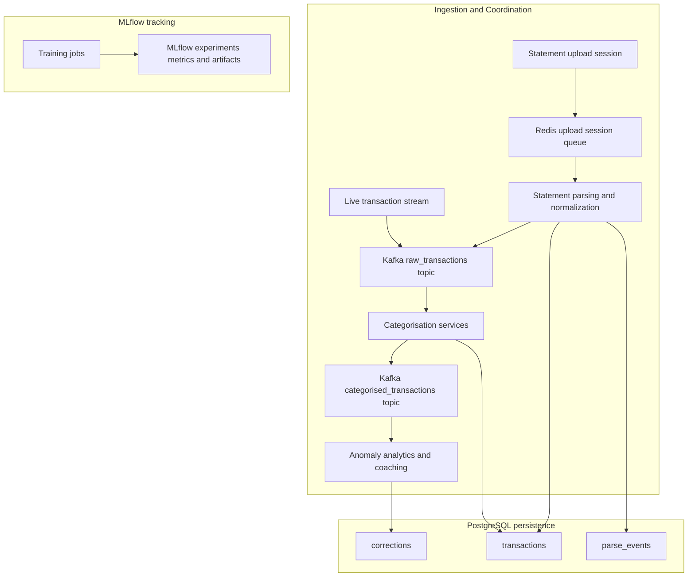
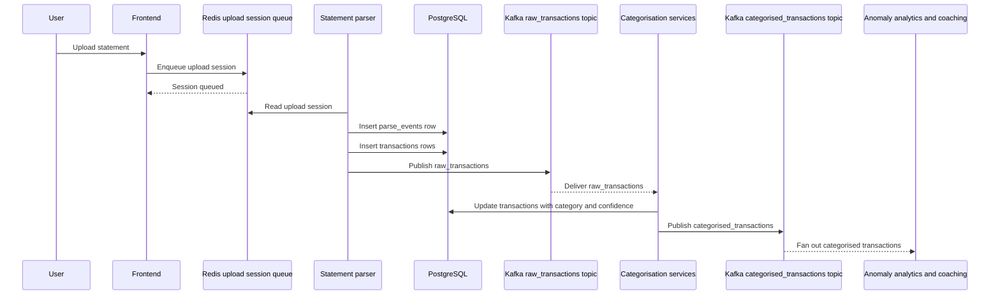
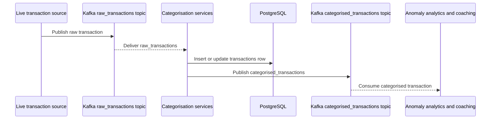
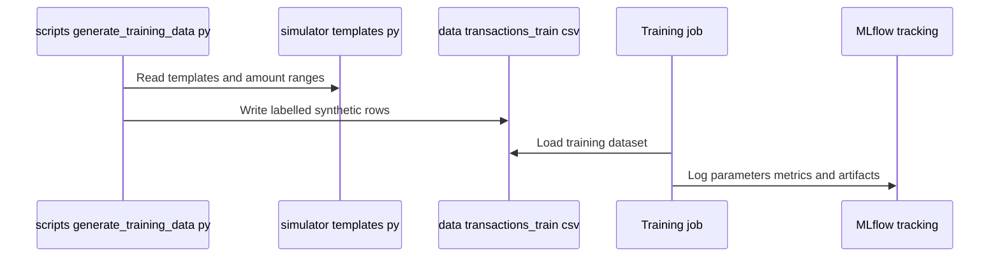

# Platform Architecture and Runtime Topology - Persistence, schema ownership, and shared infrastructure responsibilities

## Overview

This platform splits durable data, short-lived coordination, and experiment tracking into separate responsibilities so the ingestion paths can converge without sharing a single execution bottleneck.  owns the PostgreSQL bootstrap for the canonical transaction record, user corrections, and file-parse telemetry, while Kafka topics coordinate asynchronous handoff between ingest, categorisation, and downstream consumers.

The runtime topology also includes Redis-backed upload-session coordination and MLflow-backed experiment tracking. Redis supports the statement-upload path as ephemeral orchestration state, Kafka carries `raw_transactions` and `categorised_transactions` through the shared processing pipeline, and MLflow records training runs as tracking infrastructure rather than a live serving layer.

## Architecture Overview

The repository’s shared infrastructure is organized around one durable store and three coordination/tracking surfaces: PostgreSQL for persistence, Redis for upload-session queues, Kafka for event distribution, and MLflow for model experiment tracking. The ingestion flows converge before they fan out to categorisation, anomaly detection, analytics, and coaching workflows.

## Persistence and Schema Ownership

 is the schema bootstrap for the repository. It creates the PostgreSQL tables that hold the transaction ledger, user-driven category fixes, and upload/parsing telemetry, and it creates the indexes used for transaction lookup and recency-based review.

### `transactions`

The schema bootstrap is idempotent: every table and index is created with IF NOT EXISTS, so database initialization can be repeated without rewriting existing objects. [!NOTE] transactions and corrections share txn_id, but  does not define a foreign key between them. The association is therefore schema-light and is resolved by application logic rather than enforced referential constraints.

*`scripts/init-db.sql`*

This table is the canonical transaction store. It keeps the original transaction payload in `payload`, promotes classification outputs into top-level columns, and stores source metadata for later auditing.

| Column | Type | Purpose |
| --- | --- | --- |
| `id` | `BIGSERIAL` | Primary key for the stored row |
| `txn_id` | `TEXT` | Transaction identifier used for lookup and correlation |
| `user_id` | `TEXT` | User scope, defaulting to `'default'` |
| `payload` | `JSONB` | Full transaction payload |
| `category` | `TEXT` | Assigned classification label |
| `confidence` | `DOUBLE PRECISION` | Classification confidence score |
| `source` | `TEXT` | Ingestion source identifier |
| `source_file` | `TEXT` | File origin for statement-based ingestion |
| `created_at` | `TIMESTAMPTZ` | Insert timestamp, defaults to `NOW()` |

| Index | Column | Purpose |
| --- | --- | --- |
| `idx_transactions_txn_id` | `txn_id` | Fast transaction lookup by identifier |
| `idx_transactions_created` | `created_at DESC` | Recency-ordered transaction queries |

**Ownership and runtime role**

- Stores the durable transaction record after ingestion or categorisation.
- Preserves the raw payload alongside derived classification fields.
- Supports both live transaction flow and statement-upload flow through shared schema.
- Uses `created_at` ordering for review, reconciliation, and operational inspection.

### `corrections`

*`scripts/init-db.sql`*

This table stores user or operator overrides to the category assigned to a transaction. It is intentionally separate from `transactions`, so the original record remains intact while the corrected label is captured independently.

| Column | Type | Purpose |
| --- | --- | --- |
| `id` | `BIGSERIAL` | Primary key for the correction row |
| `txn_id` | `TEXT` | Transaction identifier being corrected |
| `correct_category` | `TEXT` | User-provided replacement category |
| `created_at` | `TIMESTAMPTZ` | Insert timestamp, defaults to `NOW()` |

| Index | Column | Purpose |
| --- | --- | --- |
| `idx_corrections_created` | `created_at DESC` | Recency-ordered correction review |

**Ownership and runtime role**

- Captures the feedback loop from human correction back into the platform.
- Keeps corrections decoupled from the original transaction payload.
- Provides a clean input stream for retraining, evaluation, and label reconciliation.

### `parse_events`

*`scripts/init-db.sql`*

This table tracks file-ingestion outcomes and parser performance for statement uploads. It records whether a file succeeded, how many rows were processed, and how long the parse took.

| Column | Type | Purpose |
| --- | --- | --- |
| `id` | `BIGSERIAL` | Primary key for the parse event |
| `filename` | `TEXT` | Uploaded file name |
| `format` | `TEXT` | File format identifier |
| `success` | `BOOLEAN` | Parse outcome |
| `row_count` | `INT` | Number of parsed rows |
| `latency_ms` | `DOUBLE PRECISION` | Parse duration in milliseconds |
| `created_at` | `TIMESTAMPTZ` | Insert timestamp, defaults to `NOW()` |

**Ownership and runtime role**

- Tracks statement-upload telemetry independently of transaction storage.
- Records the batch-level outcome of parsing rather than per-transaction state.
- Supports operational reporting on upload success, size, and latency.

## Shared Infrastructure Responsibilities

### PostgreSQL

PostgreSQL is the durable system of record for the platform.  establishes the exact tables that own transaction data, correction data, and parsing telemetry, making the database the persistence boundary for ingest and feedback loops.

| Responsibility | Evidence in schema | Runtime effect |
| --- | --- | --- |
| Canonical transaction storage | `transactions.payload`, `transactions.category`, `transactions.confidence` | Holds the persisted transaction view used by downstream workflows |
| Human correction storage | `corrections.correct_category` | Preserves label overrides separately from the original row |
| Upload telemetry | `parse_events.success`, `parse_events.row_count`, `parse_events.latency_ms` | Captures parse health and throughput |
| Recency access paths | `idx_transactions_created`, `idx_corrections_created` | Optimizes recent-item review |
| Identifier lookup | `idx_transactions_txn_id` | Supports transaction correlation by `txn_id` |

### Redis

Redis backs the upload-session queue for statement ingestion. In this topology it is the short-lived coordination layer that bridges file upload initiation and the parser that turns the uploaded statement into durable PostgreSQL records and downstream events.

| Responsibility | Runtime role |
| --- | --- |
| Upload-session coordination | Holds transient upload sessions while parsing work is prepared or consumed |
| Orchestration state | Keeps the statement-upload path decoupled from durable storage |
| Hand-off between upload and parse steps | Supports the transition from user upload to ingestion processing |

### Kafka

Kafka coordinates service boundaries through event topics. The two topics named in the platform description organize the runtime handoff between intake and classification, then between classification and all downstream consumers.

| Topic | Produced by | Consumed by | Responsibility |
| --- | --- | --- | --- |
| `raw_transactions` | Live transaction ingestion, statement parsing | Categorisation services | Carries unclassified transaction events into shared classification workflows |
| `categorised_transactions` | Categorisation services | Anomaly detection, analytics, coaching, and other downstream consumers | Broadcasts classified transaction events after categorisation |

**Topic coordination model**

- `raw_transactions` is the intake boundary for transaction events before categorisation.
- `categorised_transactions` is the post-classification broadcast boundary.
- The two topics separate ingestion responsibility from downstream business processing.
- Kafka decouples source-specific producers from the shared consumer graph.

### MLflow

MLflow is used as experiment-tracking infrastructure for model development and evaluation. It records training runs, metrics, and artifacts produced by the ML pipeline, while serving remains outside the runtime request path.

| Responsibility | Runtime role |
| --- | --- |
| Experiment tracking | Records model runs, parameters, metrics, and artifacts |
| Training observability | Preserves the history of model development |
| Non-serving role | Supports offline training and evaluation rather than live inference delivery |

## Runtime Flows

### Statement Upload to Persisted Transaction and Event Records

The statement-upload path uses Redis for transient coordination, then writes batch telemetry and transaction data into PostgreSQL. After parsing, the same transaction stream enters Kafka so the shared categorisation pipeline can process it alongside live transaction events.

### Live Transaction Stream to Shared Categorisation

The live stream path bypasses the upload-session queue and feeds Kafka directly. The shared categorisation path then normalizes the event, persists the transaction record, and broadcasts the categorised output for downstream consumers.

### Synthetic Training Data Generation and Experiment Tracking

The offline data path produces a reproducible labelled dataset and then uses MLflow to track the resulting training runs.  writes , and  supplies category templates and amount ranges for the synthetic rows.

## Support Scripts and Offline Data Utilities

### Frontend API Bootstrap

*`scripts/ensure-frontend-env.mjs`*

This script keeps the frontend development environment pointed at the local backend by ensuring  contains `VITE_API_BASE_URL=http://localhost:8000`.

| Behavior | Result |
| --- | --- |
| File missing | Creates  with `VITE_API_BASE_URL=http://localhost:8000` |
| File exists without the variable | Appends `VITE_API_BASE_URL=http://localhost:8000` |
| File exists with the variable | Leaves the file unchanged |

**Runtime role**

- Aligns the React/Vite frontend with the local API base URL.
- Provides a lightweight bootstrap step for local development.

### Synthetic Training Data Generator

*`scripts/generate_training_data.py`*

This script generates a reproducible labelled dataset for model training. It writes  and seeds the random generator with `42` to keep the synthetic output stable across runs.

| Item | Value |
| --- | --- |
| Output file |  |
| Row generation strategy | Approximately `280` rows per category |
| Total output size | Approximately `3360` rows |
| Reproducibility seed | `42` |

| Function | Responsibility |
| --- | --- |
| `row_for_category` | Builds one synthetic labelled transaction row for a category |
| `main` | Writes the full CSV dataset to disk |

**Output schema**

| Field | Type | Meaning |
| --- | --- | --- |
| `txn_id` | `string` | Generated transaction identifier |
| `merchant_raw` | `string` | Synthetic merchant string |
| `description` | `string` | Text description used for training |
| `amount` | `number` | Transaction amount |
| `category` | `string` | Target label |
| `source` | `string` | Data source tag |

### Transaction Template Library

*`simulator/templates.py`*

This module provides the synthetic transaction vocabulary used to build labelled data and runtime simulation samples. The templates are weighted so some categories occur more frequently than others, and the amount ranges reflect category-specific spend profiles.

| Constant | Responsibility |
| --- | --- |
| `CATEGORY_WEIGHTS` | Defines the relative frequency of each category |
| `TEMPLATES` | Holds merchant string templates by category |
| `BASE_AMOUNTS` | Holds amount ranges by category |

| Function | Responsibility |
| --- | --- |
| `_pick_category` | Selects a category using weighted sampling |
| `_mask` | Generates a masked suffix string |
| `_upi` | Generates a synthetic UPI-style numeric token |
| `build_merchant_raw` | Formats a merchant string from a category template |
| `build_transaction` | Builds a synthetic transaction dict and occasionally injects an amount anomaly |

**Category set**

food_dining, transport, shopping, housing, health_medical, entertainment, travel, education, finance, subscriptions, family_personal, uncategorised

## Key Classes Reference

build_transaction includes an anomaly injection path that multiplies the amount by 5 on a random cadence controlled by anomaly_every, which makes it suitable for synthetic anomaly scenarios as well as labelled training material.

| Class | Responsibility |
| --- | --- |
|  | Bootstraps PostgreSQL tables for transactions, corrections, and parse events |
|  | Ensures the frontend development environment points to the local backend |
|  | Generates reproducible labelled transaction training data |
|  | Provides synthetic category templates, amount ranges, and transaction builders |
