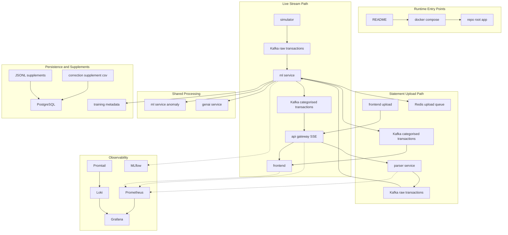
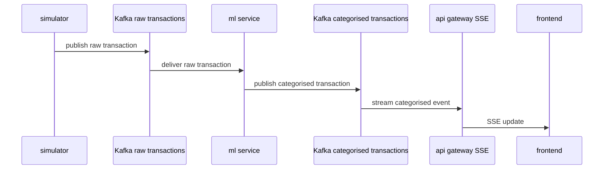
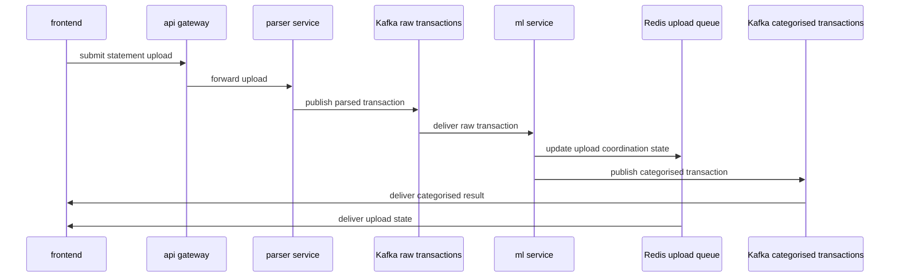
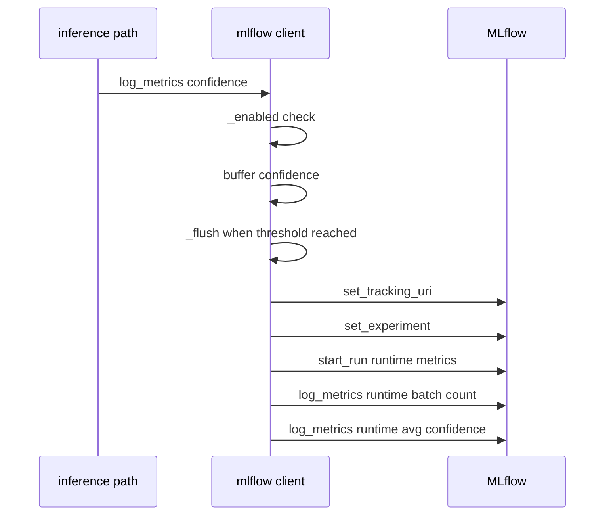
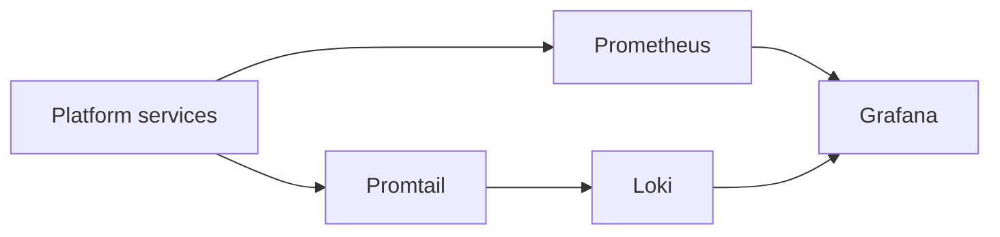

# Platform Architecture and Runtime Topology

## Overview

This platform is organized around two ingestion paths that converge on the same transaction intelligence pipeline. One path is a live stream driven by the simulator and Kafka; the other starts with a user statement upload in the frontend and routes through `api-gateway` and `parser-service` before joining the same downstream classification and anomaly workflows.

The shared runtime centers on `ml-service` for categorisation and anomaly detection, `api-gateway` for frontend delivery, PostgreSQL and CSV or JSONL supplements for correction and storage workflows, and Redis for upload-state coordination. Observability is split across metrics, dashboards, logs, and log shipping with Prometheus, Grafana, Loki, and Promtail, while MLflow is used by the ML runtime to batch and persist inference-time confidence metrics.

## Runtime Entry Points and Orchestration Context

The repository-level documentation and runtime files define the composition boundary for the whole system. They establish how the services are started together, how the local graph is wired, and where the top-level application process begins.

| File | Role in Runtime Topology |
| --- | --- |
| `README.md` | Top-level platform entry guide and runtime framing for the full expense intelligence system. |
| `docker-compose.yml` | Multi-service orchestration contract for the local stack, including ingestion, processing, storage, and observability services. |
| `app.py` | Repository-root application entrypoint used as the top-level startup context for the composed runtime. |

## Architecture Overview

## Ingestion Paths

### Live Transaction Stream

The architecture is explicitly split into a live transaction stream and a statement upload stream. Both paths converge into the same categorisation pipeline, but only the upload path introduces parser-service and the Redis-backed upload coordination flow.

The live path is designed for continuously generated transactions. The simulator produces raw events into Kafka, `ml-service` consumes them, classifies them, and emits categorised events to the downstream transaction stream. `api-gateway` then exposes the categorised stream to the frontend over SSE.

#### Flow Summary

| Stage | Component | Output |
| --- | --- | --- |
| 1 | `simulator` | Live raw transaction events |
| 2 | Kafka `raw_transactions` | Buffered raw ingestion stream |
| 3 | `ml-service` | Categorised transaction and anomaly-enriched output |
| 4 | Kafka `categorised_transactions` | Shared downstream classified stream |
| 5 | `api-gateway` SSE | Frontend delivery stream |
| 6 | `frontend` | Live transaction view for the user |

#### Live Stream Sequence

### Statement Upload Path

The upload path starts in the frontend and is routed through `api-gateway` into `parser-service` for statement parsing and normalisation. Parsed records are pushed into the same Kafka raw transaction stream used by the live path. After classification, the path branches into Redis-backed upload coordination and the shared categorised transaction stream that feeds the frontend.

#### Flow Summary

| Stage | Component | Output |
| --- | --- | --- |
| 1 | `frontend` upload | Statement file submission |
| 2 | `api-gateway` | Upload request routing |
| 3 | `parser-service` | Parsed and normalised transaction records |
| 4 | Kafka `raw_transactions` | Shared raw transaction ingestion stream |
| 5 | `ml-service` | Categorised records and anomaly signals |
| 6 | Redis upload queue | Upload progress or completion coordination |
| 7 | Kafka `categorised_transactions` | Shared categorised transaction stream |
| 8 | `frontend` | Upload result presentation |

#### Upload Sequence

## Shared Processing and Service Boundaries

### `parser-service`

The upload path is not a copy of the live stream. It adds a parse-and-normalise stage before Kafka ingestion and uses Redis as an upload coordination layer after classification.

`parser-service` owns statement parsing and normalisation for uploaded files. It is only part of the upload path and sits between `api-gateway` and the shared Kafka raw transaction topic.

#### Responsibility Boundary

- Accepts uploaded statement data from `api-gateway`.
- Transforms statement content into normalised transaction records.
- Publishes the result into the shared raw transaction stream.

### `ml-service`

`ml-service` is the convergence point for both ingestion paths. It performs transaction categorisation and hosts anomaly detection logic in , while also emitting runtime telemetry through `mlflow_client.py`.

#### Responsibility Boundary

- Consumes raw transaction events from Kafka.
- Produces categorised transaction events.
- Runs anomaly detection alongside categorisation.
- Emits inference-time confidence metrics to MLflow when configured.

### `api-gateway`

`api-gateway` is the frontend-facing delivery boundary. In the live stream it carries categorised events to the UI through SSE; in the upload path it receives uploads from the frontend and forwards them to `parser-service`.

#### Responsibility Boundary

- Receives frontend upload requests.
- Bridges frontend consumption of live categorised events.
- Acts as the runtime edge between UI and backend stream processing.

### `genai-service`

`genai-service` sits on the coaching side of the platform and consumes the same financial intelligence outputs produced by the core transaction pipeline.

#### Responsibility Boundary

- Provides GenAI-backed financial coaching workflows.
- Consumes runtime intelligence rather than raw uploads.

## Persistent Stores and Queues

### Kafka

Kafka is the primary transport backbone for transaction events. The architecture uses two named topic roles in the runtime description.

| Kafka Role | Used For | Producer | Consumer |
| --- | --- | --- | --- |
| `raw_transactions` | Raw transaction ingestion | `simulator`, `parser-service` | `ml-service` |
| `categorised_transactions` | Classified transaction fan-out | `ml-service` | `api-gateway`, `frontend` delivery path |

### Redis

Redis is used as an upload queue and coordination layer in the statement upload flow. It carries upload-state information that is distinct from the core transaction stream.

| Store | Role | Runtime Use |
| --- | --- | --- |
| Redis upload queue | Upload coordination | Tracks upload lifecycle state while the statement is being parsed and classified. |

### PostgreSQL

PostgreSQL stores runtime corrections and other persistent transaction intelligence data. The architecture documentation groups this with JSONL and CSV supplements as the storage layer for corrections and retraining inputs.

| Store | Role | Runtime Use |
| --- | --- | --- |
| PostgreSQL | Persistent data store | Stores corrections and shared platform state used by downstream workflows. |

### JSONL and CSV Supplements

Supplement files are part of the correction and training data pipeline.

| Artifact | Role | Runtime Use |
| --- | --- | --- |
|  | Correction supplement | Captures user corrections for retraining inputs. |
| JSONL supplements | Storage supplement | Supports additional runtime or training-time data supplementation. |
|  | Training metadata | Records model training metadata for reproducibility. |

## Observability and Runtime Telemetry

### MLflow Runtime Metrics Logger

*File: `ml-service/mlflow_client.py`*

This module is the runtime telemetry bridge used by inference code. It buffers confidence values, periodically flushes aggregate metrics to MLflow, and never interrupts inference when telemetry is unavailable or fails.

#### Runtime State

| Name | Type | Description |
| --- | --- | --- |
| `_LOCK` | `threading.Lock` | Serializes buffer updates and flushes. |
| `_BUFFER_COUNT` | `int` | Number of confidence samples currently buffered. |
| `_BUFFER_CONFIDENCE_SUM` | `float` | Running sum of buffered confidence values. |
| `_LAST_FLUSH_TS` | `float` | Timestamp of the last telemetry flush. |
| `_FLUSH_EVERY_SEC` | `float` | Time threshold that can trigger a flush. |
| `_MIN_BATCH` | `int` | Minimum buffered sample count needed to flush. |
| `_EXPERIMENT` | `str` | MLflow experiment name used for runtime metrics. |

#### Public API

| Method | Description |
| --- | --- |
| `log_metrics` | Accepts runtime inference metrics, buffers confidence values, and flushes aggregate telemetry to MLflow when thresholds are met. |

#### Telemetry Lifecycle

1. `log_metrics` is called from the inference path.
2. `_enabled()` checks that MLflow is importable and `MLFLOW_TRACKING_URI` is set.
3. The `confidence` value is validated and converted to `float`.
4. The value is added to the in-memory buffer under `_LOCK`.
5. `_flush(now)` runs when the buffer is large enough or stale enough.
6. `_flush(now)` sets the tracking URI, sets the experiment, opens a nested run named `runtime-metrics`, and logs:- `runtime_batch_count`
- `runtime_avg_confidence`
7. Any telemetry failure is swallowed so inference continues.

#### Telemetry Flush Sequence

### Prometheus, Grafana, Loki, and Promtail

The observability stack is split into metrics, log storage, dashboarding, and log shipping.

| Component | Responsibility | Runtime Placement |
| --- | --- | --- |
| Prometheus | Collects runtime metrics from services | Observability backend |
| Grafana | Visualizes metrics and logs | Operator dashboard |
| Loki | Stores and indexes logs | Log backend |
| Promtail | Ships container or service logs into Loki | Log shipper |

### Observability Flow

## Data Flow Boundaries

### Convergence Model

Both ingestion paths converge at the same classifier and anomaly layer in `ml-service`. The difference is not in the final intelligence outputs, but in how raw data enters the system and how the UI receives the resulting state.

| Path | Entry Source | Extra Boundary | Shared Downstream |
| --- | --- | --- | --- |
| Live stream | `simulator` | None before Kafka | `ml-service`, `api-gateway`, frontend SSE |
| Statement upload | `frontend` upload | `parser-service` and Redis coordination | `ml-service`, `categorised_transactions`, frontend |

### Shared Runtime Outcomes

- Transaction categorisation is centralized in `ml-service`.
- Anomaly detection runs alongside categorisation in the same service boundary.
- Corrections feed persistent storage and supplement files for retraining.
- MLflow captures runtime confidence telemetry from the inference path.
- Prometheus, Grafana, Loki, and Promtail provide the operational view of the system.

## Key Classes Reference

| Class | Responsibility |
| --- | --- |
| `mlflow_client.py` | Buffers inference-time confidence metrics and flushes them to MLflow as runtime telemetry. |
